# Deep View

**Cross-platform computer system forensics and runtime analysis toolkit**


---

## Overview

Deep View is a unified forensic analysis framework that brings together memory forensics, live system monitoring, virtual machine introspection, binary instrumentation, and hardware-assisted extraction into a single, extensible toolkit. It is designed for incident responders, malware analysts, threat hunters, and security researchers who need to investigate compromised systems, analyze suspicious binaries, and correlate evidence across multiple data sources --- from user-space process memory down to physical DRAM, SPI flash, and GPU VRAM.

The toolkit operates across Linux, macOS, and Windows, abstracting platform-specific mechanisms behind common interfaces. Memory dumps acquired with LiME, AVML, WinPmem, or OSXPmem are analyzed through dual engines --- Volatility 3 for its deep plugin ecosystem and MemProcFS for high-performance filesystem-style access. Hardware-assisted acquisition via DMA (PCILeech over PCIe/Thunderbolt), cold boot DRAM remanence capture, and JTAG/chip-off extraction extends reach to non-cooperative, powered-off, and embedded targets. Live systems are observed through eBPF programs on Linux, DTrace probes on macOS, and ETW sessions on Windows, all feeding a unified event stream. Intel Processor Trace and ARM CoreSight provide instruction-level recording invisible to malware. Application behavior is captured through Frida-based dynamic instrumentation or static binary reassembly with embedded monitoring hooks.

Deep View includes independent page table reconstruction (CR3 → PML4 → PT walk on raw physical memory), multi-encoding string carving with entropy filtering, TCP/IP stack reconstruction from kernel structures, and volatile artifact recovery (shell command history, clipboard, registry hives, environment variables). Detection modules automatically identify anti-forensics techniques (DKOM, SSDT hooks, inline hooks, PatchGuard bypasses, hypervisor rootkits, bootkits), process injection (12 MITRE T1055 sub-techniques), and encryption key material (AES, RSA, BitLocker, TLS session keys). Firmware-level analysis covers UEFI rootkit detection and SPI flash integrity verification. Findings are mapped to the MITRE ATT&CK framework and exported as STIX 2.1 intelligence objects for integration with SOC workflows.

---

## Architecture

```mermaid
graph TB
    CLI["CLI Interface<br/>(Click + Rich)"]:::core
    CTX["Analysis Context"]:::core
    EB["Event Bus<br/>(Pub/Sub)"]:::core

    subgraph Core["Core Framework"]
        CTX
        EB
        CFG["Config<br/>(Pydantic)"]:::core
        PLT["Platform<br/>Detection"]:::core
        PR["Plugin Registry<br/>(3-tier discovery)"]:::core
    end

    subgraph Memory["Memory Forensics"]
        MM["Memory Manager"]:::analysis
        ACQ["Acquisition<br/>LiME | AVML | WinPmem | OSXPmem"]:::source
        FMT["Format Parsers<br/>Raw | LiME | ELF Core | Crashdump"]:::analysis
        VOL["Volatility 3<br/>Engine"]:::analysis
        MPF["MemProcFS<br/>Engine"]:::analysis
        SYM["Symbol Manager<br/>(dwarf2json)"]:::analysis
        PTW["Page Table Walker<br/>(CR3 → PML4 → PT)"]:::analysis
        VAL["Virtual Address Layer"]:::analysis
    end

    subgraph Hardware["Hardware-Assisted Extraction"]
        DMA["DMA Acquisition<br/>(PCILeech, Thunderbolt, FireWire)"]:::hardware
        CB["Cold Boot<br/>(DRAM remanence)"]:::hardware
        JTAG["JTAG / Chip-Off / ISP<br/>(mobile, embedded, IoT)"]:::hardware
        SPI["SPI Flash<br/>(Bus Pirate, Dediprog)"]:::hardware
        GPU["GPU Memory<br/>(CUDA, OpenCL)"]:::hardware
    end

    subgraph Tracing["System Tracing"]
        TM["Trace Manager"]:::instrument
        BPF["eBPF/BCC<br/>(Linux)"]:::instrument
        DT["DTrace<br/>(macOS)"]:::instrument
        ETW["ETW<br/>(Windows)"]:::instrument
        IPT["Intel PT<br/>(branch trace)"]:::instrument
        CS["ARM CoreSight"]:::instrument
        TEB["Trace Event Bus<br/>(async queues)"]:::instrument
    end

    subgraph Instrument["Instrumentation"]
        IM["Instrumentation Manager"]:::instrument
        FE["Frida Engine<br/>(dynamic hooks)"]:::instrument
        BA["Binary Analyzer<br/>(LIEF)"]:::instrument
        RE["Reassembler<br/>(trampoline injection)"]:::instrument
    end

    subgraph VM["VM Introspection"]
        VMM["VM Manager"]:::analysis
        QEMU["QEMU/KVM<br/>(libvirt)"]:::analysis
        VBOX["VirtualBox<br/>(vboxmanage)"]:::analysis
        VMW["VMware<br/>(vmrun)"]:::analysis
        VMI["LibVMI / DRAKVUF<br/>(live introspection)"]:::analysis
    end

    subgraph Detection["Detection & Scanning"]
        AF["Anti-Forensics<br/>(DKOM, hooks, PatchGuard)"]:::detect
        INJ["Injection Detection<br/>(T1055)"]:::detect
        EK["Key Scanner<br/>(AES, RSA, BitLocker, TLS)"]:::detect
        AD["Anomaly Detection<br/>(heuristic + ML)"]:::detect
        RK["Rootkit Detection<br/>(hypervisor, bootkit)"]:::detect
        YS["YARA Scanner"]:::detect
        SC["String Carver<br/>(multi-encoding)"]:::detect
        IOC["IoC Engine"]:::detect
    end

    subgraph Artifacts["Volatile Artifact Recovery"]
        TCP["TCP/IP Stack<br/>Reconstruction"]:::detect
        CMD["Command History<br/>(cmd, PS, bash)"]:::detect
        FW["Firmware / UEFI<br/>Analysis"]:::detect
    end

    subgraph Reporting["Reporting & Export"]
        RE2["Report Engine<br/>(HTML, Markdown, JSON)"]:::report
        TL["Timeline Builder"]:::report
        STIX["STIX 2.1 Export"]:::report
        ATT["ATT&CK Mapper<br/>(Navigator layers)"]:::report
    end

    CLI --> CTX
    CTX --> MM
    CTX --> TM
    CTX --> IM
    CTX --> VMM
    CTX --> PR

    MM --> ACQ
    MM --> FMT
    MM --> VOL
    MM --> MPF
    MM --> SYM
    MM --> PTW
    PTW --> VAL

    Hardware --> MM
    DMA --> MM
    CB --> MM
    JTAG --> MM
    SPI --> FW
    GPU --> MM

    TM --> BPF
    TM --> DT
    TM --> ETW
    TM --> IPT
    TM --> CS
    TM --> TEB

    IM --> FE
    IM --> BA
    IM --> RE

    VMM --> QEMU
    VMM --> VBOX
    VMM --> VMW
    VMM --> VMI

    MM --> YS
    MM --> SC
    MM --> AF
    MM --> INJ
    MM --> EK
    MM --> RK
    MM --> TCP
    MM --> CMD

    AF --> STIX
    INJ --> ATT
    RK --> ATT
    TL --> RE2

    classDef core fill:#868e96,stroke:#495057,color:#fff
    classDef analysis fill:#74c0fc,stroke:#339af0,color:#1a1a2e
    classDef source fill:#ffa94d,stroke:#f76707,color:#1a1a2e
    classDef hardware fill:#ff8787,stroke:#e03131,color:#1a1a2e
    classDef instrument fill:#3bc9db,stroke:#1098ad,color:#1a1a2e
    classDef detect fill:#c084fc,stroke:#7950f2,color:#fff
    classDef report fill:#69db7c,stroke:#2f9e44,color:#1a1a2e
```

### Data Flow

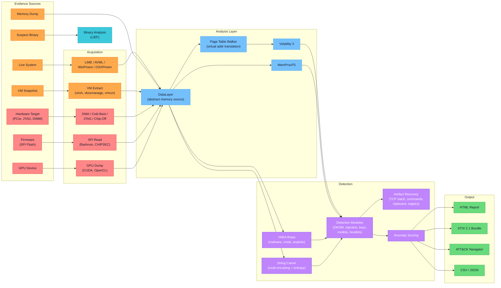

---

## Capabilities

### Memory Forensics

| Feature | Description |
|---------|-------------|
| **Multi-format support** | Raw, LiME, ELF core, Windows crashdump, hibernation files --- all via mmap for efficient large-file access |
| **Dual analysis engine** | Volatility 3 (library API, not subprocess) for deep analysis; MemProcFS for filesystem-like access and scatter-read performance |
| **Cross-platform acquisition** | AVML and LiME on Linux, OSXPmem on macOS, WinPmem on Windows, plus live `/proc/kcore` and `/dev/mem` access |
| **Symbol management** | Auto-download from Volatility symbol server, local caching, custom ISF generation via `dwarf2json` |
| **YARA scanning** | Per-process, per-region, and physical memory scanning with bundled rule sets for malware, credentials, and exploits |

### System Tracing

| Feature | Description |
|---------|-------------|
| **eBPF (Linux)** | BCC-based kernel tracing with per-CPU ring buffers, template-generated BPF C programs, and PID filter push-down |
| **DTrace (macOS)** | D script generation from abstract probe specs, structured output parsing |
| **ETW (Windows)** | Kernel provider subscriptions for process, file, network, and memory events |
| **Unified event schema** | `MonitorEvent` with dual timestamps (monotonic + wall-clock), process context, syscall details, and semantic args |
| **Filter DSL** | Platform-independent filter expressions with best-effort kernel push-down and user-space residual evaluation |

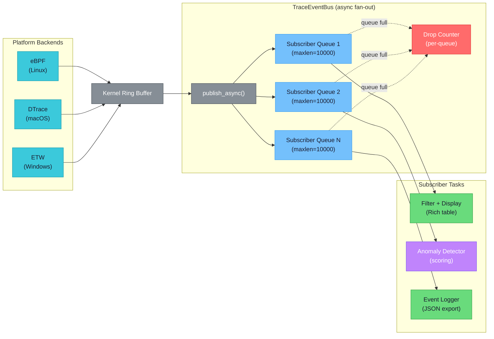

Each subscriber gets an independent async queue. Slow consumers don't block others --- when a queue is full, events are dropped (not backpressured) and the per-queue drop counter increments. Filters can be pushed down to the kernel backend (e.g., eBPF PID filtering) for efficiency.

### Application Instrumentation

| Feature | Description |
|---------|-------------|
| **Frida integration** | Attach/spawn, dynamic function hooking, JS script injection, memory read/write, module enumeration |
| **Binary analysis** | LIEF-based PE/ELF/Mach-O parsing --- sections, imports, exports, symbols, architecture detection |
| **Static reassembly** | Binary patching with trampoline injection: stolen-byte computation via Capstone, `.dvmon` section insertion, prologue redirection |
| **Pre-built scripts** | Process, file I/O, network, and API monitors; SSL pinning bypass for encrypted traffic analysis |

### VM State Imaging

| Feature | Description |
|---------|-------------|
| **QEMU/KVM** | libvirt API for VM enumeration, memory-inclusive snapshots, `virsh dump --memory-only` extraction |
| **VirtualBox** | `vboxmanage` CLI for VM listing, snapshots, `debugvm dumpvmcore` memory extraction |
| **VMware** | `vmrun` CLI for VM management, `.vmem` sidecar file extraction |

### Detection & Scanning

| Feature | Description |
|---------|-------------|
| **DKOM detection** | Cross-reference process lists from PsActiveProcessHead, CSRSS handles, PspCidTable, session lists |
| **Injection detection** | 12 MITRE T1055 sub-techniques: process hollowing, thread hijacking, PEB masquerading, RWX VAD analysis |
| **Hook detection** | SSDT hook detection, inline hook detection (JMP prologue patches) |
| **Encryption key recovery** | AES-128/256 key schedule detection, RSA private key structures, BitLocker FVEK signatures |
| **Anomaly scoring** | Heuristic feature analysis (RWX regions, unknown modules, heap entropy) with optional scikit-learn Isolation Forest |
| **IoC matching** | IP, domain, hash, URL, mutex, and string indicators against memory and file targets |

### Hardware-Assisted Memory Forensics

| Feature | Description |
|---------|-------------|
| **DMA acquisition (PCILeech)** | Non-cooperative physical memory capture over PCIe, Thunderbolt, or FireWire using FPGA boards (Screamer, SP605). Zero forensic footprint on the target; rootkits cannot intercept hardware DMA reads. Based on Ulf Frisk's PCILeech and leechcore library |
| **Cold boot capture** | DRAM remanence exploitation per Halderman et al. 2008 ("Lest We Remember"). Bit-decay confidence modeling as a function of temperature and elapsed time. DDR3/DDR4 memory controller descrambling per Bauer et al. 2016 |
| **JTAG extraction** | Boundary-scan memory reads from embedded, mobile, and IoT devices via OpenOCD, RIFF Box, or Easy-JTAG. Conforms to IEEE 1149.1 and NIST SP 800-101r1 physical extraction levels |
| **Chip-off / ISP** | Post-mortem NAND/eMMC raw imaging from desoldered flash chips or in-system programming probes. FTL reconstruction exposes wear-leveling residue and logically deleted pages invisible to filesystem tools |
| **GPU VRAM extraction** | CUDA `cuMemcpyDtoH` and OpenCL readback of GPU device memory. Recovers cryptocurrency wallet keys, ML model weights, rendered framebuffers, and hashcat residue that are invisible to CPU-side memory dumps |
| **SPI flash dumping** | Firmware image extraction via software (flashrom, CHIPSEC) or hardware (Bus Pirate, Dediprog, CH341A). Enables UEFI rootkit detection and firmware integrity verification |
| **Intel Processor Trace** | Branch-level execution recording via `perf_event_open()` and Intel `libipt` decoder. Invisible to and untamperable by malware; near-zero runtime overhead (Ge et al. ASPLOS 2017, "Griffin") |
| **ARM CoreSight** | Trace infrastructure for Cortex-A processors providing non-invasive instruction flow capture |
| **Live VM introspection** | LibVMI and DRAKVUF integration for transparent guest memory and register access via EPT-based invisible breakpoints (Lengyel et al. ACSAC 2014). Transforms VM analysis from passive snapshot to active real-time introspection |

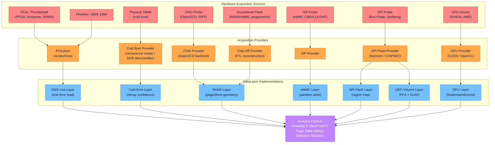

### Advanced Memory Analysis

| Feature | Description |
|---------|-------------|
| **Page table reconstruction** | Independent CR3 → PML4 → PDPT → PD → PT walk on raw physical memory, supporting 4K/2M/1G pages and 5-level (LA57) paging. Brute-force CR3 candidate scanning as fallback when OS structures are corrupted. Based on Intel SDM Vol. 3A Ch. 4 and Dolan-Gavitt's robust enumeration work |
| **Virtual address layer** | `DataLayer` implementation that transparently translates virtual address reads to physical, handling cross-page-boundary access. Enables per-process virtual address space analysis without Volatility |
| **Multi-encoding string carving** | Extract printable strings across ASCII, UTF-8, UTF-16LE/BE, Shift-JIS, EUC-KR, ISO-8859-1, and CP1252 with Shannon entropy pre-filtering to skip encrypted/compressed regions (threshold-configurable) |
| **TCP/IP stack reconstruction** | Network connection recovery via Windows pool tag scanning (TcpE, TcpL, UdpA) and Linux `inet_sock` signature matching. Extracts protocol, addresses, ports, TCP state, and owning PID |
| **Command history extraction** | Shell command recovery from memory for cmd.exe (UTF-16LE COMMAND_HISTORY), PowerShell (ConsoleHost/PSReadLine), and bash (HIST_ENTRY) via heuristic signature and command-pattern matching |

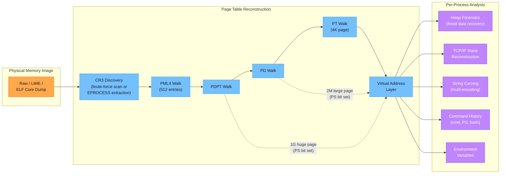

#### x86-64 Virtual Address Translation

Each virtual address is decomposed into index fields that walk the 4-level page table hierarchy. The PS (Page Size) bit at the PD or PDPT level short-circuits the walk for 2M or 1G large pages.

```text
 x86-64 Virtual Address (48-bit canonical form)
 ================================================================

  63        48 47    39 38    30 29    21 20    12 11         0
 +-----------+--------+--------+--------+--------+------------+
 | Sign Ext  | PML4   | PDPT   |   PD   |   PT   |   Offset   |
 | (copy of  | Index  | Index  | Index  | Index  |  (12 bits)  |
 |  bit 47)  | 9 bits | 9 bits | 9 bits | 9 bits |            |
 +-----------+---+----+---+----+---+----+---+----+------------+
                 |        |        |        |
    CR3 ------->+        |        |        |
                 v        |        |        |
              PML4 Table  |        |        |     Page Sizes:
              (512 entries)|       |        |     ============
                 |        v        |        |
                 +-->  PDPT Table  |        |     1G huge page
                    (512 entries)  |        |       = PDPT entry
                          |       v        |         with PS=1
                          +--> PD Table    |
                             (512 entries) |      2M large page
                                  |       v        = PD entry
                                  +--> PT Table      with PS=1
                                     (512 entries)
                                          |       4K standard
                                          v        = PT entry
                                     Physical        (normal)
                                      Address

 With LA57 (5-level paging):  adds PML5 index at bits [56:48]
```

### Firmware & Rootkit Detection

| Feature | Description |
|---------|-------------|
| **UEFI rootkit detection** | Signature scanning for known firmware implants (LoJax/APT28, MosaicRegressor) and rogue DXE drivers. Based on ESET 2018 and Kaspersky 2020 research |
| **Firmware integrity** | Compare extracted SPI flash contents against known-good hash databases. Verify BIOS write protection (CHIPSEC) and Secure Boot configuration |
| **Bootkit detection** | MBR/VBR integrity verification against known-good boot code templates. Detect INT 13h hooks and encrypted JMP sequences (TDL4, FinSpy). Maps to ATT&CK T1542.003 |
| **PatchGuard bypass detection** | Identify Windows KPP circumvention via `KiErrata` integrity checks, DPC routine validation, and `HalPrivateDispatchTable` modification scanning. Maps to ATT&CK T1562.001 |
| **Hypervisor rootkit detection** | Detect Blue Pill (Rutkowska 2006) and SubVirt (King et al. 2006) style thin hypervisors via VMCS signature scanning in physical memory, CPUID timing analysis, and unexpected VMX MSR values. Maps to ATT&CK T1564.006 |
| **Driver signature verification** | Cross-reference in-memory driver image hashes against known-good databases. Section-by-section integrity comparison detects runtime patching |

---

## Real-World Forensic Scenarios

### Scenario 1: Incident Response --- Memory Acquisition and Analysis

A SOC analyst receives an alert for suspicious PowerShell activity on a Windows server. Deep View acquires the system's physical memory, runs process enumeration and YARA scans to identify the malicious process, and generates an ATT&CK-mapped report.

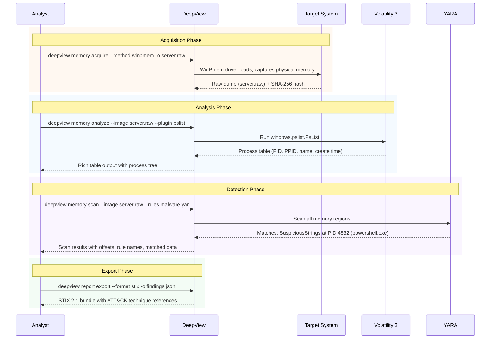

**Applicable techniques:** T1059.001 (PowerShell), T1003 (Credential Dumping), T1055 (Process Injection)

### Scenario 2: Malware Investigation --- Rootkit Detection

A threat hunter suspects a Linux server has been compromised by a kernel rootkit that hides processes using DKOM. Deep View cross-references multiple kernel data structures to reveal hidden processes.

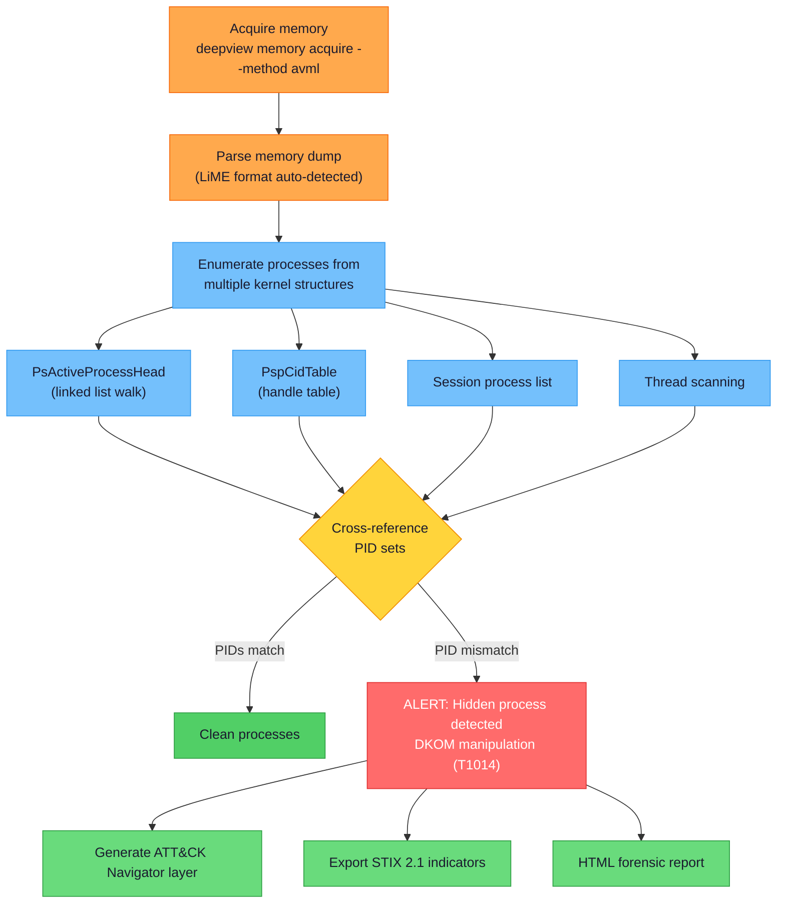

**Applicable techniques:** T1014 (Rootkit), T1574 (Hijack Execution Flow), T1562.001 (Disable Security Tools)

### Scenario 3: Live System Monitoring --- eBPF-Based Threat Hunting

An analyst monitors a potentially compromised Linux system in real time using eBPF probes to capture syscall activity, correlating process creation, network connections, and file access patterns.

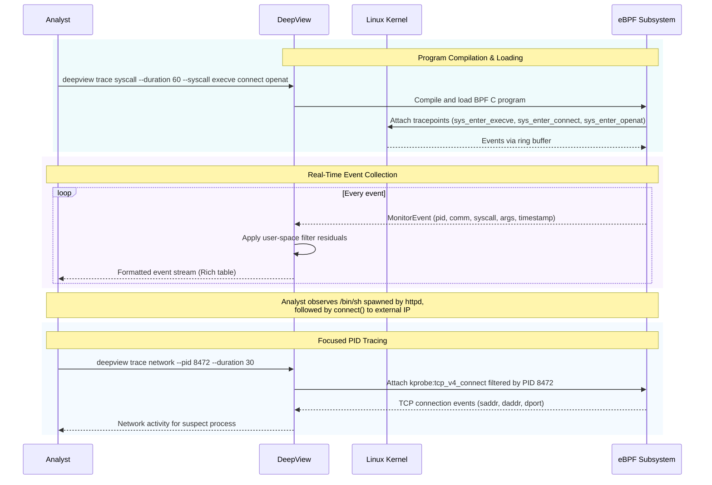

**Applicable techniques:** T1059.004 (Unix Shell), T1071.001 (Web Protocols), T1041 (Exfiltration Over C2)

### Scenario 4: Virtual Machine Forensics

An investigator needs to analyze a potentially compromised virtual machine without alerting the attacker. Deep View takes a live snapshot, extracts the memory, and performs offline analysis.

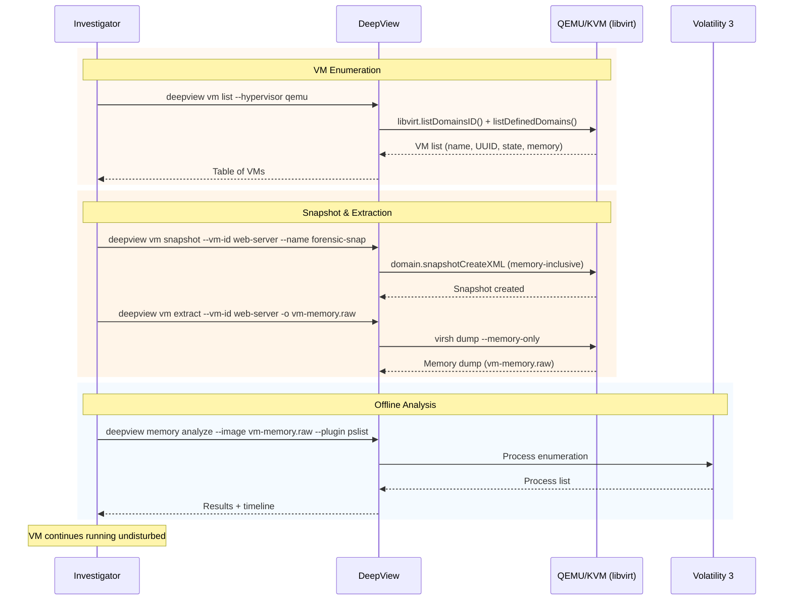

**Applicable techniques:** T1497 (Virtualization/Sandbox Evasion), T1078 (Valid Accounts)

### Scenario 5: Binary Analysis and Instrumentation

A malware analyst receives a suspicious ELF binary. Deep View analyzes its structure, identifies security-sensitive API calls, and creates an instrumented version that logs all function calls for dynamic analysis.

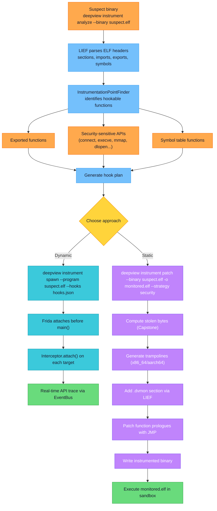

**Applicable techniques:** T1027 (Obfuscated Files), T1059 (Command Execution), T1055 (Process Injection)

### Scenario 6: Threat Intelligence Integration

After completing a forensic investigation, the analyst exports all findings to organizational threat intelligence platforms and generates ATT&CK coverage maps for the security team.

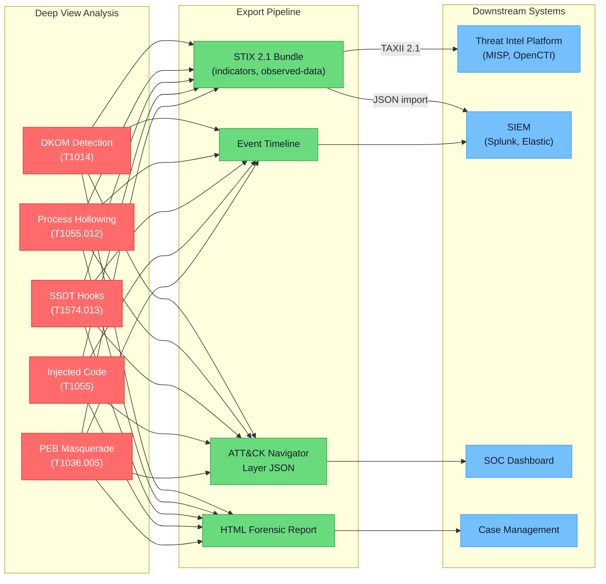

---

## Platform Support

| Capability | Linux | macOS | Windows |
|:-----------|:-----:|:-----:|:-------:|
| Memory acquisition | LiME, AVML, /proc/kcore | OSXPmem | WinPmem |
| DMA acquisition (PCILeech) | PCIe, Thunderbolt | Thunderbolt | PCIe, Thunderbolt |
| Cold boot capture | Yes | Yes | Yes |
| JTAG / chip-off / ISP | Yes | Yes | Yes |
| GPU VRAM extraction | CUDA, OpenCL | Metal, OpenCL | CUDA, OpenCL |
| SPI flash / firmware | flashrom, CHIPSEC | flashrom | CHIPSEC |
| Memory analysis (Volatility 3) | Yes | Yes | Yes |
| Memory analysis (MemProcFS) | Yes | Yes | Yes |
| Page table reconstruction | Yes | Yes | Yes |
| String carving (multi-encoding) | Yes | Yes | Yes |
| TCP/IP stack reconstruction | Yes | -- | Yes |
| Command history extraction | bash | bash | cmd, PowerShell |
| YARA scanning | Yes | Yes | Yes |
| System tracing | eBPF/BCC | DTrace | ETW |
| Intel Processor Trace | Broadwell+ | -- | -- |
| ARM CoreSight | Cortex-A | Apple Silicon | -- |
| Frida instrumentation | Yes | Yes | Yes |
| Binary analysis (LIEF) | ELF | Mach-O | PE |
| Binary reassembly | ELF | Mach-O | PE |
| VM connectors | QEMU/KVM, VBox, VMware | VBox, VMware | VBox, VMware |
| Live VM introspection (LibVMI) | KVM, Xen | -- | -- |
| DKOM detection | Yes | -- | Yes |
| Injection detection | Yes | Yes | Yes |
| Encryption key scanning | Yes | Yes | Yes |
| Rootkit detection (hypervisor, bootkit) | Yes | -- | Yes |
| Firmware / UEFI analysis | Yes | Yes | Yes |
| STIX 2.1 export | Yes | Yes | Yes |
| ATT&CK mapping | Yes | Yes | Yes |

---

## Quick Start

### Installation

```bash
# Core installation
pip install deepview

# With memory forensics support
pip install "deepview[memory]"

# With instrumentation support
pip install "deepview[instrumentation]"

# Hardware-assisted acquisition (DMA via PCILeech)
pip install "deepview[hardware]"

# Firmware / UEFI forensics
pip install "deepview[firmware]"

# GPU VRAM forensics
pip install "deepview[gpu]"

# ML-based anomaly detection
pip install "deepview[ml]"

# Full installation (all optional dependencies)
pip install "deepview[all]"

# Development installation
git clone <repo-url> && cd deepview
pip install -e ".[dev]"
```

### Basic Usage

```bash
# Check system capabilities
deepview doctor

# List installed plugins
deepview plugins

# Acquire memory from a live Linux system
sudo deepview memory acquire --method avml -o memory.raw

# Analyze a memory image
deepview memory analyze --image memory.raw --plugin pslist --engine volatility

# YARA scan a memory image
deepview memory scan --image memory.raw --rules /path/to/rules.yar

# Trace syscalls on a live system (Linux)
sudo deepview trace syscall --pid 1234 --duration 30

# Analyze a binary
deepview instrument analyze --binary /usr/bin/suspect

# Attach Frida to a running process
deepview instrument attach --pid 5678 --hooks hooks.json

# Patch a binary with monitoring hooks
deepview instrument patch --binary suspect --output monitored --strategy security

# List virtual machines
deepview vm list --hypervisor qemu

# Snapshot and extract VM memory
deepview vm snapshot --vm-id myvm --name forensic
deepview vm extract --vm-id myvm -o vm-memory.raw

# Generate reports
deepview report generate --template html -o report.html
deepview report export --format stix -o findings.json
deepview report timeline -o timeline.json
```

---

## CLI Reference

```
deepview [global-options] <command> [subcommand] [options]

Global Options:
  --config PATH              Configuration file
  --output-format FORMAT     json | table | csv | timeline
  --log-level LEVEL          debug | info | warning | error
  --plugin-path PATH         Additional plugin directories
  --no-color                 Disable colored output
  --version                  Show version

Commands:
  doctor                     Check system capabilities and tools
  plugins                    List installed plugins

  memory acquire             Acquire memory from live system or via hardware
  memory analyze             Run analysis plugin on memory image
  memory symbols             Manage kernel symbol tables
  memory scan                YARA scan on memory image
  memory strings             Carve strings (multi-encoding, entropy-filtered)
  memory pagetables          Walk page tables from CR3
  memory netstat             Reconstruct TCP/IP connections from memory
  memory history             Extract shell command history
  memory diff                Compare two memory snapshots
  memory baseline build      Build known-good memory profile
  memory baseline compare    Compare image against baseline

  trace syscall              Trace system calls
  trace network              Trace network activity
  trace filesystem           Trace file system operations
  trace process              Trace process creation/termination
  trace custom               Run custom eBPF/DTrace/ETW program

  instrument attach          Attach to running process (Frida)
  instrument spawn           Launch and instrument a program
  instrument patch           Static binary patching with hooks
  instrument analyze         Analyze binary structure (LIEF)

  vm list                    List virtual machines
  vm snapshot                Create VM snapshot
  vm extract                 Extract VM memory/state
  vm analyze                 Snapshot + analyze in one step
  vm introspect              Live VM memory read via LibVMI

  scan yara                  Run YARA rules against target
  scan ioc                   Run IoC indicator matching
  scan rules                 Manage YARA rule sets
  scan firmware              UEFI/SPI flash integrity check
  scan rootkit               Hypervisor, bootkit, PatchGuard detection

  report generate            Create HTML/Markdown report
  report timeline            Generate event timeline
  report export              Export STIX 2.1 / ATT&CK format
```

---

## Plugin System

Deep View uses a three-tier plugin discovery mechanism:

1. **Built-in plugins** --- ship with the package, registered via `@register_plugin` decorators
2. **Entry point plugins** --- third-party packages register via `[project.entry-points."deepview.plugins"]` in their `pyproject.toml`
3. **Directory plugins** --- Python files dropped into `~/.deepview/plugins/` or paths specified via `--plugin-path`

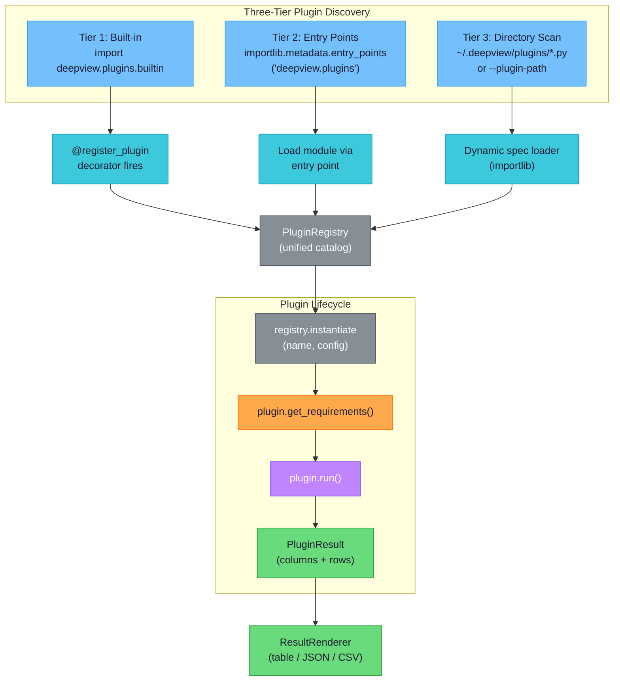

### Writing a Plugin

```python
from deepview.plugins.base import register_plugin
from deepview.interfaces.plugin import DeepViewPlugin, PluginResult, Requirement
from deepview.core.types import PluginCategory

@register_plugin(
    name="my_analysis",
    category=PluginCategory.MEMORY_ANALYSIS,
    description="Custom memory analysis plugin",
    tags=["custom", "analysis"],
)
class MyAnalysisPlugin(DeepViewPlugin):

    @classmethod
    def get_requirements(cls) -> list[Requirement]:
        return [
            Requirement(name="image_path", description="Path to memory image"),
        ]

    def run(self) -> PluginResult:
        image_path = self._config.get("image_path")
        # ... perform analysis using self._context ...
        return PluginResult(
            columns=["Finding", "Offset", "Severity"],
            rows=[{"Finding": "Example", "Offset": "0x1000", "Severity": "high"}],
        )
```

### Built-in Plugins

| Plugin | Category | Description |
|--------|----------|-------------|
| `pslist` | Memory Analysis | List processes from memory image (Volatility 3 / MemProcFS) |
| `netstat` | Network Forensics | Reconstruct TCP/UDP connections from kernel structures (Windows pool tags, Linux inet_sock) |
| `malfind` | Malware Detection | Detect suspicious memory regions, injected code, hollow processes |
| `dkom_detect` | Malware Detection | Detect hidden processes via kernel structure cross-referencing |
| `timeliner` | Timeline | Extract temporal artifacts across memory structures |
| `credentials` | Credentials | Extract password hashes, private keys, and session tokens |
| `pagetable_walk` | Memory Analysis | Walk x86-64 page tables (4/5-level) to enumerate virtual-to-physical mappings |
| `strings` | Memory Analysis | Carve printable strings across multiple encodings with entropy filtering |
| `command_history` | Artifact Recovery | Extract shell command history (cmd.exe, PowerShell, bash) from process memory |

---

## Detection Techniques

### MITRE ATT&CK Coverage

Deep View maps all detections to MITRE ATT&CK techniques and generates Navigator layers for visualization.

```mermaid
graph LR
    ROOT(("Deep View<br/>Detections")):::core

    subgraph DE["Defense Evasion"]
        T1014["T1014 Rootkit"]:::threat
        T1014a["DKOM hidden processes"]:::threat
        T1014b["Driver hiding"]:::threat
        T1014c["Driver signature mismatch"]:::threat
        T1055["T1055 Process Injection"]:::threat
        T1055_1["T1055.001 DLL Injection"]:::threat
        T1055_2["T1055.002 PE Injection"]:::threat
        T1055_3["T1055.003 Thread Hijacking"]:::threat
        T1055_4["T1055.004 APC Injection"]:::threat
        T1055_12["T1055.012 Process Hollowing"]:::threat
        T1055_13["T1055.013 Process Doppelganging"]:::threat
        T1055_14["T1055.014 VDSO Hijacking"]:::threat
        T1574["T1574 Hijack Execution Flow"]:::threat
        T1574_13["T1574.013 KernelCallbackTable"]:::threat
        T1574a["SSDT hooks"]:::threat
        T1574b["Inline hooks"]:::threat
        T1036["T1036.005 Match Legitimate Name"]:::threat
        T1036a["PEB masquerading"]:::threat
        T1562["T1562.001 Disable Security Tools"]:::threat
        T1562a["PatchGuard bypass detection"]:::threat
        T1564["T1564.006 Run Virtual Instance"]:::threat
        T1564a["Hypervisor rootkit detection"]:::threat
        T1564b["VMCS scanning"]:::threat
        T1564c["CPUID timing analysis"]:::threat
    end

    subgraph PE["Persistence"]
        T1542["T1542 Pre-OS Boot"]:::source
        T1542_1["T1542.001 System Firmware"]:::source
        T1542_1a["UEFI rootkit detection"]:::source
        T1542_1b["SPI flash integrity"]:::source
        T1542_3["T1542.003 Bootkit"]:::source
        T1542_3a["MBR/VBR integrity"]:::source
        T1542_3b["Boot code tampering"]:::source
    end

    subgraph CA["Credential Access"]
        KEYS["Encryption key recovery"]:::detect
        AES["AES-128/256 key schedules"]:::detect
        RSA["RSA private key structures"]:::detect
        BL["BitLocker FVEK"]:::detect
        DM["dm-crypt master keys"]:::detect
        TLS["TLS session keys"]:::detect
    end

    subgraph DI["Discovery"]
        PROC["Process enumeration"]:::analysis
        NETC["Network connections"]:::analysis
        MODS["Loaded modules"]:::analysis
        PTMAP["Page table mapping"]:::analysis
    end

    subgraph CO["Collection"]
        VOL["Volatile artifacts"]:::instrument
        CMDHIST["Command history"]:::instrument
        CLIP["Clipboard contents"]:::instrument
        ENVV["Environment variables"]:::instrument
    end

    ROOT --> DE
    ROOT --> PE
    ROOT --> CA
    ROOT --> DI
    ROOT --> CO

    T1014 --> T1014a & T1014b & T1014c
    T1055 --> T1055_1 & T1055_2 & T1055_3 & T1055_4
    T1055 --> T1055_12 & T1055_13 & T1055_14
    T1574 --> T1574_13 & T1574a & T1574b
    T1036 --> T1036a
    T1562 --> T1562a
    T1564 --> T1564a & T1564b & T1564c

    T1542 --> T1542_1 & T1542_3
    T1542_1 --> T1542_1a & T1542_1b
    T1542_3 --> T1542_3a & T1542_3b

    KEYS --> AES & RSA & BL & DM & TLS

    VOL --> CMDHIST & CLIP & ENVV

    classDef core fill:#868e96,stroke:#495057,color:#fff
    classDef threat fill:#ff6b6b,stroke:#e03131,color:#fff
    classDef source fill:#ffa94d,stroke:#f76707,color:#1a1a2e
    classDef detect fill:#c084fc,stroke:#7950f2,color:#fff
    classDef analysis fill:#74c0fc,stroke:#339af0,color:#1a1a2e
    classDef instrument fill:#3bc9db,stroke:#1098ad,color:#1a1a2e
```

### DKOM Detection

Direct Kernel Object Manipulation is detected by enumerating processes from independent kernel data structures and cross-referencing the results. A process visible in one structure but missing from another indicates deliberate hiding.

**Sources cross-referenced:**
- `PsActiveProcessHead` (doubly-linked list of `EPROCESS` structures)
- `PspCidTable` (handle table mapping PIDs to objects)
- `CSRSS` handle table (Windows session manager)
- Session process lists
- Desktop thread scanning (walk all threads, collect owning processes)

```text
 DKOM: How Hidden Processes Are Detected via Cross-Referencing
 =============================================================

 NORMAL STATE (all structures agree):

   PsActiveProcessHead:  [System] <-> [smss] <-> [csrss] <-> [malware] <-> [svchost] <-> ...
   PspCidTable:           PID 4 OK    PID 312 OK  PID 488 OK  PID 1337 OK  PID 672 OK
   CSRSS handles:         PID 4 OK    PID 312 OK  PID 488 OK  PID 1337 OK  PID 672 OK
   Thread scanning:       PID 4 OK    PID 312 OK  PID 488 OK  PID 1337 OK  PID 672 OK


 AFTER DKOM (attacker unlinks PID 1337 from PsActiveProcessHead):

   PsActiveProcessHead:  [System] <-> [smss] <-> [csrss] <-=========-> [svchost] <-> ...
                                                                ^
                                                      PID 1337 MISSING!

   PspCidTable:           PID 4 OK    PID 312 OK  PID 488 OK  PID 1337 OK  PID 672 OK
   CSRSS handles:         PID 4 OK    PID 312 OK  PID 488 OK  PID 1337 OK  PID 672 OK
   Thread scanning:       PID 4 OK    PID 312 OK  PID 488 OK  PID 1337 OK  PID 672 OK
                                                                ^^^^^^^^
                                                           STILL PRESENT!

   Result: PID 1337 found in PspCidTable + CSRSS + threads but NOT in
           PsActiveProcessHead --> DKOM DETECTED (MITRE ATT&CK T1014)
```

### Hook Detection & Trampoline Architecture

Deep View detects inline function hooks by scanning function prologues for unexpected JMP/CALL instructions. The following shows how a rootkit hooks a function and how Deep View's static binary patching uses the same trampoline technique for monitoring:

```text
 BEFORE HOOK (original function):                AFTER HOOK (rootkit-patched):
 ===================================             ===================================
 NtQuerySystemInformation:                       NtQuerySystemInformation:
   0x00: 4C 8B D1    mov r10, rcx                 0x00: E9 xx xx xx xx   jmp <detour>
   0x03: B8 36 00    mov eax, 0x36                 0x05: 00 00 00        <nop padding>
   0x06: 0F 05       syscall                       ...
   0x08: C3          ret
                                                  Detour Code (rootkit):
                                                    - Filter/modify results
                                                    - Call trampoline to run original

                                                  Trampoline (stolen bytes):
                                                    0x00: 4C 8B D1    mov r10, rcx  --|
                                                    0x03: B8 36 00    mov eax, 0x36    | stolen
                                                    0x06: E9 xx xx    jmp back (0x06) -|

 DETECTION: Scan prologue bytes for E9/FF/EB opcodes (JMP variants).
            If target address falls outside the owning module's range
            → flag as inline hook (T1574).
```

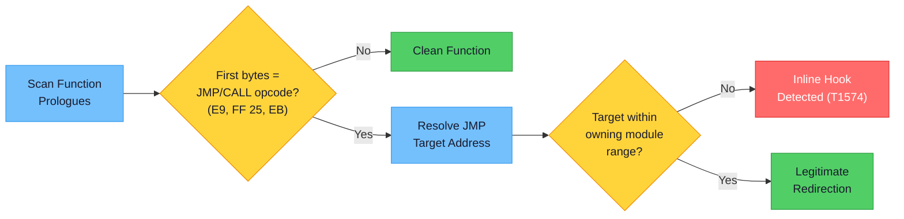

### Process Injection Detection

| Sub-technique | Detection Method |
|:-------------|:-----------------|
| Process Hollowing (T1055.012) | PEB `ImageBaseAddress` mismatch with actual mapped image base |
| Injected Code (T1055) | VAD entries with `PAGE_EXECUTE_READWRITE`, private, no file backing |
| Thread Hijacking (T1055.003) | Thread start address outside any known module's address range |
| PEB Masquerading (T1036.005) | PEB image path or command line inconsistent with on-disk binary |

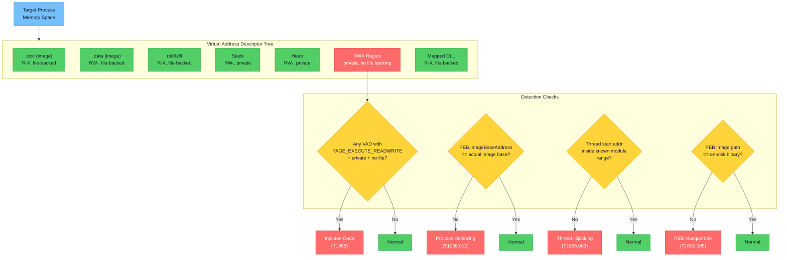

### Encryption Key Recovery

| Key Type | Detection Method |
|:---------|:----------------|
| AES-128/256 | Key schedule entropy analysis (expanded keys exhibit >6.0 bits/byte entropy with structural word relationships) |
| RSA Private Keys | ASN.1 DER sequence detection: `SEQUENCE { INTEGER(0), INTEGER(modulus), ... }` |
| BitLocker FVEK | `-FVE-FS-` signature scanning in memory |
| dm-crypt | Master key extraction from kernel `crypt_config` structures |

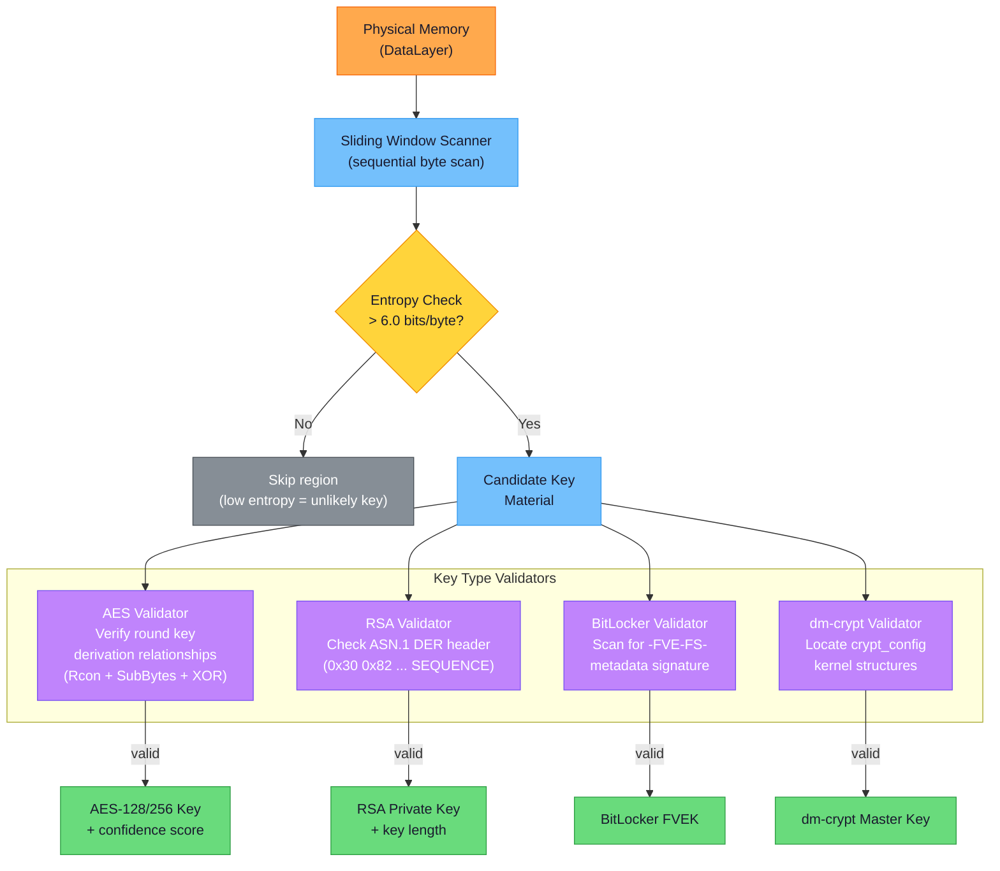

### Anomaly Scoring

Processes are scored on a 0.0 (normal) to 1.0 (highly anomalous) scale using weighted heuristics:

| Feature | Weight | Threshold |
|:--------|:------:|:----------|
| RWX memory regions | +0.15/region | Max 0.4 |
| Unknown modules | +0.10/module | Max 0.3 |
| Heap entropy | +0.20 | > 7.5 bits/byte |
| Handle count | +0.10 | > 10,000 |

Optional ML scoring via scikit-learn `IsolationForest` can supplement or replace heuristic scoring.

---

## YARA Rule Sets

Deep View ships with curated YARA rule sets for common forensic scenarios:

**`malware.yar`** --- General malware indicators
- Suspicious command strings (`cmd.exe /c`, `/bin/sh -c`, `powershell -enc`)
- Base64-encoded PE files
- Common shellcode byte patterns (NOP sleds, x86/x64 syscall sequences)

**`credentials.yar`** --- Credential material
- PEM-encoded private keys (RSA, EC, OpenSSH)
- AWS access key patterns (`AKIA[0-9A-Z]{16}`)
- Password/API key assignment patterns

**`exploits.yar`** --- Exploit tool indicators
- Process injection API combinations (`VirtualAllocEx` + `WriteProcessMemory` + `CreateRemoteThread`)
- Mimikatz string signatures
- Cobalt Strike Beacon indicators

---

## References

### Core Forensic Frameworks

| Tool | Description | Link |
|:-----|:------------|:-----|
| Volatility 3 | Open-source memory forensics framework | https://github.com/volatilityfoundation/volatility3 |
| MemProcFS | Memory Process File System --- analyze memory dumps as mounted filesystems | https://github.com/ufrisk/MemProcFS |
| Rekall | Memory forensics framework (legacy, read-only support) | https://github.com/google/rekall |
| YARA | Pattern matching for malware researchers | https://github.com/VirusTotal/yara |
| Frida | Dynamic instrumentation toolkit | https://frida.re |
| LIEF | Library to Instrument Executable Formats (PE, ELF, Mach-O) | https://lief-project.github.io |
| Capstone | Disassembly framework | https://www.capstone-engine.org |

### Memory Acquisition Tools

| Tool | Platform | Description | Link |
|:-----|:---------|:------------|:-----|
| LiME | Linux | Linux Memory Extractor kernel module | https://github.com/504ensicsLabs/LiME |
| AVML | Linux | Acquire Volatile Memory for Linux (Microsoft) | https://github.com/microsoft/avml |
| WinPmem | Windows | Windows physical memory acquisition | https://github.com/Velocidex/WinPmem |
| OSXPmem | macOS | macOS physical memory acquisition | https://github.com/google/rekall/tree/master/tools/osx/OSXPmem |
| PCILeech | Hardware | DMA-based memory acquisition via PCIe/Thunderbolt | https://github.com/ufrisk/pcileech |

### Kernel Tracing Technologies

| Technology | Platform | Description | Link |
|:-----------|:---------|:------------|:-----|
| eBPF | Linux | Extended Berkeley Packet Filter for kernel tracing | https://ebpf.io |
| BCC | Linux | BPF Compiler Collection (Python bindings) | https://github.com/iovisor/bcc |
| DTrace | macOS/Solaris | Dynamic tracing framework | https://dtrace.org |
| ETW | Windows | Event Tracing for Windows | https://learn.microsoft.com/en-us/windows/win32/etw/about-event-tracing |

### Threat Intelligence Standards

| Standard | Description | Link |
|:---------|:------------|:-----|
| STIX 2.1 | Structured Threat Information Expression | https://oasis-open.github.io/cti-documentation/stix/intro.html |
| TAXII 2.1 | Trusted Automated Exchange of Intelligence Information | https://oasis-open.github.io/cti-documentation/taxii/intro.html |
| MITRE ATT&CK | Adversarial Tactics, Techniques, and Common Knowledge | https://attack.mitre.org |
| ATT&CK Navigator | Web app for annotating and exploring ATT&CK matrices | https://mitre-attack.github.io/attack-navigator |
| Sigma | Generic signature format for SIEM systems | https://github.com/SigmaHQ/sigma |

### Symbol and Debug Information

| Tool | Description | Link |
|:-----|:------------|:-----|
| dwarf2json | Convert DWARF debug info to Volatility 3 ISF | https://github.com/volatilityfoundation/dwarf2json |
| Volatility 3 Symbol Tables | Pre-built ISF files for common OS kernels | https://github.com/volatilityfoundation/volatility3#symbol-tables |
| Microsoft Symbol Server | PDB symbols for Windows binaries | https://learn.microsoft.com/en-us/windows/win32/dxtecharts/debugging-with-symbols |

### Virtualization APIs

| API | Description | Link |
|:----|:------------|:-----|
| libvirt | Virtualization management API (QEMU/KVM, Xen) | https://libvirt.org |
| VBoxManage | VirtualBox command-line interface | https://www.virtualbox.org/manual/ch08.html |
| vmrun | VMware Workstation/Fusion CLI | https://docs.vmware.com/en/VMware-Workstation-Pro/17/com.vmware.ws.using.doc/GUID-532F4BE3-1E67-4B34-9D7A-6C205DFE8E37.html |
| LibVMI | Virtual Machine Introspection library | https://github.com/libvmi/libvmi |

### Research Papers and Resources

| Title | Authors / Source | Relevance |
|:------|:-----------------|:----------|
| *The Art of Memory Forensics* | Ligh, Case, Levy, Walters (2014) | Definitive reference for Windows/Linux/macOS memory analysis |
| *Volatility 3: The Next Generation of Memory Forensics* | Volatility Foundation | Architecture and plugin design for Volatility 3 |
| *MemProcFS: Memory Process File System* | Ulf Frisk | Filesystem-based approach to memory forensics; scatter-read optimization |
| *DKOM: Direct Kernel Object Manipulation* | Various | Techniques for hiding processes, drivers, and connections in kernel memory |
| *Process Injection Techniques --- Gotta Catch Them All* | Elastic Security | Comprehensive survey of T1055 sub-techniques |
| *BPF Performance Tools* | Brendan Gregg (2019) | eBPF tracing patterns and BCC tooling |
| *Finding Encryption Keys in Memory* | Various forensic researchers | AES key schedule detection, RSA structure identification |
| MITRE ATT&CK for Enterprise | MITRE Corporation | Framework for adversary tactics and techniques | 

### Related Forensic Tools

| Tool | Description | Link |
|:-----|:------------|:-----|
| Plaso / log2timeline | Super timeline creation from multiple log sources | https://github.com/log2timeline/plaso |
| Autopsy / Sleuth Kit | Digital forensics platform (disk forensics) | https://www.sleuthkit.org |
| GRR Rapid Response | Remote live forensics for incident response | https://github.com/google/grr |
| Velociraptor | Endpoint visibility and digital forensics | https://github.com/Velocidex/velociraptor |
| MISP | Malware Information Sharing Platform | https://www.misp-project.org |
| OpenCTI | Open Cyber Threat Intelligence Platform | https://github.com/OpenCTI-Platform/opencti |
| ClamAV | Open-source antivirus engine | https://www.clamav.net |
| FLOSS | FLARE Obfuscated String Solver | https://github.com/mandiant/flare-floss |
| angr | Binary analysis platform (symbolic execution) | https://angr.io |
| PANDA | Platform for Architecture-Neutral Dynamic Analysis | https://github.com/panda-re/panda |
| Ghidra | NSA reverse engineering framework | https://ghidra-sre.org |

---

## Configuration

Deep View reads configuration from `~/.deepview/config.toml`:

```toml
[general]
log_level = "info"
output_format = "table"
plugin_paths = ["~/.deepview/plugins"]

[memory]
default_engine = "volatility"   # or "memprocfs"
symbol_cache_dir = "~/.deepview/symbols"
yara_rules_dir = "~/.deepview/rules"

[memory.acquisition]
default_method = "auto"
compress = true

[tracing]
default_duration = 30
ring_buffer_pages = 64

[reporting]
default_template = "html"
output_dir = "~/.deepview/reports"
```

Environment variables override config file values with the `DEEPVIEW_` prefix (e.g., `DEEPVIEW_LOG_LEVEL=debug`).

---

## License

MIT
