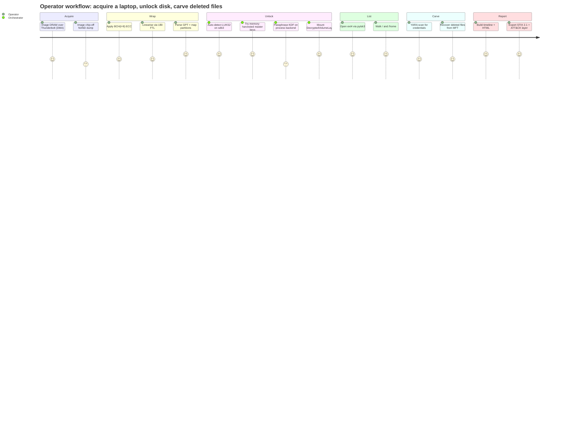

# Deep View

**Cross-platform computer system forensics and runtime analysis toolkit**

[](LICENSE)
[](pyproject.toml)
[](pyproject.toml)
[](pyproject.toml)
[](.github/workflows)

[](docs/overview/data-layer-composition.md)

---

## What is Deep View

Deep View is a forensics and runtime-analysis framework that unifies **memory imaging**, **runtime tracing**, and **storage forensics** behind a single `deepview` CLI and a composable Python API. It ships as a pure-Python core with optional native extras, so a minimal install still boots and `deepview doctor` still runs; every heavy dependency (Volatility 3, MemProcFS, Frida, LIEF, BCC, pytsk3, cryptsetup, leechcore, ...) is lazy-imported inside the subsystem that needs it.

**Memory imaging.** Deep View acquires from live Linux / macOS / Windows systems (LiME, AVML, WinPmem, OSXPmem, `/proc/kcore`), from virtual machines (QEMU/KVM, VirtualBox, VMware), from hardware probes (PCILeech DMA over PCIe/Thunderbolt/FireWire, cold-boot, JTAG, chip-off, SPI), and from remote hosts over SSH, TCP/UDP, gRPC, IPMI, and Intel AMT. Dumps are analysed through dual engines — Volatility 3 as an in-process library (not a subprocess) and MemProcFS for scatter-read performance — plus an independent page-table walker, a multi-encoding string carver with entropy filtering, TCP/IP stack reconstruction, and shell-history recovery across cmd / PowerShell / bash.

**Runtime tracing.** On Linux, eBPF/BCC programs attach to tracepoints and feed a platform-independent `MonitorEvent` schema through an async `TraceEventBus` with bounded per-subscriber queues (drops-on-overflow, never back-pressures). DTrace and ETW providers do the same on macOS and Windows. A YAML `Ruleset` classifies events, a `SessionRecorder` persists them to SQLite (WAL + JSON columns) for replay, a `CircularEventBuffer` keeps pre-event context for critical hits, and a Rich-based multi-panel dashboard renders it all live. A separate NFQUEUE-backed mangle engine can drop / delay / rewrite / corrupt packets under a YAML ruleset for authorised offensive/defensive testing.

**Storage forensics.** A composable data-layer stack walks raw NAND dumps through optional ECC (Hamming / BCH / Reed-Solomon), FTL translation (UBI, JFFS2, MTD, bad-block, eMMC hints, UFS), partition tables (MBR / GPT), and filesystem adapters (pure-Python FAT, NTFS-native, TSK-backed ext/APFS/XFS/Btrfs/F2FS/HFS, ZFS skeleton). An encrypted-container unlock orchestrator auto-detects LUKS1/LUKS2, BitLocker, FileVault2, VeraCrypt, and TrueCrypt, and tries master-keys harvested from memory, keyfiles, and passphrases in that order — passphrase KDFs (PBKDF2-SHA256, Argon2id, SHA-512-iter) are routed through a dedicated **offload engine** with thread / process / OpenCL / CUDA / remote backends so the caller thread never blocks.

---

## 60-second tour

[](docs/casts/00-doctor.cast)

```bash
# 1. Install Deep View with memory + storage + containers extras
pip install "deepview[memory,storage,containers]"

# 2. Probe what the local environment can do
deepview doctor

# 3. Acquire a memory dump, carve strings, detect keys, export STIX
sudo deepview memory acquire --method avml -o /tmp/mem.raw
deepview memory analyze --image /tmp/mem.raw --plugin pslist
deepview memory scan --image /tmp/mem.raw --rules rules/credentials.yar
deepview report export --format stix -o findings.json
```

Full walkthroughs live under [`docs/guides/`](docs/guides/) and every CLI flag is catalogued in [`docs/reference/cli.md`](docs/reference/cli.md).

---

## Architecture

Deep View wires every subsystem through an `AnalysisContext` that owns the config tree, the event bus, the layer registry, the plugin registry, and lazy handles to the storage manager, offload engine, and unlock orchestrator. CLI commands construct the context once in `cli/app.py` and stash it on the Click object; subcommands and plugins pull it back out.

```mermaid
graph TB
    CLI["CLI Interface<br/>(Click + Rich)"]:::core
    CTX["Analysis Context"]:::core
    EB["Event Bus<br/>(Pub/Sub)"]:::core

    subgraph Core["Core Framework"]
        CTX
        EB
        CFG["Config<br/>(Pydantic)"]:::core
        PLT["Platform<br/>Detection"]:::core
        PR["Plugin Registry<br/>(3-tier discovery)"]:::core
    end

    subgraph Memory["Memory Forensics"]
        MM["Memory Manager"]:::analysis
        ACQ["Acquisition<br/>LiME | AVML | WinPmem | OSXPmem"]:::source
        FMT["Format Parsers<br/>Raw | LiME | ELF Core | Crashdump | Minidump | vmem | vbox-sav | vmrs"]:::analysis
        VOL["Volatility 3<br/>Engine"]:::analysis
        MPF["MemProcFS<br/>Engine"]:::analysis
        PTW["Page Table Walker<br/>(CR3 → PML4 → PT)"]:::analysis
        VAL["Virtual Address Layer"]:::analysis
    end

    subgraph Hardware["Hardware-Assisted Extraction"]
        DMA["DMA Acquisition<br/>(PCILeech, Thunderbolt, FireWire)"]:::hardware
        CB["Cold Boot<br/>(DRAM remanence)"]:::hardware
        JTAG["JTAG / Chip-Off / ISP"]:::hardware
        SPI["SPI Flash<br/>(Bus Pirate, Dediprog)"]:::hardware
        GPUH["GPU Memory<br/>(CUDA, OpenCL)"]:::hardware
    end

    subgraph Remote["Remote Acquisition"]
        REF["RemoteProviderFactory"]:::remote
        RSSH["SSH + dd"]:::remote
        RTCP["TCP / UDP<br/>stream"]:::remote
        RAGT["gRPC Agent"]:::remote
        RLR["LiME-remote"]:::remote
        RDMA["DMA: TB / PCIe / FW"]:::remote
        RIPMI["IPMI / AMT"]:::remote
        AUTH["AuthorizationGate<br/>(--confirm + --authorization-statement)"]:::core
    end

    subgraph Storage["Storage Stack"]
        SM["Storage Manager"]:::storage
        FS["Filesystems<br/>fat-native | tsk | apfs | ntfs-native<br/>xfs | btrfs | f2fs | hfs | ext | zfs-skel"]:::storage
        ECC["ECC Codecs<br/>Hamming | BCH | Reed-Solomon"]:::storage
        FTL["FTL Translators<br/>UBI | JFFS2 | MTD | bad-block | eMMC | UFS"]:::storage
        ENC["Encodings<br/>Xpress | WKdm | zram | zswap | swap"]:::storage
        PART["Partitions<br/>MBR | GPT"]:::storage
        AUTO["Auto-Probe"]:::storage
    end

    subgraph Containers["Container Unlock"]
        UO["Unlock Orchestrator"]:::container
        LUKS["LUKS1 / LUKS2"]:::container
        BDE["BitLocker"]:::container
        FVDE["FileVault2"]:::container
        VC["VeraCrypt / TrueCrypt"]:::container
        KS["KeySource<br/>MasterKey | Keyfile | Passphrase"]:::container
        DVL["DecryptedVolumeLayer"]:::container
    end

    subgraph Offload["Offload Engine"]
        OE["OffloadEngine"]:::offload
        OBT["Thread Pool"]:::offload
        OBP["Process Pool<br/>(default)"]:::offload
        OCL["GPU OpenCL"]:::offload
        OCU["GPU CUDA"]:::offload
        ORM["Remote stub"]:::offload
        KDF["KDFs<br/>PBKDF2 | Argon2id | SHA512-iter"]:::offload
    end

    subgraph Tracing["System Tracing"]
        TM["Trace Manager"]:::instrument
        BPF["eBPF / BCC (Linux)"]:::instrument
        DT["DTrace (macOS)"]:::instrument
        ETW["ETW (Windows)"]:::instrument
        IPT["Intel PT / ARM CoreSight"]:::instrument
        TEB["Trace Event Bus<br/>(bounded async queues)"]:::instrument
        CLS["Classifier<br/>(YAML Ruleset)"]:::instrument
        REC["Session Recorder<br/>(SQLite WAL)"]:::instrument
    end

    subgraph Instrument["Instrumentation"]
        IM["Instrumentation Manager"]:::instrument
        FE["Frida Engine"]:::instrument
        BA["Binary Analyzer (LIEF)"]:::instrument
        RE["Reassembler<br/>(trampoline injection)"]:::instrument
    end

    subgraph VM["VM Introspection"]
        VMM["VM Manager"]:::analysis
        QEMU["QEMU/KVM"]:::analysis
        VBOX["VirtualBox"]:::analysis
        VMW["VMware"]:::analysis
        VMI["LibVMI / DRAKVUF"]:::analysis
    end

    subgraph Detection["Detection & Scanning"]
        AF["Anti-Forensics<br/>(DKOM, hooks, PatchGuard)"]:::detect
        INJ["Injection Detection (T1055)"]:::detect
        EK["Key Scanner<br/>AES | RSA | BitLocker | TLS"]:::detect
        AD["Anomaly Detection<br/>(heuristic + ML)"]:::detect
        RK["Rootkit Detection"]:::detect
        YS["YARA Scanner"]:::detect
        SC["String Carver"]:::detect
        IOC["IoC Engine"]:::detect
    end

    subgraph Artifacts["Volatile Artifact Recovery"]
        TCP["TCP/IP Stack Reconstruction"]:::detect
        CMD["Command History"]:::detect
        FW["Firmware / UEFI"]:::detect
    end

    subgraph Reporting["Reporting & Export"]
        RE2["Report Engine<br/>(HTML / Markdown / JSON)"]:::report
        TL["Timeline Builder"]:::report
        STIX["STIX 2.1 Export"]:::report
        ATT["ATT&CK Mapper"]:::report
    end

    CLI --> CTX
    CTX --> MM & TM & IM & VMM & SM & UO & OE & PR
    MM --> ACQ & FMT & VOL & MPF & PTW
    PTW --> VAL
    Hardware --> MM
    Remote --> MM
    REF --> RSSH & RTCP & RAGT & RLR & RDMA & RIPMI
    RSSH & RTCP & RAGT & RLR & RDMA & RIPMI --> AUTH

    SM --> FS & ECC & FTL & ENC & PART & AUTO
    UO --> LUKS & BDE & FVDE & VC
    UO --> KS
    UO --> DVL
    UO -->|"passphrase KDF"| OE
    OE --> OBT & OBP & OCL & OCU & ORM
    OE --> KDF

    TM --> BPF & DT & ETW & IPT & TEB
    TEB --> CLS --> REC
    IM --> FE & BA & RE
    VMM --> QEMU & VBOX & VMW & VMI

    MM --> YS & SC & AF & INJ & EK & RK & TCP & CMD
    FS --> YS
    DVL --> FS
    AF & INJ & RK & EK --> ATT
    AF & INJ & RK & EK --> STIX
    TL --> RE2

    classDef core fill:#585b70,stroke:#89b4fa,color:#cdd6f4
    classDef analysis fill:#74c7ec,stroke:#89dceb,color:#1e1e2e
    classDef source fill:#fab387,stroke:#f9e2af,color:#1e1e2e
    classDef hardware fill:#f38ba8,stroke:#eba0ac,color:#1e1e2e
    classDef instrument fill:#94e2d5,stroke:#89dceb,color:#1e1e2e
    classDef detect fill:#cba6f7,stroke:#b4befe,color:#1e1e2e
    classDef report fill:#a6e3a1,stroke:#94e2d5,color:#1e1e2e
    classDef storage fill:#f9e2af,stroke:#f5c2e7,color:#1e1e2e
    classDef container fill:#eba0ac,stroke:#f38ba8,color:#1e1e2e
    classDef offload fill:#b4befe,stroke:#89b4fa,color:#1e1e2e
    classDef remote fill:#f5c2e7,stroke:#cba6f7,color:#1e1e2e
```



### Data-layer composition

The unifying abstraction is `DataLayer` — a byte-addressed source with `read` / `write` / `is_valid` / `scan`. Layers **stack**: the top layer presents a clean address space while the bottom layer holds raw bytes. A single `DecryptedVolumeLayer` mounted on top of an `ECCDataLayer` mounted on top of a raw NAND dump turns into a filesystem you can `ls`.

```mermaid
graph LR
    RAW["Raw NAND<br/>(chip-off dump)"]:::source
    ECC["ECCDataLayer<br/>(BCH / RS decode)"]:::storage
    FTL["LinearizedFlashLayer<br/>(UBI / JFFS2)"]:::storage
    PART["PartitionLayer<br/>(MBR / GPT)"]:::storage
    DEC["DecryptedVolumeLayer<br/>(LUKS2 / BitLocker)"]:::container
    FS["Filesystem<br/>(ext4 / NTFS)"]:::storage
    FILE["File bytes"]:::report

    RAW --> ECC --> FTL --> PART --> DEC --> FS --> FILE

    classDef source fill:#fab387,stroke:#f9e2af,color:#1e1e2e
    classDef storage fill:#f9e2af,stroke:#f5c2e7,color:#1e1e2e
    classDef container fill:#eba0ac,stroke:#f38ba8,color:#1e1e2e
    classDef report fill:#a6e3a1,stroke:#94e2d5,color:#1e1e2e
```



More detail in [`docs/overview/data-layer-composition.md`](docs/overview/data-layer-composition.md).

---

## Subsystem capability matrices

### Memory imaging

| Format | Typical source | Parser |
|--------|----------------|--------|
| `raw` | `dd`, AVML, WinPmem | `memory/formats/raw.py` |
| `lime` | LiME kernel module | `memory/formats/lime_format.py` |
| `elf_core` | Linux `/proc/kcore`, `gcore` | `memory/formats/elf_core.py` |
| `crashdump` | Windows BSOD `MEMORY.DMP` | `memory/formats/crashdump.py` |
| `hibernation` | `hiberfil.sys` | `memory/formats/hibernation.py` |
| `minidump_full` | Full user-mode minidump | `memory/formats/minidump.py` |
| `vmem` | VMware sidecar | `memory/formats/vmem.py` |
| `vbox-sav` | VirtualBox saved state | `memory/formats/vbox_sav.py` |
| `vmrs` | Hyper-V VM runtime state | `memory/formats/vmrs.py` |

| Acquisition provider | Platform | Module |
|----------------------|----------|--------|
| AVML | Linux | `memory/acquisition/avml.py` |
| LiME | Linux | `memory/acquisition/lime.py` |
| WinPmem | Windows | `memory/acquisition/winpmem.py` |
| OSXPmem | macOS | `memory/acquisition/osxpmem.py` |
| Live `/proc/kcore`, `/dev/mem` | Linux | `memory/acquisition/live.py` |

See [`docs/architecture/memory.md`](docs/architecture/memory.md).

### Storage stack

| Filesystem | Backing library | Read | Carve | Notes |
|------------|-----------------|:----:|:-----:|-------|
| `fat-native` | pure Python | yes | yes | stdlib-only |
| `tsk` | `pytsk3` | yes | yes | ext2/3/4, HFS+, ISO9660 fallthrough |
| `apfs` | `pyfsapfs` | yes | yes | snapshots + clones |
| `ntfs_native` | pure Python | yes | yes | MFT + `$LogFile` + ADS |
| `xfs` | `pyfsxfs` | yes | yes | v5 CRC-enabled |
| `btrfs` | `pyfsbtrfs` | yes | partial | subvol awareness |
| `f2fs` | `pyfsf2fs` | yes | partial | NAT + SIT walk |
| `hfs` | `pyfshfs` | yes | yes | HFS+ / HFSX |
| `ext` | `pyfsext` | yes | yes | ext2/3/4 |
| `zfs` | (skeleton) | no | no | placeholder only — see roadmap |

| ECC codec | Correction | Module |
|-----------|------------|--------|
| `hamming` | 1-bit correct, 2-bit detect | `storage/ecc/hamming.py` |
| `bch` | configurable `t`-error, via `galois` | `storage/ecc/bch.py` |
| `reed_solomon` | RS(n,k), via `reedsolo` | `storage/ecc/reed_solomon.py` |

| FTL translator | Targets | Module |
|----------------|---------|--------|
| `ubi` | UBI volumes on MTD | `storage/ftl/ubi.py` |
| `jffs2` | JFFS2 nodes | `storage/ftl/jffs2.py` |
| `mtd` | raw MTD / NOR linearisation | `storage/ftl/mtd.py` |
| `badblock` | bad-block table handling | `storage/ftl/badblock.py` |
| `emmc_hints` | eMMC metadata hints | `storage/ftl/emmc_hints.py` |
| `ufs` | UFS layout | `storage/ftl/ufs.py` |

| Encoding | Use | Module |
|----------|-----|--------|
| `xpress` | Windows hibernation + standby | `storage/encodings/xpress.py` |
| `wkdm` | macOS compressed memory | `storage/encodings/wkdm.py` |
| `zram` / `zswap` | Linux compressed swap | `storage/encodings/zram.py` |
| `swap` | Raw swap carving | `storage/encodings/swap.py` |
| `standby_compression` | Windows standby list | `storage/encodings/standby.py` |

| Partition scheme | Module |
|------------------|--------|
| MBR | `storage/partition/mbr.py` |
| GPT | `storage/partition/gpt.py` |

See [`docs/architecture/storage.md`](docs/architecture/storage.md).

### Container unlock

| Adapter | Formats | Detection | Module |
|---------|---------|-----------|--------|
| `luks` | LUKS1, LUKS2 | `LUKS` magic + JSON header | `storage/containers/luks.py` |
| `bitlocker` | Windows Vista+ (`FVE-FS`) | `libbde-python` | `storage/containers/bitlocker.py` |
| `filevault2` | APFS + Core Storage | `libfvde-python` | `storage/containers/filevault2.py` |
| `veracrypt` | VeraCrypt + TrueCrypt, hidden | trailing-offset probe | `storage/containers/veracrypt.py` |

| KeySource | Origin | KDF cost |
|-----------|--------|----------|
| `MasterKey` | Memory-harvested key | none |
| `Keyfile` | File bytes | none or cheap hash |
| `Passphrase` | Operator input | routed to `OffloadEngine` |

| Cipher mode | Supported containers |
|-------------|---------------------|
| AES-XTS | LUKS2, VeraCrypt, BitLocker |
| AES-CBC (ESSIV) | LUKS1 |
| AES-XEX | BitLocker (legacy) |
| Serpent / Twofish cascades | VeraCrypt |
| AES-XTS + AF-split | LUKS anti-forensic splitter |

See [`docs/architecture/containers.md`](docs/architecture/containers.md).

### Offload

| Backend | Registration | Capabilities |
|---------|--------------|--------------|
| `thread` | always (stdlib) | I/O-bound work, non-picklable payloads |
| `process` | **default** (stdlib) | CPU-bound KDFs |
| `gpu-opencl` | on probe success | PBKDF2 dictionary sweeps |
| `gpu-cuda` | on probe success | PBKDF2 dictionary sweeps (CUDA path) |
| `remote` | stub | placeholder for grid dispatch |

| KDF | Backend fast path | Module |
|-----|------------------|--------|
| `pbkdf2_sha256` | process / OpenCL / CUDA | `offload/kdf/pbkdf2.py` |
| `argon2id` | process (CPU only — GPU punted) | `offload/kdf/argon2id.py` |
| `sha512_iter` | process | `offload/kdf/sha512_iter.py` |

Submit / completion both publish `OffloadJobSubmittedEvent` and `OffloadJobCompletedEvent` on the context bus — dashboards and replay recorders subscribe for free. See [`docs/architecture/offload.md`](docs/architecture/offload.md).

### Remote acquisition

Every remote provider is gated by `--confirm` and `--authorization-statement`; DMA transports additionally require `--enable-dma` plus root. Default fails closed.

| Transport | Provider | Requires | Extras |
|-----------|----------|----------|--------|
| `ssh-dd` | `ssh_dd.py` | SSH creds + target sudo | `paramiko` |
| `tcp` | `tcp_stream.py` | TCP listener on target | stdlib |
| `udp` | `tcp_stream.py` (UDP mode) | UDP listener + framing | stdlib |
| `network-agent` | `network_agent.py` | deployed gRPC agent | `grpcio` |
| `lime-remote` | `lime_remote.py` | LiME module loaded on target | stdlib |
| `dma-tb` | `dma_thunderbolt.py` | TB cable + FPGA + **root + IOMMU off** | `leechcore` |
| `dma-pcie` | `dma_pcie.py` | PCIe card (Screamer, SP605) + **root** | `leechcore` |
| `dma-fw` | `dma_firewire.py` | FireWire cable + OHCI + **root** | `forensic1394` |
| `ipmi` | `ipmi.py` | BMC IPMI credentials | `python-ipmi` |
| `amt` | `intel_amt.py` | Intel AMT provisioned | stdlib + TLS |

See [`docs/architecture/remote-acquisition.md`](docs/architecture/remote-acquisition.md).

---

## CLI surface

Every command is documented with flags at [`docs/reference/cli.md`](docs/reference/cli.md).

| Command group | Purpose | Key subcommands |
|---------------|---------|-----------------|
| `dashboard` | Multi-panel Rich live dashboard | `run`, `layouts`, `show` |
| `disassemble` | Capstone / Ghidra / Hopper | `function`, `cfg` |
| `doctor` | Environment capability probe | — |
| `filesystem` | Browse mounted layers | `ls`, `cat`, `stat`, `carve` |
| `inspect` | Live-process primitives | `process`, `mem`, `file`, `net` |
| `instrument` | Frida + static patcher | `attach`, `spawn`, `patch`, `analyze` |
| `memory` | Acquire + analyse dumps | `acquire`, `analyze`, `scan`, `strings`, `pagetables`, `netstat`, `history`, `baseline`, `diff` |
| `monitor` | Long-running live trace + classify | `start`, `stop`, `status` |
| `netmangle` | NFQUEUE packet mangling | `run`, `validate`, `status` |
| `offload` | Submit / benchmark backends | `submit`, `bench`, `status` |
| `plugins` | List + inspect registry | — |
| `remote-image` | Remote memory acquisition | `ssh`, `tcp`, `dma-tb`, `dma-pcie`, `ipmi`, `amt`, `agent` |
| `replay` | Replay recorded sessions | `list`, `play`, `export` |
| `report` | HTML / STIX / ATT&CK | `generate`, `timeline`, `export` |
| `scan` | YARA / IoC / rootkit / firmware | `yara`, `ioc`, `rules`, `firmware`, `rootkit` |
| `storage` | Wrap NAND + probe | `list`, `wrap`, `probe` |
| `trace` | Ad-hoc live tracing | `syscall`, `network`, `filesystem`, `process`, `custom` |
| `unlock` / `unlock-native` / `unlock-veracrypt` | Container unlock paths | `detect`, `luks`, `bitlocker`, `filevault2`, `veracrypt`, `auto` |
| `vm` | Hypervisor snapshots | `list`, `snapshot`, `extract`, `analyze`, `introspect` |

---

## Examples gallery

### Memory acquisition + pslist

```bash
sudo deepview memory acquire --method avml -o /var/evidence/mem.raw
deepview memory analyze --image /var/evidence/mem.raw --plugin pslist --engine volatility
```

### YARA scan with bundled credential rules

```bash
deepview memory scan \
    --image /var/evidence/mem.raw \
    --rules rules/credentials.yar \
    --output-format json
```

### Reconstruct TCP/IP stack and carve shell history

```bash
deepview memory netstat --image /var/evidence/mem.raw
deepview memory history --image /var/evidence/mem.raw --shell powershell
```

### Wrap a raw NAND dump and list the root filesystem

```bash
deepview storage wrap \
    --layer /evidence/chipoff.bin \
    --geometry 4096,128,2048 \
    --ecc bch --t 8 \
    --ftl ubi \
    --out /tmp/nand.layer
deepview filesystem ls --layer /tmp/nand.layer --path /
```

### Auto-unlock a LUKS2 volume using a key extracted from memory

```bash
deepview unlock detect --layer /evidence/disk.img
deepview unlock auto \
    --layer /evidence/disk.img \
    --memory-image /var/evidence/mem.raw \
    --passphrase-file phrases.txt
```

### Benchmark PBKDF2 on CPU vs OpenCL

```bash
deepview offload bench --kdf pbkdf2_sha256 --iter 600000 --backend process
deepview offload bench --kdf pbkdf2_sha256 --iter 600000 --backend gpu-opencl
```

### Remote memory acquisition over SSH (dry run first)

```bash
deepview remote-image ssh \
    --host 10.0.0.42 --user forensics --identity ~/.ssh/ir \
    --confirm --authorization-statement "case IR-2026-0412; signed JD" \
    --dry-run
```

### Long-running live monitoring dashboard

```bash
sudo deepview dashboard run \
    --layout network \
    --classifier rules/classification/*.yaml \
    --record sessions/ir-2026-0412.db
```

### Python API: stack a layer and scan

```python
from pathlib import Path
from deepview.core.context import AnalysisContext
from deepview.scanning.yara import YaraEngine

ctx = AnalysisContext.from_defaults()
layer = ctx.storage.wrap_nand(
    layer=ctx.layers.open(Path("/evidence/chipoff.bin")),
    geometry=ctx.storage.geometry_for("mx30lf2g18ac"),
    ecc=ctx.storage.ecc("bch", t=8),
    ftl=ctx.storage.ftl("ubi"),
)
for hit in YaraEngine(ctx).scan(layer, rules=Path("rules/malware.yar")):
    print(hit.rule, hex(hit.offset))
```

### Python API: unlock + open filesystem

```python
from pathlib import Path
from deepview.core.context import AnalysisContext
from deepview.storage.containers.unlock import Passphrase

ctx = AnalysisContext.from_defaults()
img = ctx.layers.open(Path("/evidence/disk.img"))
volume = await ctx.unlocker.auto_unlock(
    img,
    passphrases=[Passphrase("correct horse battery staple")],
)
fs = ctx.storage.open_filesystem(volume)
for entry in fs.listdir("/"):
    print(entry.name, entry.size)
```

### Replay a recorded session

```bash
deepview replay list
deepview replay play --session sessions/ir-2026-0412.db --speed 5x
```

### Classify syscall stream with a YAML ruleset

```bash
sudo deepview monitor start \
    --ruleset rules/classification/suspicious-exec.yaml \
    --pid 4832 \
    --output jsonl > events.jsonl
```

---

## Forensic workflow journey



---

## Documentation

The MkDocs-Material site under [`docs/`](docs/) covers architecture, guides, and reference material. Build and preview locally:

```bash
pip install -e ".[docs]"
mkdocs serve
```

Top-level landing pages:

| Page | Purpose |
|------|---------|
| [`docs/index.md`](docs/index.md) | Site landing |
| [`docs/overview/architecture.md`](docs/overview/architecture.md) | System-wide architecture |
| [`docs/overview/data-layer-composition.md`](docs/overview/data-layer-composition.md) | Animated layer-stack walkthrough |
| [`docs/overview/plugin-discovery.md`](docs/overview/plugin-discovery.md) | Three-tier plugin discovery sequence |
| [`docs/architecture/storage.md`](docs/architecture/storage.md) | Storage stack (formats, FTL, ECC, fs) |
| [`docs/architecture/offload.md`](docs/architecture/offload.md) | Offload engine + backends + KDF |
| [`docs/architecture/containers.md`](docs/architecture/containers.md) | Container unlock orchestrator |
| [`docs/architecture/remote-acquisition.md`](docs/architecture/remote-acquisition.md) | Transports + safety gates |
| [`docs/guides/storage-image-walkthrough.md`](docs/guides/storage-image-walkthrough.md) | NAND dump → file bytes |
| [`docs/guides/unlock-luks-volume.md`](docs/guides/unlock-luks-volume.md) | Passphrase + memory-key paths |
| [`docs/guides/unlock-veracrypt-hidden.md`](docs/guides/unlock-veracrypt-hidden.md) | Hidden-volume probing |
| [`docs/guides/remote-acquire-ssh.md`](docs/guides/remote-acquire-ssh.md) | SSH + `dd` workflow |
| [`docs/guides/remote-acquire-dma.md`](docs/guides/remote-acquire-dma.md) | Thunderbolt / PCIe / FireWire |
| [`docs/guides/offload-pbkdf2.md`](docs/guides/offload-pbkdf2.md) | Submit + observe KDF jobs |
| [`docs/guides/extending-deepview.md`](docs/guides/extending-deepview.md) | Add a filesystem adapter |
| [`docs/reference/cli.md`](docs/reference/cli.md) | Every command + flag |
| [`docs/reference/plugins.md`](docs/reference/plugins.md) | Built-in plugins |
| [`docs/reference/interfaces.md`](docs/reference/interfaces.md) | ABC reference |
| [`docs/reference/events.md`](docs/reference/events.md) | Event classes |
| [`docs/reference/config.md`](docs/reference/config.md) | Config schema |
| [`docs/reference/extras.md`](docs/reference/extras.md) | Optional-dependency matrix |

---

## Installation matrix

| Install command | Pulls in | When you need it |
|-----------------|----------|------------------|
| `pip install -e "."` | core (Click, Rich, Pydantic, PyYAML) | Always; bare `deepview doctor` works |
| `pip install -e ".[dev]"` | pytest, mypy, ruff | Contributing |
| `pip install -e ".[memory]"` | Volatility 3, yara-python | Classical memory forensics |
| `pip install -e ".[tracing,linux_monitoring]"` | BCC, pyroute2, psutil, netfilterqueue | Live Linux tracing, dashboard, netmangle |
| `pip install -e ".[instrumentation]"` | Frida, LIEF, Capstone | Dynamic + static binary work |
| `pip install -e ".[detection]"` | pyattck, stix2 | ATT&CK mapping, STIX export |
| `pip install -e ".[hardware]"` | leechcore | PCILeech DMA |
| `pip install -e ".[firmware]"` | chipsec, uefi-firmware | UEFI / SPI work |
| `pip install -e ".[gpu]"` | pycuda, pyopencl | GPU VRAM imaging |
| `pip install -e ".[ml]"` | scikit-learn, xgboost | Anomaly ML models |
| `pip install -e ".[sigma]"` | pyyaml | Sigma rule ingest |
| `pip install -e ".[sidechannel]"` | numpy, scipy | Side-channel analysis |
| `pip install -e ".[disassembly]"` | Capstone, pyhidra | Ghidra headless |
| `pip install -e ".[storage]"` | pytsk3 + `pyfs*` family | Filesystem adapters |
| `pip install -e ".[compression]"` | zstandard, lz4, python-lzo | Encoding layers |
| `pip install -e ".[ecc]"` | reedsolo, galois | BCH + Reed-Solomon |
| `pip install -e ".[offload_gpu]"` | pyopencl, pycuda | GPU offload backends |
| `pip install -e ".[containers]"` | cryptography, argon2-cffi, pycryptsetup, libbde, libfvde | LUKS / BitLocker / FileVault2 / VeraCrypt |
| `pip install -e ".[remote_acquisition]"` | paramiko, grpcio, python-ipmi, forensic1394 | SSH / agent / IPMI / FireWire |
| `pip install -e ".[docs]"` | MkDocs-Material, mermaid2, asciinema-player | Build doc site |
| `pip install -e ".[all]"` | every extra | Kitchen sink |

---

## Status and roadmap

**Current version:** `0.2.0` (see [`CHANGELOG.md`](CHANGELOG.md)).

**Stable:**

- Core framework (AnalysisContext, EventBus, PluginRegistry, config loader).
- Memory imaging for all nine listed formats; Volatility 3 and MemProcFS engines.
- Linux live tracing via eBPF, classification pipeline, session record/replay.
- Dashboard (Rich multi-panel) with `network` / `full` / `minimal` / `mangle` built-ins.
- Storage stack: all nine filesystem adapters, all three ECC codecs, all six FTL translators, MBR/GPT partitions.
- Container unlock: LUKS1/LUKS2, BitLocker, FileVault2, VeraCrypt (+ hidden).
- Offload engine with `thread` / `process` backends; OpenCL PBKDF2 kernel.
- Remote acquisition: SSH-dd, TCP, UDP, LiME-remote, gRPC agent; IPMI, AMT.

**Experimental (APIs may shift):**

- `zfs` skeleton adapter — fills the name slot but does not actually read blocks yet.
- CUDA PBKDF2 backend — requires specific driver stack; auto-falls-back to CPU.
- NFQUEUE packet mangling — fully functional but scope-restricted to authorised testing only.
- Remote DMA (Thunderbolt / PCIe / FireWire) — gated by `--confirm` + `--authorization-statement` + `--enable-dma` + root; no defaults ever touch a target.
- Intel PT and ARM CoreSight collectors — decode is limited to branch trace.

**Punted to later releases:**

- Full libzfs-backed ZFS read path.
- GPU Argon2id — memory-hard KDF doesn't map cleanly onto OpenCL/CUDA with acceptable throughput; CPU stays the fast path.
- Offload `remote` backend beyond its stub; a future release will wire a gRPC dispatcher.
- Windows live tracing parity with Linux eBPF (ETW collection exists; classification parity is ongoing).
- Autodoc / API reference generation — the doc site intentionally stays narrative-first.

---

## Contributing

See [`CONTRIBUTING.md`](CONTRIBUTING.md) for the development workflow, test/lint/typecheck invocations, docs/cast recording workflow, and how to add a new filesystem adapter, ECC codec, FTL translator, container unlocker, or remote provider. A [`CODE_OF_CONDUCT.md`](CODE_OF_CONDUCT.md) applies to all interactions in this repository; security issues follow the responsible-disclosure process described in [`SECURITY.md`](SECURITY.md).

---

## License

[MIT](LICENSE) — see the license file for full text.
