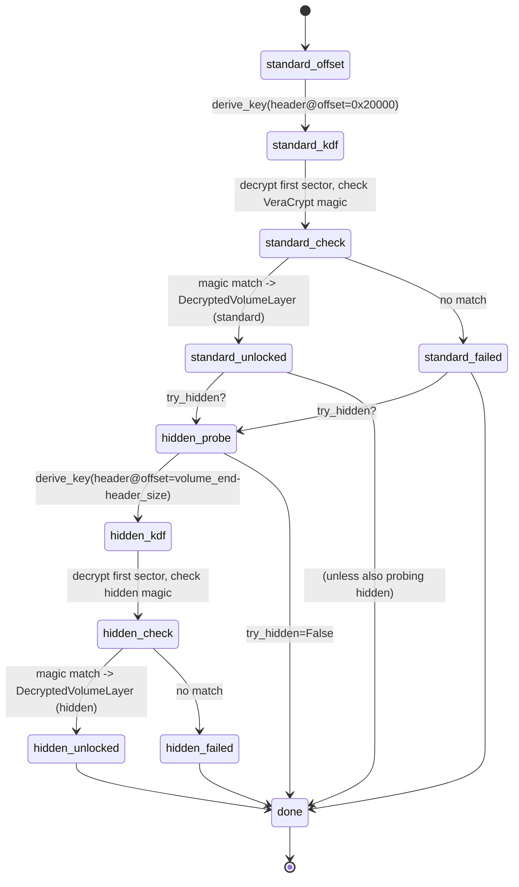

# Container unlock

Encrypted-volume unlocking is orchestrated by `ctx.unlocker` — an
[`UnlockOrchestrator`](#unlockorchestrator) that owns a list of per-format
[`Unlocker`](#unlocker) adapters and runs them against any `DataLayer` the operator
hands it. On success each adapter produces a
[`DecryptedVolumeLayer`](../overview/data-layer-composition.md) — a sector-keyed,
lazy-decrypting `DataLayer` that higher-level code treats like any other byte source.

From `src/deepview/storage/containers/unlock.py`:

> ```
> The UnlockOrchestrator is the top-level entry point. It keeps a registry of
> Unlocker adapters (LUKS / BitLocker / VeraCrypt / FileVault2 in later
> slices) and tries every registered adapter against a given DataLayer.
> For each detected container it attempts:
>
> 1. MasterKey candidates harvested from memory (cheap - just a symmetric
>    AES decrypt).
> 2. Keyfile candidates.
> 3. Passphrase candidates, with KDF work routed through the OffloadEngine
>    so PBKDF2 / Argon2id never blocks the caller thread.
> ```

## `UnlockOrchestrator`

The orchestrator auto-imports every sibling adapter module at construction time
(`luks`, `bitlocker`, `filevault2`, `veracrypt`) — each module exports an `UNLOCKER`
class attribute that the orchestrator instantiates and registers. If an adapter fails
to import (its optional dep isn't installed) or instantiate, it's silently skipped.
`deepview doctor` surfaces what's missing.

```mermaid
sequenceDiagram
    autonumber
    participant CLI as CLI / user
    participant O as UnlockOrchestrator
    participant U1 as LUKSUnlocker
    participant U2 as VeraCryptUnlocker
    participant ScanK as EncryptionKeyScanner
    participant Off as OffloadEngine
    participant DVL as DecryptedVolumeLayer
    participant Bus as EventBus

    CLI->>O: auto_unlock(layer, passphrases, keyfiles, scan_keys=True, try_hidden=False)
    activate O

    alt scan_keys
        O->>ScanK: scan each ctx.layers
        ScanK-->>O: list[MasterKey candidates]
    end

    loop for each registered Unlocker
        O->>U1: detect(layer)
        alt detected
            U1-->>O: ContainerHeader(format, cipher, kdf, ...)
            Note over O,Bus: ordered_sources = master_keys + keyfiles + passphrases

            loop over ordered_sources
                O->>Bus: publish(ContainerUnlockStartedEvent)
                alt MasterKey
                    O->>U1: unlock(layer, header, MasterKey)
                    U1-->>O: DecryptedVolumeLayer (fast path)
                else Passphrase
                    O->>U1: unlock(layer, header, Passphrase)
                    U1->>Off: submit(make_job(kind=header.kdf, ...))
                    Off->>Off: ProcessPoolBackend runs KDF
                    Off-->>U1: OffloadResult.output = derived_key
                    U1-->>O: DecryptedVolumeLayer
                end
                alt success
                    O->>Bus: publish(ContainerUnlockedEvent)
                    O-->>CLI: DecryptedVolumeLayer in result list
                else cipher_check_failed
                    O->>Bus: (continue loop; no event)
                end
            end

            alt all sources exhausted
                O->>Bus: publish(ContainerUnlockFailedEvent)
            end
        else not_detected
            U1-->>O: None
        end
        O->>U2: detect(layer)  %% try next adapter
    end

    O-->>CLI: list[DecryptedVolumeLayer]
    deactivate O
```

!!! tip "MasterKey is tried before Passphrase on purpose"
    A master-key candidate extracted from a live memory image is a cheap AES test — one
    sector decrypt, check the LUKS/VeraCrypt/BitLocker magic/hash. A passphrase trial
    is orders of magnitude more expensive (the whole point of the KDF). Ordering master
    keys first means "I have the memory dump *and* a passphrase guess" completes in
    milliseconds on the master-key hit and never runs the KDF.

## Hidden-volume probe

VeraCrypt (and TrueCrypt) supports a hidden volume carved out of the tail of a standard
volume's free space. `try_hidden=True` tells the VeraCrypt adapter to probe the trailing
region in addition to the standard offset. Each probe is an independent unlock attempt
with its own header parse, its own KDF run, and its own sector-decrypt sanity check.



!!! warning "`try_hidden=True` doubles the KDF cost"
    Two full KDF passes per passphrase trial. For interactive use it's fine. For a
    dictionary attack against an unknown hidden volume it's expensive; the operator
    should prune the passphrase list against the standard volume first.

## `KeySource` hierarchy

The orchestrator talks to adapters through a three-class hierarchy rooted at
`KeySource`. Each subclass knows how to derive the *cipher key material* a
`DecryptedVolumeLayer` needs. Derivation is async because `Passphrase` goes through the
offload engine — the other two are synchronous under the hood but conform to the ABC.

| Class | Input | Derivation | Cost |
|-------|-------|------------|------|
| `MasterKey(key: bytes)` | Pre-known / memory-extracted raw key | Returned verbatim | O(1) |
| `Keyfile(path: Path)` | Filesystem keyfile | `sha256(data)` | O(file size) |
| `Passphrase(passphrase: str)` | UTF-8 passphrase | `OffloadEngine.submit(KDF job)` | O(KDF iterations) — process-pool-offloaded |

From `unlock.py`:

> ```python
> @dataclass(frozen=True)
> class MasterKey(KeySource):
>     key: bytes
>     async def derive(self, engine, header) -> bytes:
>         return self.key
>
> @dataclass(frozen=True)
> class Keyfile(KeySource):
>     path: Path
>     async def derive(self, engine, header) -> bytes:
>         data = Path(self.path).read_bytes()
>         return hashlib.sha256(data).digest()
> ```

## `Unlocker` ABC and the per-format matrix

Every adapter subclasses `Unlocker` (in `containers/unlock.py`) and implements two
methods:

- `detect(layer, offset=0) -> ContainerHeader | None` — synchronous, side-effect-free
  probe. Returns a `ContainerHeader(format, cipher, sector_size, data_offset,
  data_length, kdf, kdf_params, raw)` when the magic/header is present.
- `unlock(layer, header, source, *, try_hidden=False) -> DecryptedVolumeLayer` — async,
  may trigger KDF offload via `source.derive(engine, header)`, then constructs the
  `DecryptedVolumeLayer`.

| Format | Module | Cipher(s) | KDF | Optional dep |
|--------|--------|-----------|-----|--------------|
| **LUKS1** | `luks` | `aes-cbc-essiv:sha256`, `aes-cbc-plain64`, `aes-xts-plain64`, `serpent-xts-plain64`, `twofish-xts-plain64` | PBKDF2-SHA1 / SHA256 / SHA512 | `cryptography` |
| **LUKS2** | `luks` | `aes-xts-plain64` (default), `serpent-xts-plain64`, `twofish-xts-plain64` | PBKDF2-SHA256 / PBKDF2-SHA512 / Argon2id / Argon2i | `cryptography`, `argon2-cffi` |
| **BitLocker** | `bitlocker` | `aes-xts-128`, `aes-xts-256`, `aes-cbc-128-elephant`, `aes-cbc-256-elephant` | SHA-256 recovery / TPM / clear-key / user-passphrase PBKDF2 | `cryptography` |
| **FileVault2** | `filevault2` | `aes-xts-plain64` (CoreStorage), AES-CTR (APFS encrypted container) | PBKDF2-SHA256 (user) / Keybag | `cryptography` |
| **VeraCrypt / TrueCrypt** | `veracrypt` | AES, Serpent, Twofish, Camellia, Kuznyechik — single and cascades (AES-Twofish, Serpent-AES, Twofish-Serpent, AES-Twofish-Serpent, Serpent-Twofish-AES, Kuznyechik-Serpent-Camellia etc.) | PBKDF2-{RIPEMD-160, SHA-256, SHA-512, Whirlpool, Streebog}, Argon2id (VC ≥ 1.26) | `cryptography`, `pycryptodome` (for Kuznyechik/Streebog) |

!!! note "Cipher cascades live in `_cipher_cascades.py`"
    VeraCrypt's inner-to-outer encrypt order is non-obvious for 3-cipher cascades; the
    decrypt path has to reverse it. `_cipher_cascades.build_cascade_cipher(name, keys,
    mode)` returns a callable that does both sides correctly. Adapters never re-derive
    the order themselves.

## `DecryptedVolumeLayer` — modes and IVs

From `src/deepview/storage/containers/layer.py`:

> ```
> DecryptedVolumeLayer wraps another DataLayer holding raw ciphertext
> and exposes the decrypted plaintext as a normal byte-addressable
> layer. Decryption is lazy and sector-keyed: a read() that spans
> multiple sectors reads each sector's ciphertext from the underlying
> layer, computes the per-sector IV / tweak according to iv_mode /
> mode, decrypts it through cryptography.hazmat.primitives.ciphers
> (lazy imported so a core install without the containers extra still
> imports this module), and slices the requested range out of the
> assembled buffer.
>
> A small LRU cache of decrypted sectors is kept to make sequential /
> neighbouring reads cheap - the default cap of 256 sectors is enough
> for partition table + superblock probes without ballooning memory.
> ```

### `CipherMode`

| Value | Used by | IV / tweak shape |
|-------|---------|------------------|
| `xts` | LUKS2 default, VeraCrypt, BitLocker | 16-byte little-endian sector-number tweak |
| `cbc-essiv` | LUKS1 (common default) | ESSIV: `AES-ECB(sha256(key), sector_le8)` |
| `cbc-plain64` | Legacy dm-crypt / LUKS1 | 8-byte LE sector num, zero-padded to 16 |
| `ctr` | FileVault2 (APFS encrypted), some enterprise BitLocker configs | Sector-number counter |

### `IVMode`

| Value | Meaning |
|-------|---------|
| `plain64` | Sector number rendered little-endian 8 bytes, padded to block size |
| `essiv-sha256` | ESSIV: encrypt sector number with SHA-256-hashed key as ESSIV key |
| `tweak` | 16-byte little-endian tweak for XTS |

From `layer.py` the per-sector LRU cache caps at 256 entries — enough for partition-table
+ filesystem-superblock probes without ballooning memory on large volumes. Sequential
reads stay cheap because neighbouring sectors stay hot in the cache; random-access
reads pay one AES block per new sector only.

!!! warning "`DecryptedVolumeLayer` is read-only by design"
    ```python
    def write(self, offset: int, data: bytes) -> None:
        raise NotImplementedError("DecryptedVolumeLayer is read-only")
    ```
    Forensic use does not write back. If a workflow ever needs mutation (e.g. writing
    into a copy-on-write overlay), layer another `DataLayer` that buffers writes above
    the decrypted layer — don't un-const the layer itself.

## Nesting works for free

Because every unlock produces a `DecryptedVolumeLayer` and the adapters take any
`DataLayer` as input, nesting is just composition:

```python
from pathlib import Path

from deepview.core.context import AnalysisContext
from deepview.storage.formats.nand_raw import RawNANDLayer
from deepview.storage.geometry import NANDGeometry

ctx = AnalysisContext.from_config()
raw = RawNANDLayer(Path("/evidence/device.nand"), NANDGeometry.inferred_2k_64())

# First peel: an outer VeraCrypt standard volume.
outer_layers = await ctx.unlocker.auto_unlock(
    raw,
    passphrases=["outer-passphrase"],
    try_hidden=False,
)
outer = outer_layers[0]   # DecryptedVolumeLayer

# Second peel: a LUKS container stored inside the decrypted outer volume.
inner_layers = await ctx.unlocker.auto_unlock(
    outer,
    passphrases=["inner-passphrase"],
)
inner = inner_layers[0]   # DecryptedVolumeLayer over DecryptedVolumeLayer

# Now open a filesystem on the doubly-decrypted inner volume.
fs = ctx.storage.open_filesystem(inner)
```

The inner layer's `read(off, len)` triggers outer-layer sector decrypts which trigger
raw-NAND page reads. Each sub-layer caches its own decrypted sectors. This is just the
composition story from the [data-layer page](../overview/data-layer-composition.md)
applied to encryption.

!!! tip "CLI can nest too"
    `deepview storage auto-open` takes `--unlock-passphrase-env VAR` and can be piped
    twice:
    ```bash
    deepview storage auto-open evidence.img \
        --unlock-passphrase-env OUTER \
        --emit-decrypted-layer outer.layer
    deepview storage auto-open outer.layer \
        --unlock-passphrase-env INNER
    ```

## Events published

All on `ctx.events` (core bus), defined in `core/events.py`:

| Event | When |
|-------|------|
| `ContainerUnlockStartedEvent(format, layer, key_source)` | Each `(unlocker × source)` trial begins |
| `ContainerUnlockProgressEvent(format, stage, attempted, total)` | Before KDF offload submits |
| `ContainerUnlockedEvent(format, layer, produced_layer, elapsed_s)` | A trial succeeded |
| `ContainerUnlockFailedEvent(format, layer, reason)` | All sources exhausted for a given detected container |

Subscribers: the Rich dashboard's `ContainerPanel`, the replay recorder, the CLI's
live-renderer progress bar. Adding a new subscriber is free — there's no import-time
coupling between publisher and consumer.

## Related reading

- [`storage`](storage.md) — where containers fit into the wider storage stack.
- [`offload`](offload.md) — the engine that runs every passphrase KDF job.
- [`overview/data-layer-composition`](../overview/data-layer-composition.md) — why
  `DecryptedVolumeLayer` plugs into the rest of Deep View without any adapters.
- [`guides/unlock-luks-volume`](../guides/unlock-luks-volume.md) and
  [`guides/unlock-veracrypt-hidden`](../guides/unlock-veracrypt-hidden.md) — worked
  examples.
