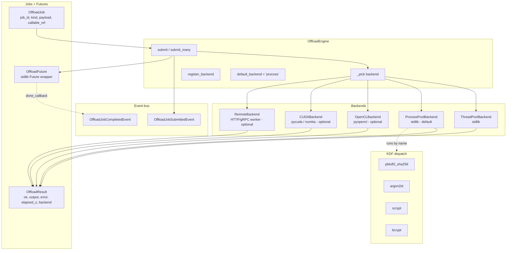
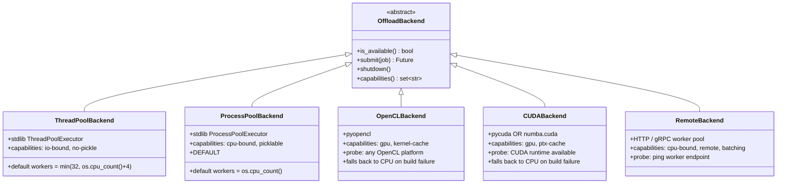
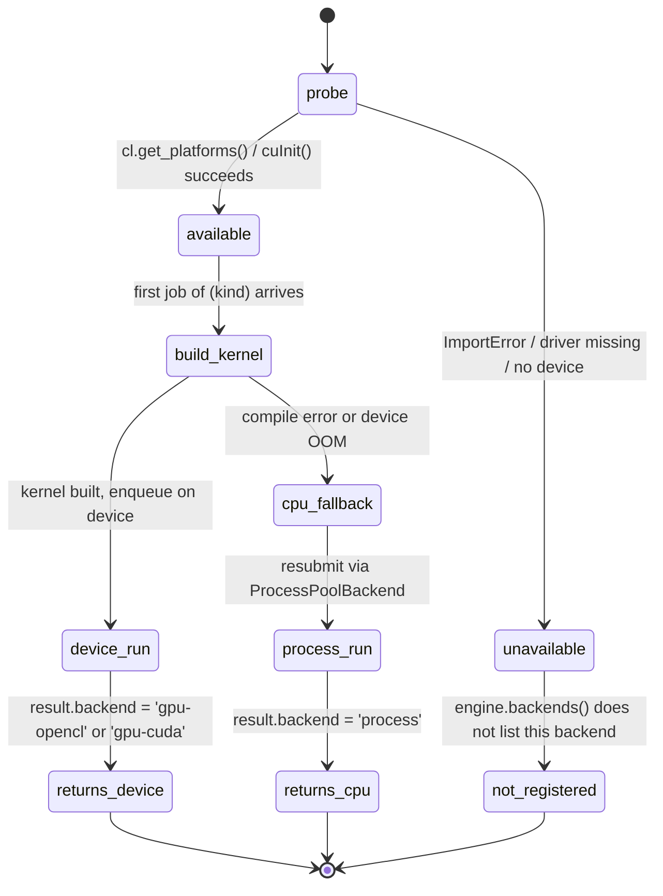

# Offload engine

The offload engine is Deep View's shared CPU-offload primitive. Subsystems that have
work they don't want to run on the caller thread — KDF iterations for container unlock,
YARA scans over a multi-gigabyte layer, bulk hashing during acquisition, heavy ML-style
scoring — submit an `OffloadJob` and receive an `OffloadFuture`. Backend selection is a
string key (`"thread"`, `"process"`, `"gpu-opencl"`, `"gpu-cuda"`, `"remote"`); default
is `"process"` because every built-in workload is CPU-bound.

From `src/deepview/offload/engine.py`:

> ```
> The engine is the single thing AnalysisContext lazily constructs as
> context.offload. It:
>
> - auto-registers the two in-tree backends (ThreadPoolBackend +
>   ProcessPoolBackend) at construction — both are always available;
> - registers the GPU and remote stubs only if their probe succeeds,
>   so engine.status() on a core install reports thread and process
>   and nothing else;
> - publishes OffloadJobSubmittedEvent at submit time and
>   OffloadJobCompletedEvent when the stdlib future resolves — both
>   through context.events so anything subscribed to the core EventBus
>   (dashboard panels, replay recorder, classification pipeline) sees
>   the activity for free.
> ```

## Internal structure



## Backend matrix



!!! note "GPU backends register themselves only if `is_available()` returns true"
    `OffloadEngine.__init__` imports `OpenCLBackend()` and `CUDABackend()` eagerly *but
    wrapped in a try/except*, and only adds them to the registry when their probe
    returns true. That way `engine.backends()` on a CPU-only laptop reports exactly the
    two stdlib backends, and `deepview doctor` doesn't lie about GPU availability.

## Why `ProcessPool` is the default

Every shipped KDF workload (PBKDF2-SHA256, Argon2id, scrypt, bcrypt) and every bulk-hash
helper is CPU-bound: one Python-level call dispatches into a compiled extension and
holds the GIL for the full iteration budget. With `ThreadPoolBackend` a single Argon2id
job saturates one worker thread and stalls every other thread submitted to the same
backend. With `ProcessPoolBackend` each job runs in its own process and scales linearly
with core count.

The cost of process pool: the payload must be picklable and there's a per-submit
serialisation overhead of a few hundred microseconds. For the built-in workloads that's
irrelevant next to a 100 ms+ KDF iteration budget. For *short* picklable work (~1 ms)
the `"thread"` backend is the better choice; callers pass it explicitly.

## GPU fallback

The GPU backends treat kernel compilation as the probe step — if the driver can build
and link the kernel against the detected device, the backend registers and runs jobs on
device; if build fails, the engine skips the backend and the job falls back to
`ProcessPool`. `OffloadResult.backend` records which backend *actually* ran the job so
the caller can audit.



## KDF dispatch table

Every KDF workload is addressed by `kind` + `callable_ref`. The orchestrator in
`storage/containers/unlock.py` picks `kind` from the detected container header's KDF
advertisement; `callable_ref` is a dotted-path to a function in `deepview.offload.kdf`.

| `kind` | `callable_ref` | Payload shape | Output | Backends |
|--------|----------------|---------------|--------|----------|
| `pbkdf2_sha256` | `deepview.offload.kdf:pbkdf2_sha256` | `{password: str, salt: bytes, iterations: int, dklen: int}` | `bytes` | process, thread, opencl (limited), remote |
| `pbkdf2_sha512` | `deepview.offload.kdf:pbkdf2_sha512` | same | `bytes` | process, thread, remote |
| `argon2id` | `deepview.offload.kdf:argon2id` | `{password: str, salt: bytes, time_cost: int, memory_cost: int, parallelism: int, dklen: int}` | `bytes` | process, remote |
| `scrypt` | `deepview.offload.kdf:scrypt` | `{password: str, salt: bytes, n: int, r: int, p: int, dklen: int}` | `bytes` | process, remote |
| `bcrypt` | `deepview.offload.kdf:bcrypt` | `{password: str, salt: bytes, cost: int}` | `bytes` (23-byte digest) | process, remote |
| `sha256_bulk` | `deepview.offload.kdf:sha256_bulk` | `{chunks: list[bytes]}` | `list[bytes]` (digests in order) | any |

From `storage/containers/unlock.py::Passphrase.derive`:

> ```python
> if header.kdf == "argon2id":
>     callable_ref = "deepview.offload.kdf:argon2id"
> else:
>     callable_ref = "deepview.offload.kdf:pbkdf2_sha256"
>
> payload = {
>     "password": self.passphrase,
>     "salt": kdf_params.get("salt", b""),
>     "iterations": kdf_params.get("iterations", 1000),
>     "dklen": kdf_params.get("dklen", 32),
> }
> job = make_job(kind=header.kdf or "pbkdf2_sha256",
>                payload=payload, callable_ref=callable_ref)
> future = engine.submit(job)
> result = future.await_result()
> ```

!!! tip "Adding a new KDF"
    Implement a module-level callable in `offload/kdf.py` that takes a `dict` payload
    and returns `bytes`. Export its dotted path as `<module>:<callable>` — the engine
    resolves it via `importlib.import_module` + `getattr`. Picklability is required for
    `ProcessPool`; if your KDF uses unpicklable state, expose a thin wrapper that
    constructs the state inside the callable.

## Submit / await / observe example

=== "Python"

    ```python
    import asyncio

    from deepview.core.context import AnalysisContext
    from deepview.core.events import (
        OffloadJobSubmittedEvent,
        OffloadJobCompletedEvent,
    )
    from deepview.offload.jobs import make_job

    async def main():
        ctx = AnalysisContext.from_config()

        # Observe the lifecycle via the bus.
        ctx.events.subscribe(
            OffloadJobSubmittedEvent,
            lambda ev: print(f"SUBMIT  {ev.job_id[:8]}  kind={ev.kind}  backend={ev.backend}"),
        )
        ctx.events.subscribe(
            OffloadJobCompletedEvent,
            lambda ev: print(
                f"DONE    {ev.job_id[:8]}  ok={ev.ok}  "
                f"elapsed={ev.elapsed_s:.3f}s  backend={ev.backend}"
                f"{'  error=' + ev.error if not ev.ok else ''}"
            ),
        )

        # Submit a PBKDF2 job.
        job = make_job(
            kind="pbkdf2_sha256",
            callable_ref="deepview.offload.kdf:pbkdf2_sha256",
            payload={
                "password": "correct horse battery staple",
                "salt": b"\x00" * 16,
                "iterations": 200_000,
                "dklen": 32,
            },
            cost_hint=0.5,
        )

        future = ctx.offload.submit(job)          # backend="process" by default
        result = future.await_result()            # blocks this coroutine's thread
        assert result.ok, result.error
        print("derived key:", result.output.hex())

        # Or submit many and consume in completion order.
        jobs = [
            make_job(
                kind="pbkdf2_sha256",
                callable_ref="deepview.offload.kdf:pbkdf2_sha256",
                payload={"password": f"pw{i}", "salt": b"\x01" * 16,
                         "iterations": 100_000, "dklen": 32},
            )
            for i in range(8)
        ]
        async for res in ctx.offload.submit_many(jobs):
            print(f"batch-done  {res.job_id[:8]}  ok={res.ok}")

    asyncio.run(main())
    ```

=== "Expected output"

    ```text
    SUBMIT  1a2b3c4d  kind=pbkdf2_sha256  backend=process
    DONE    1a2b3c4d  ok=True  elapsed=0.187s  backend=process
    derived key: 9fcb2f4...
    SUBMIT  aa00...   kind=pbkdf2_sha256  backend=process
    SUBMIT  aa01...   kind=pbkdf2_sha256  backend=process
    ...
    DONE    aa03...   ok=True  elapsed=0.092s  backend=process
    batch-done  aa03...  ok=True
    ...
    ```

## Events the engine publishes

Both are defined in `core/events.py` and travel through `ctx.events` (the core
`EventBus`, not the tracing bus), so any subscriber — the Rich dashboard's
`OffloadPanel`, the replay recorder, a third-party log shipper — sees engine activity
without import-time coupling.

| Event class | When | Fields |
|-------------|------|--------|
| `OffloadJobSubmittedEvent` | Synchronously at submit time, before `backend.submit()` | `job_id`, `kind`, `backend`, `cost_hint` |
| `OffloadJobCompletedEvent` | From a stdlib `done_callback` after the future resolves | `job_id`, `ok`, `elapsed_s`, `backend`, `error` |

!!! warning "Completion event always fires — except on submit failure"
    If `backend.submit()` raises synchronously (e.g. the backend is dead / misconfigured),
    the exception bubbles to the caller and there's no future, so no completion event.
    Subscribers that track in-flight jobs by correlating submit/complete event IDs must
    handle that case — the `id` they saw on submit might never complete.

## Status / introspection

```bash
deepview offload status           # every registered backend + its capabilities
deepview offload benchmark --kind pbkdf2_sha256 --iterations 200000
deepview doctor                   # per-backend availability summary
```

Programmatically:

```python
for name, backend in ctx.offload.backends().items():
    print(f"{name:14s}  available={backend.is_available()}  "
          f"caps={sorted(backend.capabilities())}")
```

## Trade-offs

!!! note "Why the engine is a single dispatcher, not per-subsystem pools"
    Container unlock, acquisition hashing, YARA batches, and anomaly scoring all
    compete for the same CPU budget. Having one pool per subsystem oversubscribes the
    box; having one shared engine with explicit submit-side priority via `cost_hint`
    lets the operator reason about throughput globally.

!!! note "Why GPU is opt-in, not default"
    Half of the shipped KDFs (PBKDF2, Argon2id) have GPU kernels that outperform CPU
    by 3-10x on a modern dGPU. The other half (bcrypt, scrypt at typical parameters)
    don't — GPU memory bandwidth is the bottleneck and the CPU wins. Hard-coding
    `"gpu-opencl"` as default would silently slow scrypt down. Instead callers opt in
    per workload.

!!! note "Why completion events fire from a done-callback, not a wrapped future"
    Stdlib `concurrent.futures.Future.add_done_callback` runs the callback from the
    thread that resolves the future. That's the backend's worker thread for the process
    pool (via the ProcessPoolExecutor's result-collector), which is safe to publish from
    because `EventBus.publish` is synchronous and idempotent. Wrapping the future in a
    custom class to publish from a different thread would add latency and a race.

## Related reading

- [Containers](containers.md) — the largest KDF workload consumer.
- [Remote acquisition](remote-acquisition.md) — another subsystem that emits progress
  events through the same bus.
- [Events reference](../reference/events.md#offload) — exact event schema.
- [`guides/offload-pbkdf2`](../guides/offload-pbkdf2.md) — step-by-step recipe.
