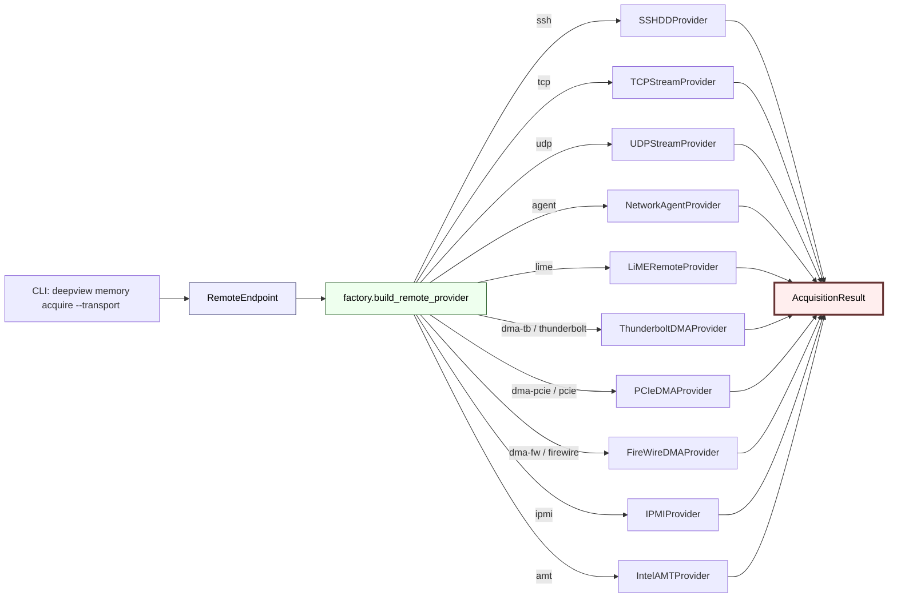
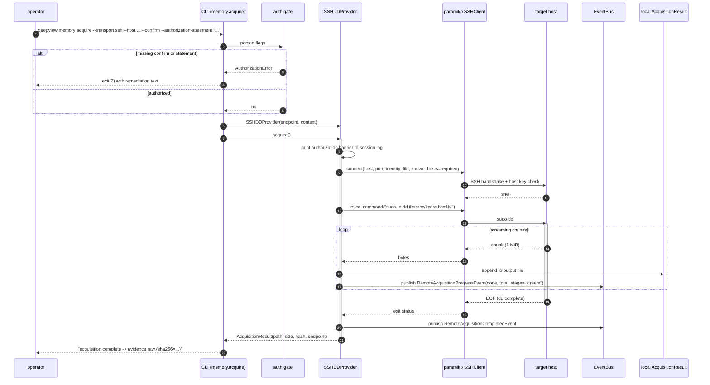
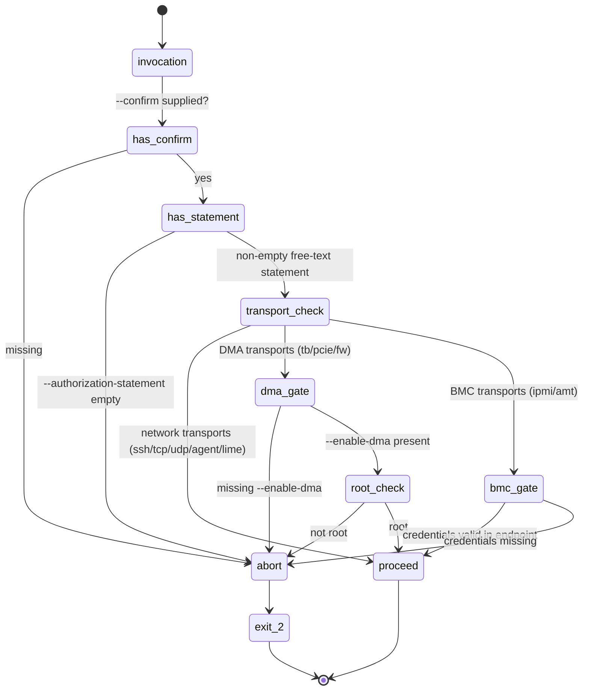

# Remote acquisition

The remote-acquisition subsystem pulls memory (and occasionally device state) off a
target system over a network / bus transport. It's the one part of Deep View that
touches hosts other than the analyst's own, so the whole design is organised around
**fail-secure defaults and explicit operator authorization**.

From `src/deepview/memory/acquisition/remote/base.py`:

> ```
> This module defines the minimal shared surface for every remote provider:
>
> - RemoteEndpoint is a frozen dataclass describing where and how to reach
>   a remote host. Credentials are never stored inline - only
>   environment-variable names or file paths are kept, so secrets never
>   leak into the process's attribute tree.
> - RemoteAcquisitionProvider extends MemoryAcquisitionProvider with an
>   endpoint instance attribute, a progress-publishing helper that feeds
>   RemoteAcquisitionProgressEvent into the analysis context's EventBus,
>   and a transport_name hook used by the CLI factory.
> - AuthorizationError is the exception surface the CLI raises when the
>   operator has not supplied the --confirm and --authorization-statement
>   flags required by every dual-use remote command.
> ```

## Factory + transport catalogue



From `src/deepview/memory/acquisition/remote/factory.py`:

> ```python
> def build_remote_provider(
>     transport: str,
>     endpoint: RemoteEndpoint,
>     *,
>     context: AnalysisContext,
> ) -> RemoteAcquisitionProvider:
>     """Return a concrete provider for transport.
>
>     transport is the CLI-visible selector (for example "ssh", "tcp",
>     "agent", "dma-tb"). Unknown selectors raise ValueError.
>     """
>     t = transport.lower()
>     if t == "ssh":
>         from deepview.memory.acquisition.remote.ssh_dd import SSHDDProvider
>         return SSHDDProvider(endpoint, context=context)
>     ...
> ```

Every branch lazy-imports its provider module so the `ValueError` path stays fast and
the SSH / DMA / IPMI optional deps never load unless their transport was requested.

## Transports at a glance

| Transport | Module | Library dep | Privileges | Platforms | Dual-use notes |
|-----------|--------|-------------|------------|-----------|----------------|
| `ssh` | `ssh_dd` | `paramiko` (optional) | target-side root for `/dev/mem`/`/proc/kcore`/kernel pagemap | Linux, macOS | Requires SSH credentials; producer runs `sudo dd` on target |
| `tcp` | `tcp_stream` | stdlib `socket` | server runs with target privileges already | Any | Must be paired with a trusted ingest agent on target |
| `udp` | `tcp_stream` (UDP) | stdlib `socket` | same | Any | Lossy by design — checksum every chunk |
| `agent` | `network_agent` | stdlib `http.client` / optional `httpx` | agent process chooses | Any | Agent binary must ship with explicit authorization banner |
| `lime` | `lime_remote` | stdlib | target-side root (LiME kernel module loaded) | Linux | Standard LKM-based memory acquisition over TCP |
| `dma-tb` (Thunderbolt) | `dma_thunderbolt` | `leechcore` (optional) | host root, IOMMU must permit | Linux, Windows | **High dual-use risk** — bypasses OS; IOMMU caveat emitted on probe |
| `dma-pcie` | `dma_pcie` | `leechcore` / `PCILeech` (optional) | host root | Linux, Windows | Same warning applies |
| `dma-fw` (FireWire) | `dma_firewire` | `pyfwhost` (optional) | host root | Linux | Legacy attack surface; included for forensic completeness |
| `ipmi` | `ipmi` | `pyghmi` (optional) | BMC credentials | Any | Talks to BMC, not OS; side-channel for power-state + SEL data |
| `amt` | `intel_amt` | `amt-api` (optional) | AMT credentials + target enabled | Intel-only | Out-of-band, pre-boot access; highest trust needed |

## SSH-DD acquisition flow

The `ssh` transport is the workhorse of remote acquisition for Linux/macOS fleets. It
establishes an SSH session, prints an authorization banner that records the acquisition
context in the operator's session log, runs `sudo dd` against `/dev/mem` or
`/proc/kcore`, and streams the raw bytes back in chunks. Every chunk tick emits
`RemoteAcquisitionProgressEvent`.



!!! tip "known_hosts is required"
    `SSHDDProvider` refuses to connect without a populated `known_hosts` file. Even
    with `endpoint.require_tls=True` a TLS-less SSH handshake against an unknown host
    is exactly the attack vector we don't want to normalise. The CLI prints the
    `ssh-keyscan` hint on the `AuthorizationError` for first-time hosts.

## DMA-Thunderbolt acquisition flow

DMA captures are qualitatively different — there's no target OS cooperation, so the
gate sequence is more aggressive. The provider refuses to operate without host root,
actively probes IOMMU state, and emits a persistent warning if DMA protection is
enabled (which blocks the capture), disabled (which is the exploitable state), or
absent (legacy hardware).

```mermaid
sequenceDiagram
    autonumber
    participant Op as operator
    participant CLI as CLI (memory.acquire)
    participant Gate as multi-step gate
    participant Prov as ThunderboltDMAProvider
    participant LC as leechcore
    participant PCI as /sys/class/pci_bus / IOMMU probe
    participant Bus as EventBus
    participant Dst as AcquisitionResult

    Op->>CLI: deepview memory acquire --transport dma-tb --enable-dma --confirm --authorization-statement "..."
    CLI->>Gate: flags
    alt not root
        Gate-->>CLI: AuthorizationError("DMA requires root")
    else missing --enable-dma
        Gate-->>CLI: AuthorizationError("DMA opt-in required")
    else missing confirm / statement
        Gate-->>CLI: AuthorizationError
    else all gates passed
        Gate-->>CLI: proceed
    end

    CLI->>Prov: ThunderboltDMAProvider(endpoint, context)
    CLI->>Prov: acquire()
    activate Prov

    Prov->>PCI: probe IOMMU state
    alt IOMMU enforcing DMA protection
        PCI-->>Prov: enforcing
        Prov->>Bus: RemoteAcquisitionProgressEvent(stage="iommu-warning", total=0)
        Prov-->>CLI: error("Target IOMMU blocks DMA; abort or disable at target")
    else IOMMU permissive or legacy
        PCI-->>Prov: permissive/legacy
        Prov->>Bus: RemoteAcquisitionProgressEvent(stage="iommu-warning", total=0, detail="permissive")
    end

    Prov->>LC: open Thunderbolt device
    LC-->>Prov: handle
    loop chunked reads
        Prov->>LC: read(physical_offset, chunk_size)
        LC-->>Prov: bytes
        Prov->>Dst: append
        Prov->>Bus: RemoteAcquisitionProgressEvent(done, total, stage="dma-read")
    end
    LC-->>Prov: done
    Prov->>Bus: RemoteAcquisitionCompletedEvent
    Prov-->>CLI: AcquisitionResult
    deactivate Prov
```

## Authorization gating

Every remote provider checks the same multi-step gate before touching the wire. The gate
is in `cli/commands/memory.py` and is shared across transports; the provider itself
re-validates root where it needs to, so you can't bypass the CLI and still hit a DMA
transport programmatically without tripping the same check.



!!! warning "The authorization statement is free text — and it's logged"
    `--authorization-statement "Investigation case 2026-Q2-4711, approved by $MANAGER"`
    is recorded in the session log before any bytes flow. The CLI will not accept an
    empty string, and the statement is echoed in the banner the target side sees
    (where applicable). It exists so the operator has to *pause and articulate*
    authorization — forgetting is a deliberate speed bump.

## Fail-secure, never silent

Four invariants the subsystem never violates:

1. **No default credentials in memory.** `RemoteEndpoint` stores credentials only by
   indirection: `password_env` is an *environment-variable name*, `identity_file` /
   `known_hosts` / `tls_ca` are *paths*. The dataclass' `repr` never surfaces a secret.
   Providers read the secret at call time.
2. **No silent transport fallback.** If `paramiko` isn't installed, the SSH provider
   raises `ImportError` with remediation text — it does not fall back to plain TCP or
   to `ssh(1)` subprocess. The operator made an explicit transport choice; changing it
   requires a new flag.
3. **No zero-byte "success".** An acquisition that writes zero bytes is treated as a
   failed acquisition even if the transport closed cleanly. `AcquisitionResult.size` is
   checked against a lower bound (`> 0`, plus the endpoint's `extra.min_bytes` hint if
   set) before the result is returned.
4. **TLS is the default on every TCP-ish transport.** `RemoteEndpoint.require_tls=True`
   by default; opting out requires setting it `False` explicitly. `NetworkAgentProvider`
   and `TCPStreamProvider` refuse to start without a verified `tls_ca` when
   `require_tls` is true.

!!! note "DMA is dual-use"
    Thunderbolt / PCIe / FireWire DMA captures are a defensive forensic tool and a
    well-known attack vector. The gate sequence above exists to make misuse noisy —
    `--enable-dma`, root, confirm, and authorization statement are *all* required, and
    every capture emits `RemoteAcquisitionProgressEvent` on the bus so a companion
    process can log the operation even if the CLI run is interrupted.

## Events published

All on `ctx.events` (core bus), defined in `core/events.py`:

| Event | Fields | Emitted by |
|-------|--------|------------|
| `RemoteAcquisitionStartedEvent` | `endpoint`, `transport`, `target_size` | Every provider's `acquire()` entry |
| `RemoteAcquisitionProgressEvent` | `endpoint`, `bytes_done`, `bytes_total`, `stage` | Every provider during streaming |
| `RemoteAcquisitionCompletedEvent` | `endpoint`, `bytes_total`, `elapsed_s`, `artifact_path` | On clean finish |
| `RemoteAcquisitionFailedEvent` | `endpoint`, `reason`, `stage` | On any raise / short read / authorization failure |

The Rich dashboard's `RemotePanel` subscribes to all four; the CLI's live renderer
subscribes to progress + completed.

## Related reading

- [Memory acquisition manager](../reference/interfaces.md#memoryacquisitionprovider) —
  the base ABC `RemoteAcquisitionProvider` extends.
- [Offload engine](offload.md) — where post-acquisition hashing / parsing work gets
  dispatched.
- [`guides/remote-acquire-ssh`](../guides/remote-acquire-ssh.md) — worked SSH-DD
  example with dry-run and banner walkthrough.
- [`guides/remote-acquire-dma`](../guides/remote-acquire-dma.md) — Thunderbolt /
  PCIe capture including IOMMU caveats.
- [Events reference](../reference/events.md#remote) — exact event schema.
