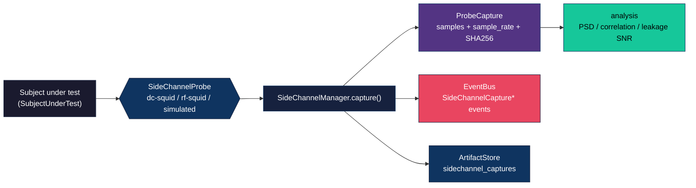
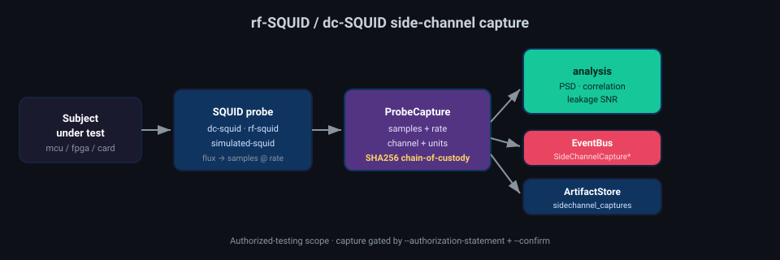

# Side-channel acquisition (rf-SQUID / dc-SQUID)

Deep View's side-channel subsystem captures **magnetic** side-channel traces from a
*subject under test* (SUT) using superconducting magnetometers, and analyses them for
data-dependent leakage. It is the magnetic counterpart to the SDR / ChipWhisperer EM and
power pipelines the `sidechannel` extra already anticipates.

!!! warning "Authorized-testing scope only"
    Side-channel capture is a dual-use capability. Deep View scopes it to hardware you own
    and are authorized to analyse — chip/board characterisation, leakage assessment, CTF
    challenges, and hardware-security research. The `deepview sidechannel capture` command
    **requires `--authorization-statement`** (recorded in the capture metadata) and
    **dry-runs unless `--confirm`** is passed, exactly like `deepview remote-image`.

## Probes

Two superconducting magnetometer probes ship, behind one `SideChannelProbe` interface
(`src/deepview/interfaces/sidechannel.py`):

| Probe | `probe_name` | Readout | Notes |
|-------|--------------|---------|-------|
| dc-SQUID | `dc-squid` | Flux-locked loop, direct flux coupling | `DCSquidProbe` |
| rf-SQUID | `rf-squid` | RF tank-circuit, flux-modulated resonance | `RFSquidProbe` (adds `rf_bias_hz`) |
| Simulated | `simulated-squid` | Deterministic synthetic trace | `SimulatedSquidProbe` — no hardware |

The two hardware probes lazily bind to a DAQ driver module named in config
(`SideChannelConfig.squid_driver`, default `squidpy`). When the driver is absent
`is_available()` returns `False` and `capture()` raises a clear error pointing the operator
at the simulated probe — the same fail-soft optional-dependency contract used across Deep
View. The **simulated probe** synthesises a reproducible, data-dependent emanation plus
seeded pseudo-noise so the whole capture → hash → analysis pipeline is testable offline,
with no DAQ hardware.

## Capture pipeline





`SideChannelManager.capture()` (`src/deepview/sidechannel/manager.py`) is the audited path:
it publishes `SideChannelCaptureStartedEvent` / `…ProgressEvent` / `…CompletedEvent` on the
core `EventBus` and records a `sidechannel_captures` artifact carrying the probe, the
subject, the sample count, and the **SHA256 of the trace** — the same chain-of-custody
invariant every `AcquisitionResult` carries.

## Chain of custody

Each `ProbeCapture` hashes the canonical little-endian float64 serialization of its samples
(`serialize_samples`), so a capture's integrity can be verified independently of how it was
stored. Identical probe parameters (including the simulated probe's seed) yield identical
samples and therefore an identical SHA256 — captures are reproducible and auditable.

## Analysis

`src/deepview/sidechannel/analysis.py` (lazy numpy/scipy, the `sidechannel` extra) provides:

- `power_spectral_density(capture)` — Welch PSD;
- `dominant_frequency(capture)` — strongest spectral component (recovers a clocked core's
  emanation frequency);
- `correlation(a, b)` — Pearson correlation between two traces;
- `leakage_snr(captures_by_class)` — first-order leakage SNR across ≥2 input classes.

## CLI

```bash
deepview sidechannel probes                       # list probes + availability
deepview sidechannel capture --subject board-1 \
    --authorization-statement "ENG-2026-04" --confirm -o cap.json
deepview sidechannel analyze --capture cap.json   # PSD / dominant frequency
```

See `examples/13_squid_capture_simulated.py` for a runnable, hardware-free walkthrough.
