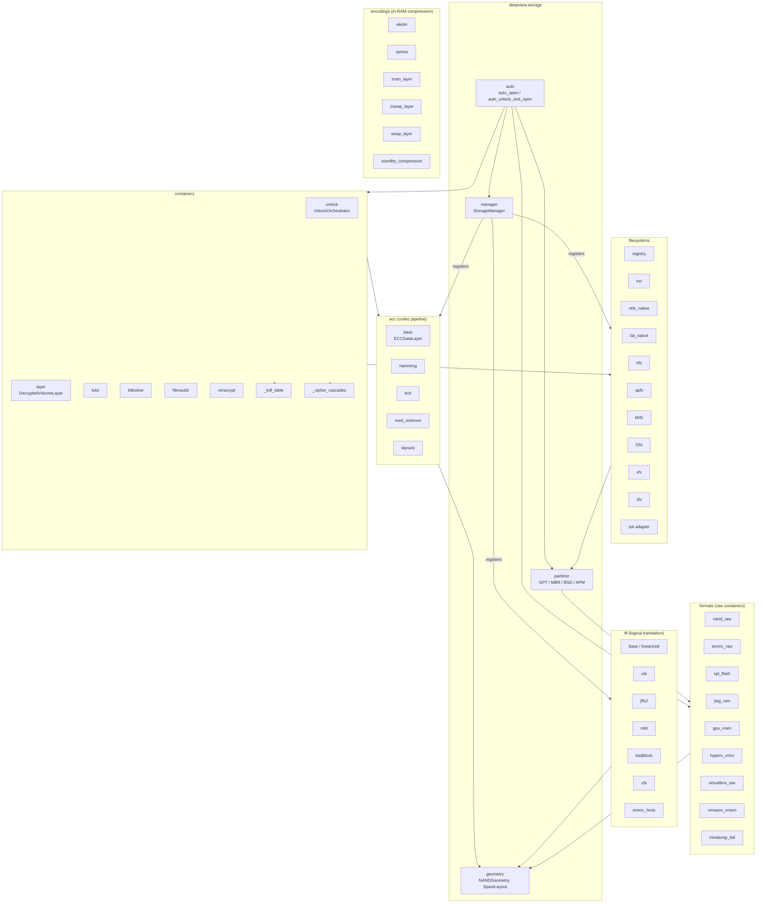
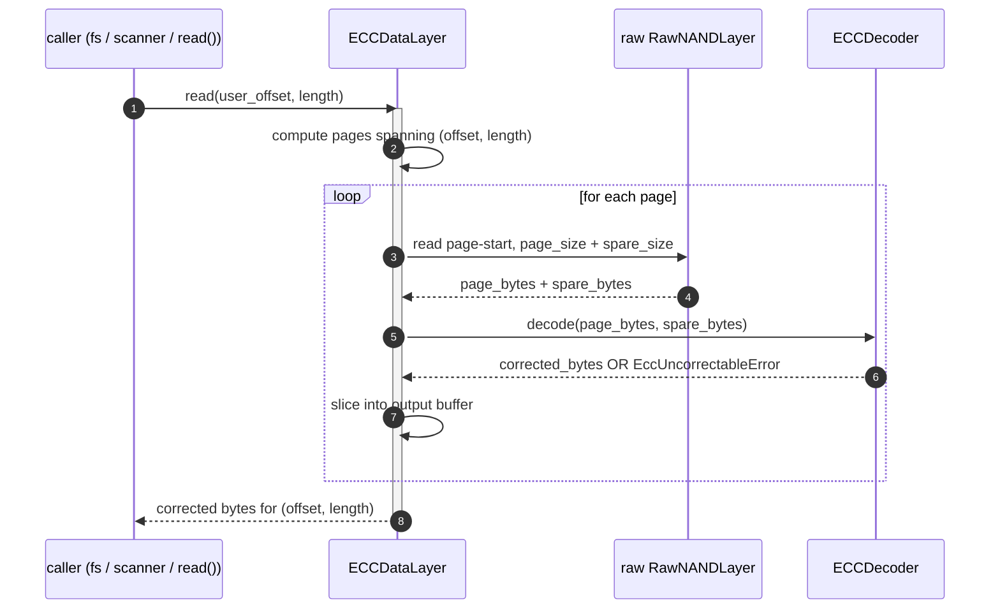
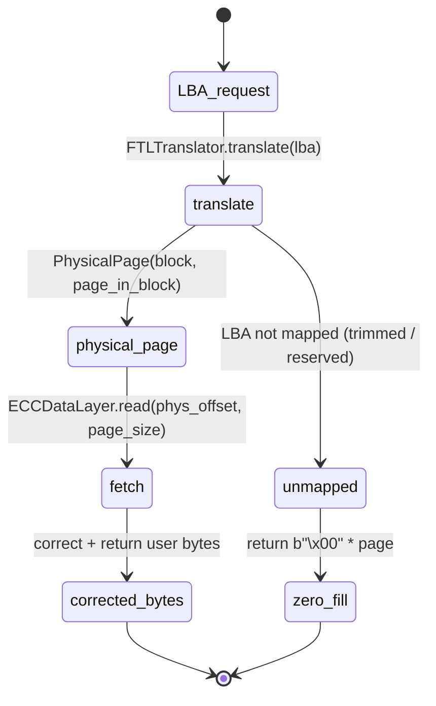

# Storage subsystem

The storage subsystem turns *anything that holds bytes the operator cares about* — raw
flash dumps, eMMC images, JTAG captures, encrypted volumes, modern copy-on-write
filesystems — into a uniform chain of [`DataLayer`](../overview/data-layer-composition.md)
compositions. It sits next to but strictly beneath `memory/` in the module graph: the
memory manager decides *what kind of forensic artefact a path is*; the storage subsystem
decides *how to unpack the on-disk structure* once the bytes are reachable.

Nothing in storage calls out to tracing, classification, or reporting. Storage writes
findings into `ctx.artifacts` and layers into `ctx.layers`; downstream subsystems
discover them there.

From `src/deepview/storage/manager.py`:

> ```python
> class StorageManager:
>     """Central wiring for filesystem, FTL, and ECC adapters.
>
>     Mirrors :class:`deepview.memory.manager.MemoryManager` style: detect what's
>     available at construction, dispatch by name on demand, lazy-import every
>     optional backing library inside the per-adapter modules.
>     """
> ```

## Internal package layout



## Submodule tour

### `formats/` — raw container adapters

What it does: recognise a file on disk (or a block device) as a particular kind of
*dump* and hand back the raw `DataLayer` underneath. These are the format layer — they
don't know about ECC, FTL, partitions, or filesystems.

| Module | Key types | Optional dep |
|--------|-----------|--------------|
| `nand_raw` | `RawNANDLayer`, `NANDGeometry`-aware indexing | None (stdlib) |
| `emmc_raw` | `EMMCImageLayer`, boot1/boot2/user-area split | None |
| `spi_flash` | `SPIFlashLayer` for SFDP dumps | None |
| `jtag_ram` | `JTAGRAMLayer` for Arm CoreSight / OpenOCD captures | None |
| `gpu_vram` | `GPUVRAMImageLayer` for SMI / nvdump | None |
| `hyperv_vmrs`, `virtualbox_sav`, `vmware_vmem` | VM saved-state parsers | None |
| `minidump_full` | Windows full-kernel / user minidump | None |

Extension point: subclass `DataLayer` and register yourself via the format-detection
chain in `memory/manager.py::MemoryManager._detect_format` — the storage-side entry
points are `formats/__init__.py::FORMAT_ADAPTERS`.

### `ecc/` — codec pipeline

What it does: wrap a raw `DataLayer` (typically `RawNANDLayer`) with an
[`ECCDataLayer`](../overview/data-layer-composition.md) that reads page+spare, runs the
codec to correct user bytes, and presents a clean logical stream.

| Module | Codec | Strength | Optional dep |
|--------|-------|----------|--------------|
| `hamming` | Hamming(255,247) / SEC-DED 256-byte | 1-bit correct / 2-bit detect | `bchlib` (optional, pure-Python fallback) |
| `bch` | BCH(t=4/8/16) configurable | 4 / 8 / 16 bit correct per block | `bchlib` |
| `reed_solomon` | RS(255,223) / RS(n,k) configurable | `(n-k)/2` byte correct | `reedsolo` |
| `layouts` | ONFI / linear spare-area layouts | — | None |

Extension point: subclass `ECCDecoder` in `interfaces/ecc.py`, expose
`decode(user_bytes, spare_bytes) -> bytes` and register via
`StorageManager.register_ecc(name, cls)`.



!!! tip "Uncorrectable pages don't abort the read"
    On `EccUncorrectableError`, the layer returns the raw user bytes and emits a
    `StorageECCErrorEvent` on the bus. That way a scanner looking for known strings
    still finds what it can even on a partially-damaged dump.

### `ftl/` — logical translation

What it does: turn *physical-page-addressed* flash (after ECC correction) into a
*logical-block-addressed* stream the way the device's wear-levelling + bad-block
management would have presented it to the host.

| Module | Purpose | Key types | Optional dep |
|--------|---------|-----------|--------------|
| `ubi` | UBI (Unsorted Block Images) | `UBITranslator` | None |
| `jffs2` | JFFS2 in-place | `JFFS2Translator` | None |
| `mtd` | Passthrough for raw MTD | `MTDPassthroughTranslator` | None |
| `badblock` | Skip-and-remap bad-block table | `BadBlockRemapTranslator` | None |
| `ufs` | UFS L2P mapping | `UFSTranslator` | None |
| `emmc_hints` | eMMC manufacturer hint tables | `EMMCHintTranslator` | None |
| `linearized` | `LinearizedFlashLayer` wrapper | — | None |



Extension point: subclass `FTLTranslator` in `interfaces/ftl.py`, implement
`translate(lba) -> PhysicalPage | None`, and register via `register_ftl(name, cls)`.

### `encodings/` — in-RAM compression decoders

What it does: decode the compressed / pseudo-paged byte ranges that modern operating
systems keep in RAM (zram, zswap, Windows standby cache). These surface as
`DataLayer`s over the *decompressed* stream so memory-forensics plugins can scan them
alongside conventional pages.

| Module | Codec | Optional dep |
|--------|-------|--------------|
| `wkdm` | Apple WKdm compressed pages | None |
| `xpress` | Microsoft Xpress/Huffman standby pages | None |
| `zram_layer` | zram devices backed by LZO/LZ4/Zstd | `python-lzo` / `lz4` / `zstandard` |
| `zswap_layer` | zswap pool pages | `zstandard` |
| `swap_layer` | Conventional swap-space parser | None |
| `standby_compression` | Windows standby-list compressed pages | None |

### `filesystems/` — per-format adapters

What it does: present a filesystem that lives inside a `DataLayer` (typically a
`PartitionLayer` or a `DecryptedVolumeLayer`) through the `Filesystem` ABC:
`probe(layer)`, `list_dir(path)`, `read_file(path)`, `stat(path)`, `walk(...)`.

| Module | Filesystem | Optional dep |
|--------|------------|--------------|
| `ext` | ext2/3/4 | None (stdlib parser) |
| `ntfs_native` | NTFS | None (native parser) |
| `fat_native` | FAT12/16/32, exFAT | None |
| `hfs` | HFS+ | None |
| `apfs` | APFS | `apfs-python` (optional) |
| `btrfs` | Btrfs | `btrfs-progs` via `pyfsbtrfs` (optional) |
| `xfs` | XFS | `pyfsxfs` (optional) |
| `f2fs` | F2FS | None |
| `zfs` | ZFS | `libzfs_core` (optional) |
| `tsk` | Fallback via TSK (the Sleuth Kit) | `pytsk3` (optional) |
| `registry` | Filesystem registration side effects | — |

```mermaid
sequenceDiagram
    autonumber
    participant Init as StorageManager.__init__
    participant Reg as filesystems.registry.register_all
    participant Mod as each fs module
    participant Mgr as StorageManager

    Init->>Reg: register_all(self)
    activate Reg
    loop for each fs in built-in list
        Reg->>Mod: try: import deepview.storage.filesystems.<fs>
        alt import succeeds
            Mod-->>Reg: module (with Filesystem subclass exposed)
            Reg->>Mgr: register_filesystem(name, cls)
        else ImportError (missing optional dep)
            Mod-->>Reg: ImportError
            Reg->>Reg: skip silently; doctor surfaces it later
        end
    end
    Reg-->>Init: done
    deactivate Reg
    Note over Init: StorageManager usable even if half the adapters are unavailable
```

Extension point: subclass `Filesystem` in `interfaces/filesystem.py` and either
(a) add the module to `filesystems/registry.py::BUILT_IN_FILESYSTEMS`, or
(b) call `context.storage.register_filesystem(name, cls)` from your own plugin code.

### `containers/` — encrypted-volume unlocking

Covered end-to-end on the [containers page](containers.md). In brief:

- `unlock.UnlockOrchestrator` — the top-level `ctx.unlocker`.
- `layer.DecryptedVolumeLayer` — the per-sector decrypting `DataLayer` produced by
  every adapter on success.
- `luks`, `bitlocker`, `filevault2`, `veracrypt` — per-format `Unlocker` adapters.
- `_kdf_table`, `_cipher_cascades`, `_af_split`, `_layer_file_io` — shared private
  helpers used by multiple adapters.

### `partition/` — GPT / MBR / BSD / APM parsing

`parse_partitions(layer) -> Iterator[Partition]` walks known partition tables off the
start of a layer and yields `Partition(index, start_offset, size, type_guid, name)`.
`PartitionLayer(underlying, start, size)` is the `DataLayer` slice that filesystems open
against.

### `auto/` — one-shot end-to-end opener

From `src/deepview/storage/auto.py`:

> ```
> Pipeline:
>     1. Detect the dump format via MemoryManager; build the raw DataLayer.
>     2. If nand_geometry is supplied, optionally wrap with an ECCDataLayer
>        + LinearizedFlashLayer via StorageManager.wrap_nand.
>     3. Detect partitions on the (possibly transformed) layer.
>     4. For each partition, attempt to auto-probe its filesystem.
>     5. Return an AutoOpenResult bundle.
>
> All optional dependencies are lazy-loaded; anything unavailable becomes a
> notes entry instead of a hard error.
> ```

## Composition walkthrough

This is the canonical end-to-end recipe: raw NAND dump → ECC correct → FTL linearise
→ partition slice → container unlock → filesystem → file bytes.

```python
from pathlib import Path

from deepview.core.context import AnalysisContext
from deepview.storage.auto import auto_unlock_and_open
from deepview.storage.geometry import NANDGeometry, SpareLayout

ctx = AnalysisContext.from_config()

# One call. Every optional dep is lazy. Any unavailable step becomes a note,
# not an exception.
result = await auto_unlock_and_open(
    ctx,
    Path("/evidence/embedded_device.nand"),
    nand_geometry=NANDGeometry(
        page_size=2048,
        spare_size=64,
        pages_per_block=64,
        block_count=2048,
        spare_layout=SpareLayout.onfi(spare_size=64),
    ),
    ecc="bch8",
    ftl="ubi",
    spare_layout="onfi",
    passphrases=["correct horse battery staple"],
    try_hidden=False,
)

print(f"raw layer:          {result.raw_layer.metadata.name}")
print(f"transformed layer:  {result.transformed_layer.metadata.name}")
print(f"partitions:         {len(result.partitions)}")
for idx, fs in result.filesystems.items():
    print(f"  partition[{idx}]: {fs.fs_type()}")
for note in result.notes:
    print(f"  note: {note}")
```

At each step the next layer up consumes only the `DataLayer` contract. Any of the
transformations can be absent (clean laptop image → no ECC/FTL; unencrypted partition →
no container). The `notes` field is where degradations surface; the operator sees
exactly what Deep View could and couldn't unpack.

## Trade-offs

!!! note "Why lazy, why so lazy"
    **Optional-dep isolation.** Every ECC codec, filesystem parser, container unlocker,
    and encoding decoder imports its library *inside* the method that needs it — never
    at module top level. A core install has ~10 transitive dependencies; the full set
    has hundreds. The price is a tiny import-latency spike the first time a given
    adapter runs; the gain is that `deepview doctor` stays correct and that nothing
    blows up `import deepview` on a bare system.

!!! note "Why registration is silent on failure"
    `StorageManager.__init__` wraps `register_all(self)` in a bare `try/except` — an
    adapter that fails to register (because its optional dep isn't installed, or the
    probe helper it imports has changed signature, or anything else) is *skipped*, not
    propagated. The CLI's `deepview doctor` is the single place we surface adapter
    availability. This keeps the storage subsystem usable even when half the adapters
    aren't.

!!! note "Why the dispatch table is hand-written"
    `auto._build_ecc_decoder`, `auto._build_ftl_translator`, and the registry seed lists
    are small hand-written dispatch tables rather than entry-point-based discovery.
    The storage subsystem wants *predictable, ordered* probe lists — if three ECC
    codecs plausibly match a dump, the operator should get to pick, not have discovery
    order decide. Third-party extensions still work via `register_ecc` / `register_ftl`
    / `register_filesystem` at runtime; they just don't get a CLI short-name out of the
    box.

!!! note "Why partition parsing is separate"
    `parse_partitions()` is a free function, not a method on `StorageManager`. It takes
    a `DataLayer` and yields `Partition`s — no state. That keeps partition probing
    trivially reusable inside the unlock orchestrator (which needs to parse a
    post-decryption partition table without round-tripping through the manager) and
    inside remote-acquisition tooling (which wants to peek at partitions on a
    streamed-in raw device before committing to a full image pull).

!!! note "Why `LinearizedFlashLayer` is a separate wrapper"
    The FTL translator is a pure function; the layer is the byte-addressable facade.
    Separating them means the operator can combine `BCHDecoder` + `UBITranslator` or
    `BCHDecoder` + `JFFS2Translator` without every FTL needing to know about every ECC.

## Related reading

- [`overview/data-layer-composition`](../overview/data-layer-composition.md) — the
  `DataLayer` ABC this subsystem produces and consumes.
- [`architecture/containers`](containers.md) — encrypted-volume unlock, a sibling of
  the partition/filesystem steps.
- [`architecture/offload`](offload.md) — where container KDF work is dispatched.
- [`guides/storage-image-walkthrough`](../guides/storage-image-walkthrough.md) — a full
  tutorial of a NAND dump through every rung of the stack.
