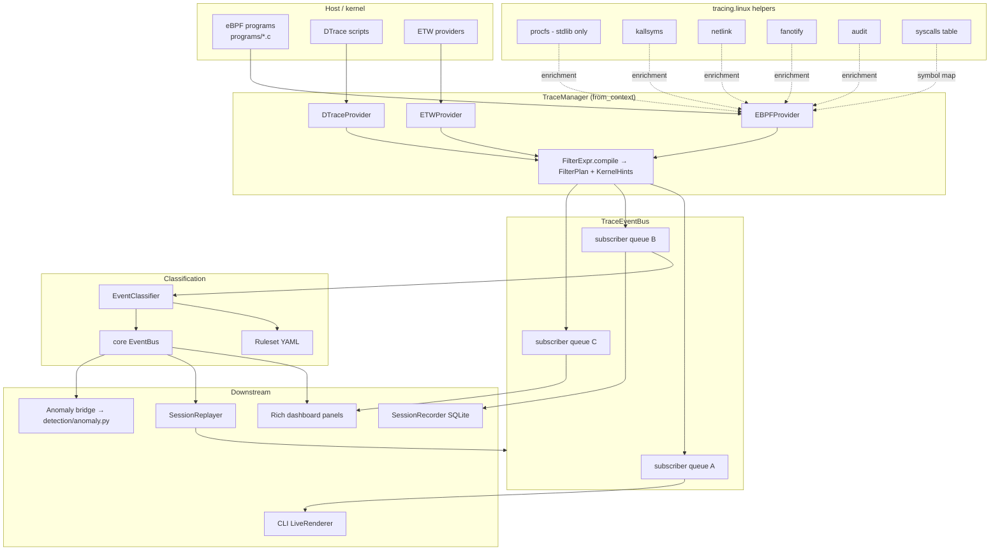

# Tracing and classification

Deep View's live-tracing pipeline was already documented in detail at the module level —
this page is a short refresher that orients the tracing subsystem against the
other architecture pages in this section and pins down the one thing that tends to
confuse newcomers: the **two** event buses that live in an `AnalysisContext`.

For the full narrative see the tracing / classification sections in `CLAUDE.md`, plus:

- `src/deepview/tracing/manager.py` — `TraceManager.from_context(ctx)`.
- `src/deepview/tracing/filters.py` — `parse_filter()` / `FilterExpr.compile()`.
- `src/deepview/tracing/stream.py` — `TraceEventBus` (async, per-subscriber queues,
  drop-on-overflow).
- `src/deepview/tracing/providers/{ebpf,dtrace,etw}.py` — platform providers.
- `src/deepview/classification/` — `Ruleset`, `EventClassifier`, builtin YAML rules.
- `src/deepview/replay/` — `SessionRecorder` / `SessionReplayer`.

## The two buses

| Bus | Class | Used for | Backpressure? |
|-----|-------|----------|---------------|
| Core `events` | `EventBus` in `core/events.py` | *Everything else* — plugin lifecycle, offload, storage, containers, remote acquisition, classification outputs | Synchronous publish; handlers run in-line |
| Tracing firehose | `TraceEventBus` in `tracing/stream.py` | *Only* the high-volume live-trace stream (syscalls, fs events, network events from eBPF/ETW/DTrace) | Bounded per-subscriber async queues; slow subscribers increment a `drops` counter instead of blocking producers |

The split exists because a single `raw_syscalls` eBPF probe on a busy box produces tens
to hundreds of thousands of events per second. A synchronous bus with five subscribers
would serialise every producer on the slowest consumer. The `TraceEventBus`
fan-out model lets each subscriber consume as fast as it can and fall behind
*independently*.

!!! warning "Never add unbounded buffering"
    The drop-on-overflow contract is deliberate. Adding a subscriber that buffers
    unboundedly, or switching the default to blocking backpressure, will OOM the
    process within seconds under real live-trace load. If you need lossless capture
    of a trace session, use `SessionRecorder` (which writes to SQLite as it drains) —
    not an unbounded in-memory buffer.

## End-to-end topology



A few details worth internalising from the diagram:

- **`FilterExpr.compile() -> FilterPlan + KernelHints`.** The filter DSL compiles
  user-visible expressions (`pid == 1234 && syscall in {openat, execve}`) into a plan
  that (a) evaluates the cheap predicates at the user-space pre-check layer via raw
  ctypes, and (b) lifts known-narrow predicates (single PID, single UID) into kernel
  hints baked into the eBPF program at load time. That's how live tracing stays under
  control on a busy box — the hottest code path is a few ctypes field reads, not a
  full Python-level filter evaluation.
- **Enrichment is side-lateral.** `procfs`, `kallsyms`, `netlink`, `fanotify`, `audit`
  helpers enrich events inside the provider, not downstream. That keeps the plumbing
  under one async lock and avoids double-lookups.
- **Classification writes to the core bus, not the trace bus.** The `EventClassifier`
  consumes `MonitorEvent`s off the trace bus and publishes `EventClassifiedEvent`
  onto the core bus with the classifications attached to `MonitorEvent.metadata`. Every
  downstream consumer (dashboard alerts panel, replay recorder, anomaly bridge) sees
  the already-classified form — classification is not something each subscriber has to
  re-run.
- **Replay is symmetric.** `SessionReplayer` re-publishes stored events onto a private
  `TraceEventBus` at configurable speed; every classifier / renderer / panel is
  oblivious to whether the bytes are live or replayed. That means the exact same rule
  authoring workflow works against recorded data.

## CLI surface

```bash
# Live tracing with a single-PID filter (goes to a kernel hint, not user-space)
deepview trace --filter 'pid == 1234' --fields syscall,arg0,arg1

# Classification + alert render over the live stream
deepview monitor --rules /etc/deepview/classification.d/

# Record a session to SQLite
deepview replay record --out session.db

# Replay it (fast-forward 10x)
deepview replay play session.db --speed 10

# Inspect a live process via /proc/[pid]/mem as a DataLayer
deepview inspect process --pid 1234 --yara rules.yar
```

Every one of these commands builds an `AnalysisContext`, calls
`TraceManager.from_context(ctx)`, subscribes the CLI's live renderer to the resulting
`TraceEventBus`, and lets the core bus carry classification + artifact events.

## Where to poke next

- **Adding a new eBPF probe.** Drop the C in `tracing/programs/`, register the probe
  in `tracing/providers/ebpf.py`, make sure the event envelope lands on
  `MonitorEvent.fields`. Test with a single-PID filter first so you don't overwhelm
  the poll thread.
- **Adding a classification rule.** YAML file under
  `src/deepview/classification/builtin_rules/`. The ruleset loader picks it up on
  `EventClassifier` init. See the existing rules for the match-expression DSL.
- **Teaching the dashboard a new panel.** Subclass `Panel` in
  `cli/dashboard/panels.py`, subscribe it to a core-bus event type in its `__init__`,
  bind it to a layout region in the YAML. Dashboard and subsystems never import each
  other at module load — the only coupling is the typed event class.

## Related reading

- `CLAUDE.md` — the authoritative tracing + classification + replay sections.
- [Architecture overview](../overview/architecture.md) — how this subsystem fits
  against the rest of Deep View.
- [Events reference](../reference/events.md) — event schema for `MonitorEvent`,
  `EventClassifiedEvent`, and the classification builtins.
