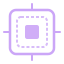

# SVG icons

Deep View ships a small catalogue of hand-crafted workflow icons. Each is a
64x64 single-colour SVG that accepts a colour override via `currentColor` (set
by inline CSS in the SVG, overridable from the embedding page).

These icons are used in landing-page step diagrams, the mkdocs navigation
cards, and the social card for release announcements. They are **not** brand
marks — use the [logo](../assets/logo.svg) for that.

## Catalogue

### Acquire

{ width=64 }

Used wherever raw bytes enter Deep View: memory acquisition (`LiME`, `AVML`,
`winpmem`, `OSXPmem`, live capture), disk imaging, firmware dumps, and PCIe
DMA via `chipsec` / `leechcore`. The downward arrow over a disk platter reads
as "bytes come in here".

File: [`docs/assets/icon-acquire.svg`](../assets/icon-acquire.svg)

### Wrap

{ width=64 }

Used for the transformation stage between raw acquisition and analysis: ECC
correction, flash translation (FTL), LUKS / FileVault / BitLocker decryption,
and format-specific parsing (LiME headers, ELF core, crashdump, hibernation).
The nested squares read as "layers on top of the raw stream".

File: [`docs/assets/icon-wrap.svg`](../assets/icon-wrap.svg)

### Analyse

{ width=64 }

Used for everything that consumes a wrapped DataLayer: plugins, YARA/IoC
scanners, anti-forensics detection, classifiers, and the on-demand inspect
primitives. The magnifying glass over a signal trace is deliberately the same
family of shape as the [main logo](../assets/logo.svg).

File: [`docs/assets/icon-analyse.svg`](../assets/icon-analyse.svg)

### Report

{ width=64 }

Used for outputs: HTML reports, Markdown exports, JSON dumps, ATT&CK
Navigator layers, STIX 2.1 bundles, and the replay-session database. The
document silhouette with a verdict dot is the universal "this is the
deliverable" glyph.

File: [`docs/assets/icon-report.svg`](../assets/icon-report.svg)

## Usage

Each icon is wrapped in an `<svg>` with its own `<title>` and `<desc>` for
screen-reader accessibility. The fill is bound to `currentColor`, so you can
recolour from the embedding CSS:

```html
<span style="color: #94e2d5">
  
</span>
```

Or inline, with a theme-driven accent class:

```html
<svg class="dv-step-icon dv-accent-teal" aria-hidden="true">
  <use href="/assets/icon-analyse.svg#dv-icon-analyse-title"/>
</svg>
```

## Conventions

- **Size.** Render at 32, 48, 64, or 96 px. Below 32 px the 2.5 px strokes
  flatten; above 96 px use the [logo](../assets/logo.svg) instead.
- **Colour.** Default fill is mauve `#cba6f7`. Where an icon represents a
  specific subsystem, use that subsystem's accent (see [Palette](palette.md)):
    - acquire - teal (`#94e2d5`) for memory, sapphire (`#74c7ec`) for VM, peach (`#fab387`) for firmware.
    - wrap - lavender (`#b4befe`).
    - analyse - mauve (`#cba6f7`) default; sky (`#89dceb`) when representing a live trace.
    - report - green (`#a6e3a1`).
- **Pairing.** Keep at most two icons in a single row; four-step workflows
  stack vertically on narrow screens.
- **No re-export.** Don't convert these to PNG for embedding. Let the
  browser rasterise at the size it needs.
