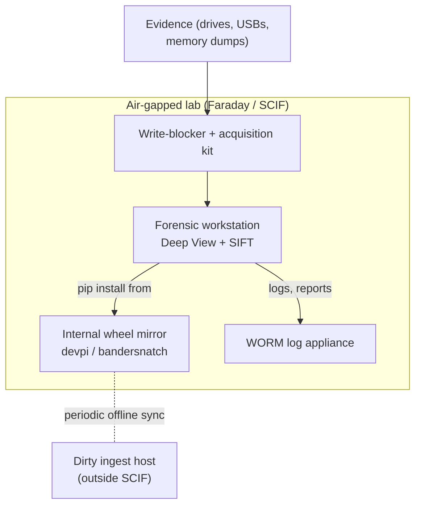

# Isolated / air-gapped forensic lab

This page documents the recommended setup for running Deep View in an
air-gapped forensic lab — no outbound network, a wheel mirror instead
of PyPI, WORM logging, and acquisition hardware that never touches the
corporate network.

!!! warning "Dual-use and legal posture"
    Air-gapped labs exist precisely because the engagements run inside
    them are sensitive: classified material, criminal evidence,
    regulated incident response. Deep View's [dual-use
    statement](../security/dual-use-statement.md) and
    [operator OPSEC](../security/opsec.md) page define the procedural
    baseline that an isolated lab must implement in hardware and
    paperwork rather than in code.

## Physical layout



- **Ingress** is one-way only. Wheel updates, YARA rules, and
  Volatility symbols reach the mirror via a dirty ingest host that
  signs bundles and transfers them on read-only media.
- **Egress** is nil. Reports leave on locked optical media through
  the standard SCIF release process, not over the network.
- **Time sync** runs from an internal NTP appliance; never trust
  inbound NTP from the upstream network.

## Wheel mirror

Deep View installs as a normal Python package, so the air-gapped
install reduces to pointing `pip` at a local mirror. Two viable
approaches:

### `devpi` server

`devpi-server` proxies PyPI on the dirty side, and serves a read-only
snapshot on the clean side. Sync nightly.

```bash
# Dirty side (has internet):
devpi-server --init --serverdir=/srv/devpi
devpi-server --serverdir=/srv/devpi --host 0.0.0.0

devpi use http://dirty.devpi.local/
devpi user -c uploader password=...
devpi login uploader
devpi index -c forensics bases=root/pypi

# Populate by installing into a throwaway venv — devpi caches every
# wheel that satisfies the resolve.
python -m venv /tmp/resolve
/tmp/resolve/bin/pip install --index-url http://dirty.devpi.local/uploader/forensics/+simple/ \
    "deepview[all,dev]==0.2.0"

# Export the whole cache to a tarball that the SCIF release desk can
# verify and carry across.
tar --sort=name -cf deepview-mirror-2026-04-14.tar.zst \
    --use-compress-program=zstd \
    /srv/devpi
sha256sum deepview-mirror-2026-04-14.tar.zst > deepview-mirror-2026-04-14.sha256
gpg --detach-sign --local-user lab-release deepview-mirror-2026-04-14.tar.zst

# Clean side (air-gapped):
# 1. Verify GPG signature against the lab's offline keyring.
# 2. Expand /srv/devpi.
# 3. Start devpi-server with --offline-mode so it refuses any
#    outbound lookups.
devpi-server --serverdir=/srv/devpi --offline-mode --host 0.0.0.0
```

### `bandersnatch` + static wheelhouse

Simpler when you only need a pinned set. Mirror is a plain HTTP static
directory of wheels; `pip install --no-index --find-links` drives
installs. Rebuild the wheelhouse per release.

```bash
# Dirty side:
pip wheel --wheel-dir ./wheelhouse \
    "deepview[all,dev]==0.2.0" \
    --no-deps   # if you want surgical control of transitives

# Treat the wheelhouse like evidence.
sha256sum wheelhouse/*.whl > WHEELS.sha256
gpg --detach-sign --local-user lab-release WHEELS.sha256

# Clean side:
pip install --no-index --find-links /srv/wheels \
    "deepview[memory,tracing,instrumentation,storage,compression,ecc,containers]==0.2.0"
```

!!! tip "Pin to a release tag"
    Never mirror `latest` or floating ranges. Pin every dependency in
    a `constraints.txt`, sign the constraints file, and re-verify the
    signature on the clean side before installing.

## Lab-wide config

Use `DEEPVIEW_CONFIG` to point every workstation at a shared TOML
file. Keep the file on a read-only network share (NFS with
`ro,nosuid,nodev,root_squash`) so individual analysts cannot drift
the policy.

```bash
# /etc/profile.d/deepview.sh (deployed by configuration management)
export DEEPVIEW_CONFIG=/srv/forensics/etc/deepview.toml
export DEEPVIEW_REPORTING__OUTPUT_DIR=/srv/forensics/cases/${USER}/reports
export DEEPVIEW_REPORTING__FORMATS="json,html,stix"
```

Example `deepview.toml` fragment for a SCIF lab:

```toml
[acquisition]
# Never prompt on acquisition — authorisation is paperwork-checked
# before the workstation is booted.
require_authorization_flag = true

[reporting]
output_dir = "/srv/forensics/cases"
formats    = ["json", "html", "stix"]
# Embed case IDs in every report filename for WORM ingest.
filename_template = "{case_id}/{plugin}/{timestamp}-{host}.{ext}"

[reporting.redact]
process_env            = true
environment_variables  = true
command_line_secrets   = true

[tracing]
# Air-gapped lab runs offline analysis only. Refuse live providers.
live_providers_enabled = false

[memory]
# Volatility symbol packs ship with the mirror snapshot, not
# downloaded on demand.
symbol_packs_dir = "/srv/forensics/volatility-symbols"
allow_symbol_download = false

[logging]
destination = "syslog"
syslog_host = "worm.internal.lab"
syslog_port = 6514
```

## Immutable / WORM logging

Every Deep View invocation should emit to an append-only log that
cannot be rewritten by a compromised workstation or a careless
analyst.

- **Send logs to a syslog sink on WORM hardware.** `rsyslog` with
  `$OutputFileCreateMode 0440` and a filesystem with the `append-only`
  attribute (`chattr +a`) is the cheapest working option. Better:
  a commercial WORM appliance with cryptographic seals per file.
- **Emit JSON, not text.** Deep View's structlog pipeline defaults to
  `structlog.stdlib.JSONRenderer`; keep that in the lab config so
  log lines are parseable at ingest time.
- **Include the run ID and authorisation statement.** Set
  `DEEPVIEW_REPORTING__RUN_ID=$(uuidgen)` in every session script and
  pass `--authorization-statement "$CASE_AUTH"` on every command that
  accepts it. Both fields land in the log line and the report.
- **Hash the report at close.** Scripts that call
  `deepview report export` should SHA-256 the output and append the
  hash to the WORM log as a separate line.

!!! danger "Local journald is not WORM"
    `systemd-journald` rotates its binary files and root can truncate
    them. Forward journald to the syslog appliance, do not rely on
    the local copy as evidence.

## Recommended hardware

The hardware list below is the minimum Deep View assumes when the
`hardware` and `remote_acquisition` extras are installed. Substitute
vendor-specific kit as your procurement allows.

### Write-blockers

- A hardware write-blocker that interposes on the target storage
  interface (SATA, NVMe, USB, SAS). Pure software write-blocking is
  insufficient for evidence that may go to court.
- Verify the blocker against the NIST CFTT write-blocker matrix
  before each engagement.

### Live memory acquisition

- **Intel host**: a workstation with Thunderbolt 3/4 and IOMMU
  enabled, matched with a Thunderbolt-attached `leechcore` target
  cable (e.g. `PCILeech ScreamerM.2` + `Screamer FPGA`).
- **Apple Silicon host**: DMA acquisition is restricted; fall back to
  live `osxpmem` with SIP configured per Apple's forensic guidance.
- **Windows hypervisor hosts**: WinPMem ISO delivered via out-of-band
  management, never by staging a binary on the live system.

### Acquisition transport

- **FireWire 1394** for legacy systems where it's still the lowest-
  impact DMA path. The `forensic1394` extra's Python bindings drive
  it from Deep View.
- **PCIe JTAG / debug cards** for the handful of engagements where
  even Thunderbolt is blocked. These cards also cover baseband
  access for mobile forensics, which sits outside Deep View's
  current scope.

### Storage for evidence

- Ingest drives are **new** per case, never reused. Hash and seal
  before connecting; hash and seal again before archiving.
- Case vault uses ZFS with `copies=2` on ECC memory. Scrub weekly.
  Snapshots are **not** a substitute for tape / optical archive.
- Long-term archive: M-DISC or LTO-9 WORM tape, signed with an
  offline key.

## Onboarding checklist

For each new engagement:

1. Paperwork: engagement scope, authorisation statement, custody
   sheet, classification.
2. Mint a case ID. Create `/srv/forensics/cases/${CASE_ID}`.
3. Hash evidence drives at acquisition time (`sha256sum` +
   `deepview acquire hash`).
4. Run `deepview doctor --strict` on the workstation; attach the
   JSON output to the custody sheet.
5. Acquire memory first (see
   [operator OPSEC](../security/opsec.md#acquisition-order-volatile-first)).
6. Run analyses with `--authorization-statement` set; verify each
   session's WORM log line lands.
7. Export reports; SHA-256 each; attach to the custody sheet; burn
   to WORM media before leaving the SCIF.

## Next

- If the lab also runs on SIFT VMs, read the
  [SIFT workstation](sift-workstation.md) page for the integration
  layout.
- For shared-node analysis without the air gap, the
  [Kubernetes recipe](kubernetes.md) is the natural next step once
  the network policy allows it.
