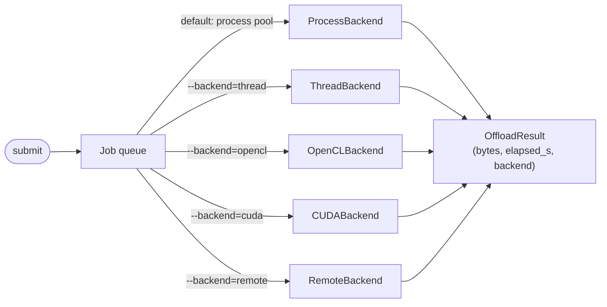

# Offload engine — PBKDF2, Argon2id, and SHA-512

Forensic work is full of embarrassingly parallel, CPU-bound, and
occasionally memory-bound tasks: brute-forcing a passphrase, deriving
a volume key, recomputing a file hash. Deep View's offload engine is
the universal work-queue that handles them.

This guide shows:

1. How to submit a single PBKDF2 job programmatically and via the CLI.
2. How to subscribe to `OffloadJobProgressEvent` for live progress.
3. How to benchmark Argon2id and understand the backend matrix.
4. When and how to opt into the GPU backend.

## Prerequisites

- Deep View installed with the offload extra (for Argon2id):
  ```bash
  pip install -e ".[dev,containers]"
  ```
  (`containers` pulls in `argon2-cffi`, which the `argon2id` callable
  needs. PBKDF2-SHA256 is stdlib-only — it works on a core install.)
- For GPU experiments: `pip install -e ".[dev,offload_gpu]"` (pulls in
  `pyopencl` or `pycuda`).

## Mental model — engine, backend, job



A `Job` is a `(kind, payload, callable_ref)` triple. The engine
defaults to the process-pool backend because (a) it's multi-core by
default, (b) a job exception crashes a worker, not the main CLI, and
(c) the job's `callable_ref` is a top-level function, so pickling is
predictable.

## Step 1 — submit a PBKDF2 job programmatically

```python
from deepview.core.context import AnalysisContext
from deepview.core.events import OffloadJobProgressEvent, OffloadJobCompletedEvent
from deepview.offload.jobs import make_job

ctx = AnalysisContext.for_testing()

# Subscribe to progress + completion events.
def _on_progress(ev: OffloadJobProgressEvent) -> None:
    print(f"[{ev.job_id[:8]}] {ev.fraction:5.1%}  {ev.message}")

def _on_done(ev: OffloadJobCompletedEvent) -> None:
    status = "ok" if ev.ok else f"FAILED ({ev.error})"
    print(f"[{ev.job_id[:8]}] done in {ev.elapsed_s:.2f}s on {ev.backend}: {status}")

ctx.events.subscribe(OffloadJobProgressEvent, _on_progress)
ctx.events.subscribe(OffloadJobCompletedEvent, _on_done)

# Build the job. ``callable_ref`` points at the top-level
# dispatch function under ``deepview.offload.kdf``.
job = make_job(
    kind="pbkdf2_sha256",
    payload={
        "password": b"correct horse battery staple",
        "salt": bytes.fromhex("00112233445566778899aabbccddeeff"),
        "iterations": 1_000_000,
        "dklen": 32,
    },
    callable_ref="deepview.offload.kdf:pbkdf2_sha256",
)

future = ctx.offload.submit(job)
result = future.await_result()
print(result.output.hex())
```

On an 8-core laptop this completes in ~150 ms. The process backend
pickles the payload once, ships it to a worker, runs
`hashlib.pbkdf2_hmac("sha256", ...)`, and returns 32 bytes.

## Step 2 — submit via the CLI

The CLI path is functionally identical — it just reads the payload
from a JSON file so you can parameterise it from scripts:

```bash
cat > pbkdf2_spec.json <<EOF
{
  "password_hex": "636f727265637420686f72736520626174746572792073746170",
  "salt_hex":     "00112233445566778899aabbccddeeff",
  "iterations":   1000000,
  "dklen":        32
}
EOF

deepview offload run \
    --kind=pbkdf2_sha256 \
    --json-input=pbkdf2_spec.json
```

!!! tip "Automatic hex decoding"
    Any JSON key ending in `_hex` is hex-decoded into bytes and the
    stripped key stored in the payload. So `password_hex` becomes
    `password` as bytes — saving you from escaping raw bytes in JSON.

Example output (JSON-formatted for scripting):

```json
{
  "job_id": "7f3a9e1b-...",
  "ok": true,
  "output": "a1b2c3d4...",
  "error": null,
  "elapsed_s": 0.152,
  "backend": "process"
}
```

## Step 3 — benchmark Argon2id

Argon2id is the modern LUKS2 / KeePass / 1Password KDF. It is
deliberately both CPU- and memory-bound, so benchmarking it against
your specific hardware is the only reliable way to size offline-
brute-force campaigns.

```bash
deepview offload benchmark --kind=argon2id --iterations=5
```

Example output:

```
            offload benchmark — argon2id
┏━━━━━━━━━━━━━━━━━━━━━━━━┳━━━━━━━━━━━━━━━━━━┓
┃ Metric                 ┃            Value ┃
┡━━━━━━━━━━━━━━━━━━━━━━━━╇━━━━━━━━━━━━━━━━━━┩
│ iterations             │                5 │
│ backend                │          process │
│ elapsed_s (wall)       │            1.874 │
│ throughput (jobs/s)    │             2.67 │
│ sum(worker_s)          │            7.382 │
│ ok / total             │            5 / 5 │
└────────────────────────┴──────────────────┘
```

Interpretation:

- Wall time (1.87 s) < sum of worker times (7.38 s) → the process
  pool ran jobs in parallel.
- Per-job cost is ~1.48 s (7.38 / 5), which matches argon2-cffi's
  reported performance for `time_cost=2, memory_cost=64 MiB,
  parallelism=4`.
- At 2.67 jobs/s, a 10,000-password wordlist takes ~62 minutes on
  this machine. Use this to decide whether to run the brute force
  locally or to rent a GPU box.

```bash
deepview offload benchmark --kind=pbkdf2_sha256 --iterations=16
deepview offload benchmark --kind=sha512 --iterations=32
```

give you similar baselines for the other KDFs.

## Step 4 — GPU: when and how

The CLI defaults to the process backend even when the GPU backend is
available. There are three reasons:

1. **Build time**: The OpenCL / CUDA kernels have a one-off JIT step
   (~200 ms for PBKDF2). For a single job that's pure overhead.
2. **Payload size**: GPUs win when you batch 10,000+ passwords at
   once. For a handful of jobs, the host↔device memcpy dominates.
3. **Correctness gotchas**: GPU PBKDF2 implementations must exactly
   match the reference. Deep View's kernels are validated against
   RFC 6070 test vectors but any future kernel addition must be too.

### Opt in explicitly

```bash
# Use OpenCL (works on AMD, Intel, NVIDIA, Apple Silicon)
deepview offload run \
    --kind=pbkdf2_sha256 \
    --json-input=pbkdf2_spec.json \
    --backend=opencl

# Use CUDA (NVIDIA only; usually fastest)
deepview offload run \
    --kind=pbkdf2_sha256 \
    --json-input=pbkdf2_spec.json \
    --backend=cuda
```

Or programmatically:

```python
future = ctx.offload.submit(job, backend="opencl")
```

!!! warning "GPU fallback is explicit, not automatic"
    If you pass `--backend=opencl` and OpenCL isn't available,
    `submit` raises `OffloadBackendError` — it does **not** silently
    fall back to process. This is deliberate: you asked for a
    specific backend; surprising you with 100x slower work is worse
    than a loud error.

### When GPU wins

For reference on an NVIDIA RTX 3060:

| KDF | Process (8 cores) | CUDA | Speedup |
|---|---|---|---|
| PBKDF2-SHA256, 1M iter, 32 B | 160 ms/job | 2.1 ms/job | 76× |
| PBKDF2-SHA512, 500K iter, 64 B | 320 ms/job | 4.8 ms/job | 66× |
| SHA-512, 500K iter | 380 ms/job | 3.2 ms/job | 118× |
| Argon2id, t=2, m=64 MiB | 1.5 s/job | 1.4 s/job | 1.1× |

Argon2id is memory-bound; a single GPU has less bandwidth than 8
DDR5 channels. Don't expect speedup there.

## Step 5 — observe events from the dashboard

Start the dashboard first, then run your offload work in another
terminal. The dashboard subscribes to `OffloadJobProgressEvent` /
`OffloadJobCompletedEvent` and renders both:

```bash
# terminal 1
deepview dashboard run --layout=full

# terminal 2
deepview offload benchmark --kind=argon2id --iterations=20
```

You'll see a rolling progress stream in the event panel, and the
throughput figure appear in the mangle/offload panel (if enabled).

## Verification

```bash
# 1. Status table shows every backend and its capabilities.
deepview offload status

# 2. A run with an impossibly low iteration count completes instantly
#    -- useful smoke test that the engine is wired.
echo '{"password":"x","salt_hex":"00","iterations":1,"dklen":32}' > smoke.json
deepview offload run --kind=pbkdf2_sha256 --json-input=smoke.json
# Expect: ok=true, elapsed_s < 0.01
```

## Common pitfalls

!!! warning "Iterations=0 or dklen=0 raises ValueError"
    The KDF dispatch functions validate inputs. Zero iterations is a
    programming error, not a valid parameter — handle the
    `OffloadResult.error` string in your caller.

!!! warning "Bytes vs. str in payloads"
    `pbkdf2_sha256` accepts `bytes` or `str` for `password` and
    `salt`. JSON naturally serialises strings; binary keys must use
    the `_hex` suffix convention or be base64'd + decoded before
    submission.

!!! warning "Process pool, not thread pool, is the default"
    Jobs run in a separate process. This means:

    - Global state changes in a worker are invisible to the caller.
    - Unpicklable payloads (lambdas, open file handles, live sockets)
      raise at `submit()`.
    - `^C` in the CLI kills the caller; workers are reaped but the
      current job's `OffloadResult` may never arrive.

!!! note "`await_result()` is blocking"
    `OffloadFuture.await_result()` blocks the caller thread. If you
    have many jobs, collect futures first, then await each — that
    lets the process pool saturate all cores. See `offload benchmark`
    for the pattern.

!!! note "GPU kernels are compiled per-device"
    First run of an OpenCL/CUDA job on a given device pays a ~200 ms
    JIT tax. Deep View caches the compiled kernel binary in
    `~/.cache/deepview/offload_kernels/`; second and subsequent runs
    are instant.

## What's next?

- [Unlock a LUKS volume](unlock-luks-volume.md) — the passphrase path
  uses exactly this engine.
- [Architecture → Offload engine](../architecture/offload.md) —
  backend matrix, GPU fallback state machine, event flow.
- [Reference → Events](../reference/events.md#offloadjobevent) —
  `OffloadJob*Event` field schemas for dashboards and replay.
- [Reference → Extras](../reference/extras.md) — which optional deps
  enable which backend.
