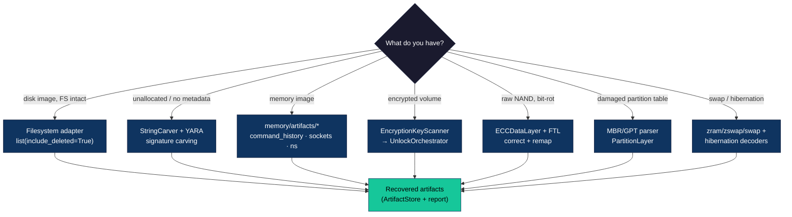
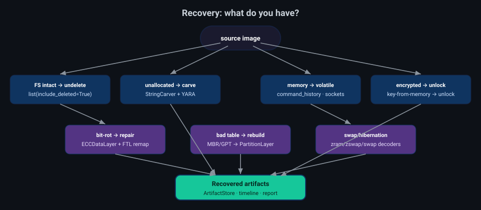

# Recovering artifacts

"Recovery" in Deep View spans everything from undeleting a file with intact
metadata to carving printable remnants out of unallocated space, reconstructing
volatile state from a memory image, and repairing the layers *underneath* a
filesystem (ECC, bad blocks, partition tables) so a damaged image becomes
readable at all. This guide maps each recovery **use case** to the capability
that serves it, then walks a self-contained carving scenario.

## Recovery decision flow





## Use cases → capabilities

| Recovery use case | Capability | Entry point |
|-------------------|------------|-------------|
| Undelete a file (metadata intact) | Filesystem adapters honouring `include_deleted` | `deepview filesystem`, `StorageManager.open_filesystem` |
| Carve deleted files / unallocated space | `deleted_file_carve` plugin + `StringCarver` | `plugins/builtin/deleted_file_carve.py` |
| Carve strings / IoCs from raw bytes | `StringCarver`, `IndicatorEngine`, YARA | `deepview scan ioc/yara`, `scanning/string_carver.py` |
| Recover volatile state from memory | Volatile artifact recovery | `memory/artifacts/{command_history,linux_sockets,linux_ns,linux_proc}.py` |
| Recover shell / command history | `command_history` plugin | `plugins/builtin/command_history.py` |
| Recover keys from memory → unlock a volume | `EncryptionKeyScanner` → `UnlockOrchestrator` (`MasterKey` source) | `deepview unlock`, `detection/encryption_keys.py` |
| Recover swap / hibernation pages | `zram` / `zswap` / `swap` / hibernation decoders | `storage/encodings/*`, `plugins/builtin/swap_extract.py` |
| Repair bit-rot before recovery | `ECCDataLayer` (Hamming/BCH/Reed–Solomon) + FTL bad-block remap | `storage/ecc/*`, `storage/ftl/badblock.py` |
| Reconstruct a damaged partition table | MBR/GPT parser + `PartitionLayer` | `storage/partition.py` |
| Build a cross-artifact timeline | `TimelineBuilder` | `deepview report timeline` |

Because every layer is a composable `DataLayer`, these stack: an ECC layer
under an FTL under a partition under a filesystem means a NAND dump with
bit-rot and a clobbered partition table can still be walked for deleted files —
each recovery step feeds the next.

## Scenario: carve artifacts from unallocated space

When the directory entries are gone, carving recovers the *content* directly.
`StringCarver` reconstructs ASCII and UTF-16LE strings from any byte source —
unallocated clusters, a `LiveProcessLayer`, or a raw memory dump:

```python
from deepview.scanning.string_carver import StringCarver

carver = StringCarver(min_length=6, encodings=["ascii", "utf-16-le"])
for cs in carver.carve(raw_bytes):
    print(f"0x{cs.offset:06x} [{cs.encoding}] {cs.value!r}")
```

`examples/14_recover_artifacts_by_carving.py` is a runnable, dependency-free
version that synthesises an image with embedded artifacts (a deleted shell
command, a staging URL, an SSH key path, a wide-char registry remnant) and
recovers them — then surfaces the network indicators among the results.

For a filesystem image with intact metadata, prefer the structured path:

```bash
deepview filesystem ls image.dd:/ --include-deleted
```

and feed recovered detections into a report:

```bash
deepview report timeline -o timeline.json
deepview report export --format stix -o findings.json
```

## Chain of custody

Recovery is evidence handling: keep the source read-only (every Deep View
`DataLayer` refuses writes), and prefer the paths that hash what they produce —
acquisition results and side-channel captures carry a SHA256, and carved
artifacts retain their source offsets so a finding can always be traced back to
where in the image it came from.
