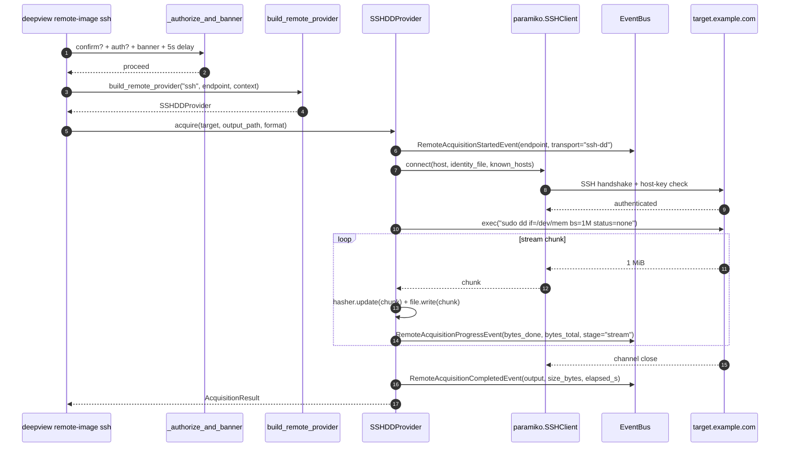

# Remote acquisition over SSH

Acquiring memory from a running host without disturbing it is a
classic forensic workflow. Deep View's `remote-image ssh` transport
opens an SSH session, runs `sudo dd if=/dev/mem bs=1M` on the target,
streams the output back over the channel, and writes it to a local
file — all while publishing progress events and enforcing a strict
authorization gate.

This guide walks through:

1. The **authorization gate** (why every remote-acquisition command
   requires three opt-ins before it does anything).
2. The **dry-run rehearsal** — recommended before every real
   acquisition.
3. The live dd-over-SSH stream and the progress events it publishes.

!!! warning "Dual-use capability"
    Remote acquisition reads every byte of the target machine's
    physical memory over the network. Only run this against systems
    you own or have written authorization to analyse. Deep View's CLI
    gates this command behind `--confirm`, an authorization statement,
    and a 5-second cancel window — respect those gates.

## Prerequisites

- Deep View installed with the remote-acquisition extra:
  ```bash
  pip install -e ".[dev,remote_acquisition]"
  ```
- The target host reachable over SSH.
- An unprivileged SSH account on the target with passwordless `sudo`
  access to `dd` (or a root account, but passwordless `sudo dd` is
  strongly preferred).
- A local `known_hosts` file pinning the target host key (required
  unless you pass `--no-require-tls` — **do not do this**).
- An authorization statement you can reference by env var or file.

### Authorization statement

The `--authorization-statement` flag takes one of three forms:

| Form | Example | Source |
|---|---|---|
| `env:NAME` | `env:AUTH` | environment variable `AUTH` |
| `file:/path` | `file:/home/analyst/case-123.txt` | file contents |
| inline literal | `"Case 123 approved by Jane Doe, 2026-04-14"` | argv (still must be non-empty) |

All three forms must resolve to a **non-empty** string. The source
(e.g. `env:AUTH` or `file:/home/analyst/case-123.txt`) is echoed in
the banner; the contents are logged to `~/.cache/deepview/audit.log`.

```bash
export AUTH="Case 2026-0417: authorized by Legal, scope = target.example.com"
```

## Scenario — dry-run, then live

### Step 1 — rehearse with `--dry-run`

Every remote-acquisition command supports `--dry-run`. It prints the
banner + the planned operation but **does not** open a socket,
authenticate, or transfer any bytes:

```bash
deepview remote-image ssh \
    --host target.example.com \
    --username analyst \
    --identity-file ~/.ssh/id_ed25519_forensics \
    --known-hosts ~/.ssh/known_hosts \
    --source /dev/mem \
    --output target.mem.raw \
    --format raw \
    --confirm \
    --authorization-statement=env:AUTH \
    --dry-run
```

You will see:

```
WARNING: Remote memory acquisition is a dual-use capability. You have attested
authorization via env:AUTH. Proceeding against target.example.com via ssh-dd
in 5 seconds. Press ^C to abort.
--dry-run set; no network traffic will occur.
plan: transport=ssh-dd host=target.example.com port=None output=target.mem.raw format=raw
```

!!! tip "Why rehearse?"
    The dry-run catches 95% of typos: a missing `known_hosts` line,
    an expired authorization env var, the wrong hostname, a file path
    that collides with existing evidence. Rehearsing is free — run it
    first **every time**.

### Step 2 — live acquisition

Drop `--dry-run`. The banner prints, then a 5-second `time.sleep`
gives you one last chance to `^C`:

```bash
deepview remote-image ssh \
    --host target.example.com \
    --username analyst \
    --identity-file ~/.ssh/id_ed25519_forensics \
    --known-hosts ~/.ssh/known_hosts \
    --source /dev/mem \
    --output target.mem.raw \
    --format raw \
    --confirm \
    --authorization-statement=env:AUTH
```

### What happens on the wire



### Terminal output

```
WARNING: Remote memory acquisition is a dual-use capability. You have attested
authorization via env:AUTH. Proceeding against target.example.com via ssh-dd
in 5 seconds. Press ^C to abort.
[SSH] connected to target.example.com as analyst (host-key pinned via known_hosts)
[dd] streaming /dev/mem at bs=1M
[progress] 512 MiB / 16384 MiB (3.1%)  throughput=52.4 MB/s
[progress] 1024 MiB / 16384 MiB (6.3%)  throughput=53.1 MB/s
...
[progress] 16384 MiB / 16384 MiB (100.0%)  throughput=54.0 MB/s
done: output=target.mem.raw size=17179869184 format=raw elapsed=303.41s
```

!!! tip "Tail the progress events from the dashboard"
    Run `deepview dashboard run --layout=full` in another terminal
    first. The `EventTailPanel` will render each
    `RemoteAcquisitionProgressEvent` live; no extra flags required.

## Verification

After the dd finishes:

```bash
# 1. File size is sane and matches /proc/meminfo on the target.
stat -c %s target.mem.raw

# 2. The image can be loaded as a memory dump.
deepview memory load target.mem.raw --register-as=tgt_mem

# 3. A quick process listing sanity-checks the capture.
deepview memory ps --layer=tgt_mem | head
```

If `memory ps` returns a populated process list, the acquisition
succeeded.

## Common pitfalls

!!! warning "Host-key pinning is non-negotiable"
    `--require-tls` is the default for SSH, and it maps to
    "`--known-hosts` is required." If the target's fingerprint isn't
    in your `known_hosts` yet, run `ssh-keyscan target.example.com >>
    ~/.ssh/known_hosts` on a trusted network **first**. Don't pass
    `--no-require-tls` as a shortcut — that downgrades to
    `AutoAddPolicy` and opens you to MITM.

!!! warning "`/dev/mem` is restricted on modern kernels"
    Most distros since 2016 ship with `CONFIG_STRICT_DEVMEM=y`, which
    restricts `/dev/mem` to the first megabyte. For a full memory
    capture use `/proc/kcore` (pass `--source=/proc/kcore`) or deploy
    the LiME kernel module (see [`remote-image lime`](../reference/cli.md#remote-image-lime)).

!!! warning "dd on a live host is never a clean capture"
    Physical memory churns continuously; a 16 GiB dd takes 5 minutes
    and the bytes on page 0 at second 0 won't match the bytes on page
    0 at second 300. This is inherent to live acquisition — if you
    need a consistent snapshot use a hypervisor checkpoint (see
    [`deepview vm snapshot`](../reference/cli.md#vm-snapshot)) instead.

!!! warning "Authorization env vars do leak"
    If your authorization statement is in `AUTH`, anyone who can
    read `/proc/$pid/environ` on your workstation can read it. Prefer
    `file:/restricted/path/auth.txt` with 0400 permissions when the
    statement contains sensitive case details.

!!! note "^C during the 5-second delay is clean"
    The delay is a single `time.sleep(5)` wrapped in a
    `KeyboardInterrupt` → `click.Abort` handler. `^C` during the
    countdown exits with status 1 before any network traffic. Use it.

## What's next?

- [Remote acquisition via DMA](remote-acquire-dma.md) — Thunderbolt /
  PCIe / FireWire variants for when SSH access is unavailable.
- [Architecture → Remote acquisition](../architecture/remote-acquisition.md)
  — factory, transport matrix, and authorization gating diagrams.
- [Reference → Events](../reference/events.md#remoteacquisitionevent) —
  `RemoteAcquisition*Event` field schemas for building progress UIs.
- [Reference → Extras](../reference/extras.md) — which optional deps
  enable which remote transports.
