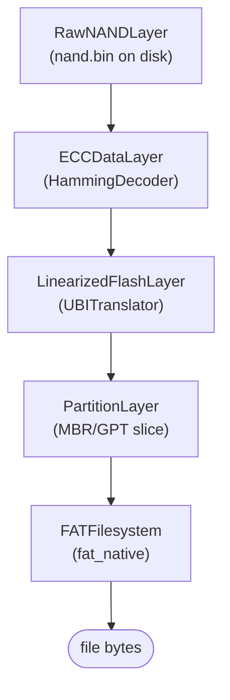
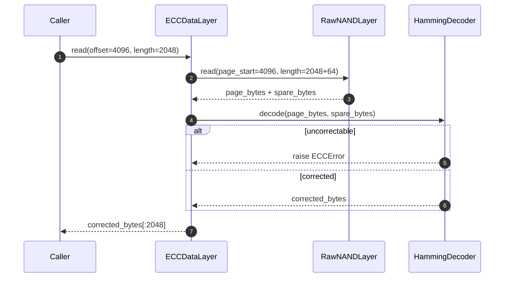

# Storage image walkthrough — from NAND dump to file bytes

This guide takes a raw NAND chip image end-to-end through every layer of
Deep View's storage stack: raw bytes → ECC correction → FTL translation →
partition parsing → filesystem mount → a single file read.

The goal is to show how each storage primitive composes onto the next via
the [`DataLayer`](../reference/interfaces.md#datalayer) abstraction, and
to map every Python-level step to the equivalent `deepview` CLI
invocation.

## Scenario

You have a `nand.bin` extracted with a chip-off probe from an embedded
Linux device (think: an IP camera, a home router, a BLE thermostat).
The chip advertises ONFI-style spare OOB bytes, 2048-byte pages, 64
pages per block, and was formatted with UBI on top of JFFS2-style bad-
block remapping. A FAT12 partition sits on a `ubi0_0` volume.

You want:

1. The raw layer validated as a legitimate NAND image.
2. Hamming ECC applied to every page before anything reads the payload.
3. UBI's logical-to-physical block remapping applied on top.
4. The MBR/GPT parsed, the FAT12 slice located, and its root directory
   listed.
5. A single file (`config.cfg`) dumped to stdout for review.

!!! note "Fixture-friendly"
    This guide doubles as the exact scaffolding the test suite uses in
    `tests/unit/test_storage/test_auto.py` against synthetic NAND
    fixtures — so you can walk the same steps against repo-bundled
    dummy data without a real chip-off rig.

## Prerequisites

- Deep View installed with the storage + ECC extras:
  ```bash
  pip install -e ".[dev,storage,ecc]"
  ```
- An image file `nand.bin` in your working directory. For a throwaway
  fixture, any file with a byte size that is an integer multiple of
  `(page_size + spare_size) * pages_per_block * blocks` will at least
  reach the FTL step.
- The `deepview doctor` command reports `storage`, `ecc` and `ftl`
  adapters as importable:
  ```bash
  deepview doctor | rg 'storage|ecc|ftl'
  ```

!!! tip "Test against the bundled fixture first"
    If you don't have a real NAND image handy, every command below
    accepts the repo fixture at
    `tests/fixtures/storage/synthetic_nand_small.bin`. Substitute that
    path for `nand.bin` throughout.

## Mental model — the composition stack

Deep View treats every transformation of a byte stream as a `DataLayer`
wrapping another `DataLayer`. Reads are forwarded down the stack and
transformed on the way back up.



Each box in the diagram is a concrete class under
`src/deepview/storage/`. The wrap order is always "innermost first":
the ECC layer sits closest to the raw bytes, the filesystem sits at the
outermost edge.

See [Architecture → Data-layer composition](../overview/data-layer-composition.md)
for an animated version of this stack.

## ECC read path

Before any byte leaves the ECC layer, Hamming/BCH verifies and (if
needed) corrects the page. The sequence looks like this:



!!! warning "Uncorrectable errors are fail-loud"
    When Hamming / BCH / Reed-Solomon exhausts its correction budget,
    `ECCDataLayer.read` raises an `ECCError` with the faulty page
    number. It is **not** silently passed through — do not catch and
    ignore this in forensic workflows.

## Step 1 — build the raw layer

=== "Python"

    ```python
    from pathlib import Path
    from deepview.core.context import AnalysisContext
    from deepview.memory.formats.raw import RawMemoryLayer

    ctx = AnalysisContext.for_testing()
    raw = RawMemoryLayer(Path("nand.bin"))
    ctx.layers.register("nand_raw", raw)
    ```

=== "CLI"

    ```bash
    # The memory manager treats any file as a raw byte layer when the
    # format probes don't match a known dump format. ``storage list`` will
    # show the layer registered under its basename.
    deepview memory load nand.bin --register-as=nand_raw
    deepview storage list
    ```

At this point `ctx.layers.get("nand_raw")` is a `DataLayer` whose
`read(offset, length)` returns the corresponding slice of `nand.bin`.
Nothing is parsed yet.

## Step 2 — wrap with ECC + FTL

The `StorageManager.wrap_nand` helper composes an `ECCDataLayer` +
`LinearizedFlashLayer` in one call. The `deepview storage wrap` CLI
subcommand does the same thing over `click`-flagged geometry.

=== "Python"

    ```python
    from deepview.storage.geometry import NANDGeometry, SpareLayout
    from deepview.storage.ecc.hamming import HammingDecoder
    from deepview.storage.ftl.ubi import UBITranslator

    geometry = NANDGeometry(
        page_size=2048,
        spare_size=64,
        pages_per_block=64,
        blocks=2048,
        spare_layout=SpareLayout.onfi(spare_size=64),
    )
    wrapped = ctx.storage.wrap_nand(
        raw,
        geometry,
        ecc=HammingDecoder(),
        ftl=UBITranslator(geometry),
    )
    ctx.layers.register("nand_ubi", wrapped)
    ```

=== "CLI"

    ```bash
    deepview storage wrap \
        --layer=nand_raw \
        --out=nand_ubi \
        --ecc=hamming \
        --ftl=ubi \
        --spare-layout=onfi \
        --page-size=2048 \
        --spare-size=64 \
        --pages-per-block=64 \
        --blocks=2048
    ```

!!! tip "Inspect what adapters are available"
    `deepview storage list` enumerates every registered layer, FS
    adapter, FTL translator, and ECC decoder — handy when you're not
    sure whether `bch` or `rs` was loaded.

The output should read `registered 'nand_ubi' (ecc=hamming, ftl=ubi,
layout=onfi)`. Read through the resulting layer and every page gets
the ECC dance described above before it touches your hands.

## Step 3 — parse partitions

=== "Python"

    ```python
    from deepview.storage.partition import parse_partitions, PartitionLayer

    partitions = list(parse_partitions(wrapped))
    for p in partitions:
        print(p.index, p.start_offset, p.size, p.type_guid or p.type_id)
    ```

=== "CLI"

    ```bash
    # There is no top-level ``partition`` command yet; use the Python
    # API from ``deepview python`` or from your own plugin. The
    # ``filesystem ls`` command below auto-slices via offset.
    deepview filesystem ls --layer=nand_ubi --offset=0 --fs-type=auto
    ```

On a healthy image you see one entry per partition: one FAT, one UBIFS
volume, etc. Pick the FAT partition's `start_offset` for the next step.

## Step 4 — list the filesystem root

=== "Python"

    ```python
    fs = ctx.storage.open_filesystem(wrapped, offset=partitions[0].start_offset)
    for entry in fs.list("/"):
        print(f"{entry.path:40s}  {entry.size:>10d}  {entry.mode:06o}")
    ```

=== "CLI"

    ```bash
    deepview filesystem ls \
        --layer=nand_ubi \
        --offset=32768 \
        --fs-type=auto \
        --path=/
    ```

The table includes size, mode, mtime, and whether an entry is a
tombstone (deleted but still recoverable — this is why we went through
the trouble of ECC + FTL instead of `mount -o loop`).

## Step 5 — read a single file

=== "Python"

    ```python
    data = fs.read("/config.cfg")
    print(data.decode("utf-8", errors="replace"))
    ```

=== "CLI"

    ```bash
    deepview filesystem cat \
        --layer=nand_ubi \
        --offset=32768 \
        --fs-type=auto \
        --path=/config.cfg
    ```

Because `filesystem cat` writes raw bytes to stdout, you can pipe it
into anything — `strings`, `xxd`, a YARA scan, a hex editor. The FAT
adapter is pure Python so this works on every platform Deep View
supports.

## Verification

Run this one-liner after each step to sanity-check the stack:

```bash
deepview storage list
```

You should see:

- **Registered layers**: `nand_raw` (RawMemoryLayer), `nand_ubi`
  (LinearizedFlashLayer — the outermost wrap).
- **Filesystem adapters**: `fat`, plus any native adapters (`ntfs`,
  `ext`, `apfs`) that imported cleanly at startup.
- **FTL translators**: `ubi`, `jffs2`, `mtd`, `badblock`.
- **ECC decoders**: `hamming` at minimum; `bch` and `rs` if the
  optional `[ecc]` extra is installed.

The `filesystem find` subcommand is useful for sanity-checking that the
whole stack actually produces a readable tree:

```bash
deepview filesystem find --layer=nand_ubi --pattern='*.cfg'
```

## Common pitfalls

!!! warning "Wrong spare layout = silent corruption"
    ONFI OOB is not universal. Samsung KLM, Toshiba TC58, and Micron
    MT29F parts all use proprietary spare layouts — picking the wrong
    one still "decodes" but every page is scrambled. If Hamming
    produces a correction on every single page, you have the wrong
    `--spare-layout`. Named presets live in
    `deepview.storage.ecc.layouts` (`samsung_klm`, `toshiba_tc58`,
    `micron_mt29f`).

!!! warning "ECC without matching geometry"
    `HammingDecoder` expects a specific ratio of data bytes to ECC
    bytes. If your `--page-size` is 4096 but the chip was dumped in
    2048-byte pages, every page reads as uncorrectable. Verify
    `page_size * pages_per_block * blocks + spare_size * ...` matches
    `stat -c %s nand.bin` before blaming the ECC.

!!! warning "UBI is non-contiguous by design"
    Don't be surprised if `wrapped.read(0, 4096)` returns different
    bytes than `raw.read(0, 4096)`. UBI deliberately shuffles logical
    erase blocks across physical erase blocks for wear levelling. The
    whole point of the FTL layer is to undo that mapping.

!!! note "When `--fs-type=auto` guesses wrong"
    The probe iterates registered adapters in insertion order (see
    [`filesystems/registry.py`](../reference/interfaces.md#filesystem)).
    Pass `--fs-type=fat` explicitly if auto-detection lands on a
    superficially similar signature.

## What's next?

- [Unlock a LUKS volume](unlock-luks-volume.md) — the same composition
  pattern with a `DecryptedVolumeLayer` inserted between FTL and
  partition parsing.
- [Extending Deep View](extending-deepview.md) — add a new filesystem
  adapter that behaves exactly like `fat_native` does here.
- [Architecture → Storage subsystem](../architecture/storage.md) — the
  full reference diagram with every adapter, encoder, and translator
  enumerated.
- [Reference → CLI](../reference/cli.md#storage) — the canonical flag
  list for every `storage` subcommand.
