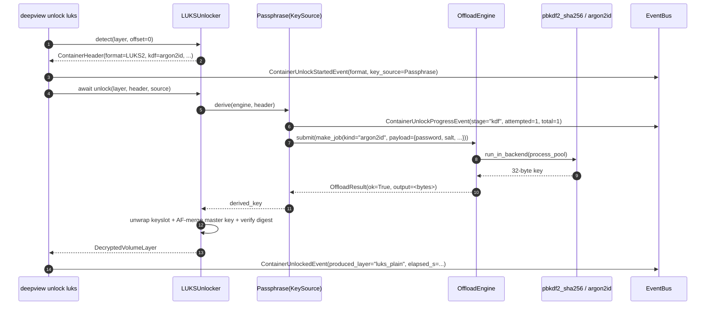
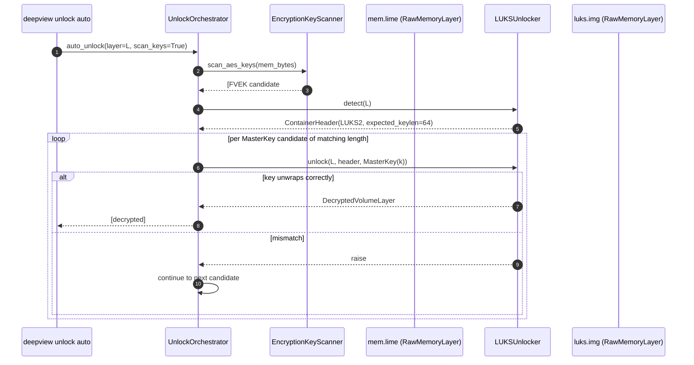

# Unlock a LUKS volume

This guide shows two ways to unlock a LUKS1/LUKS2 container with Deep
View:

1. **Passphrase path** — the common case: the analyst knows (or is
   brute-forcing) the user passphrase, and Deep View runs the
   container's KDF through the offload engine.
2. **Memory-extracted master key path** — the forensic case: the
   volume was unlocked on a running host, its FVEK was still resident
   in RAM, and a memory dump is available to carve the key from.

Both paths end at the same `DecryptedVolumeLayer` — a read-only
`DataLayer` over the plaintext extent that every downstream Deep View
subsystem (filesystem mount, YARA scan, carving) can consume unchanged.

## Prerequisites

- Deep View installed with the containers extra:
  ```bash
  pip install -e ".[dev,containers]"
  ```
- A LUKS1 or LUKS2 disk image (`luks.img`) you are **authorized** to
  examine.
- For the memory path, a RAM dump (`mem.lime`) captured while the
  volume was unlocked.
- Environment variable with the passphrase when applicable:
  ```bash
  read -s LUKS_PW
  export LUKS_PW
  ```

!!! warning "Secrets via env, never argv"
    Deep View deliberately accepts `--passphrase-env=NAME` rather than
    `--passphrase=VALUE`. Shell history, `ps`, `/proc/*/cmdline`, and
    syslog would all leak a passphrase passed on the command line —
    the env-var dance avoids every one of those.

## Scenario 1 — passphrase path

```bash
deepview unlock luks luks.img \
    --passphrase-env=LUKS_PW \
    --mount=luks_plain
```

### What happens under the hood



### What you see in the terminal

```
detected LUKS2 cipher=aes-xts-plain64 kdf=argon2id payload_offset=0x1000000
┏━━━━━━━━━━━┳━━━━━━━━━━━━┳━━━━━━━━━━━━━━━━━━━━━━┓
┃ Container ┃ KeySource  ┃ ProducedLayer         ┃
┡━━━━━━━━━━━╇━━━━━━━━━━━━╇━━━━━━━━━━━━━━━━━━━━━━┩
│ LUKS2     │ Passphrase │ decrypted:luks.img:0  │
└───────────┴────────────┴──────────────────────┘
registered layer name='luks_plain'
```

The produced `luks_plain` layer now lives in `context.layers` and can
feed any downstream command:

```bash
deepview filesystem ls --layer=luks_plain --fs-type=auto --path=/
deepview scan yara --layer=luks_plain --rules=my_rules.yar
```

!!! tip "Subscribe to progress events from code"
    The `ContainerUnlockProgressEvent` published during the KDF step
    carries `stage="kdf"`, `attempted=n`, `total=m`. Subscribe via
    `ctx.events.subscribe(ContainerUnlockProgressEvent, handler)`
    before the CLI runs to render a live progress bar.

### Why offload the KDF?

Argon2id with the defaults most installers pick (64 MiB memory cost,
time cost 2) takes ~250 ms per try on consumer CPUs. PBKDF2-SHA512
with 1M iterations (LUKS1 default) takes ~400 ms. Running either on
the caller thread would freeze the CLI / dashboard / event loop; the
offload engine runs it on a process-pool worker (default backend) so
the main thread is free to publish events and respond to `^C`.

## Scenario 2 — memory-extracted master key

This path is useful when:

- The passphrase is unknown or the user refuses to disclose it.
- You have a RAM acquisition (LiME, AVML, WinPmem, DMA-captured dump).
- The volume was open at acquisition time, so the FVEK was resident.

### Command

```bash
deepview unlock auto luks.img \
    --memory-dump=mem.lime \
    --confirm \
    --register-as-prefix=auto
```

!!! warning "Memory-key scanning is dual-use"
    The `--memory-dump` flag triggers a full-volume scan for AES /
    LUKS / BitLocker / FileVault master-key shapes. On a wrongly-
    scoped dump this could harvest keys you have no authority to
    possess. `--confirm` is **required** to bypass the interactive
    prompt; read the banner before passing it in automation.

### What happens under the hood



`EncryptionKeyScanner` is the module under
`src/deepview/detection/encryption_keys.py`. It looks for AES key-
schedule shapes: a round-key prefix, the correct number of sub-key
bytes, and optionally a LUKS master-key context. Every candidate gets
wrapped in a `MasterKey(key=...)` `KeySource` and tried against every
registered `Unlocker`.

!!! note "Fast because there is no KDF"
    A `MasterKey` source's `derive()` just returns the bytes it was
    constructed with — no PBKDF2, no Argon2. So each candidate is
    ~1 ms to try, and 50-100 candidates still completes in the time it
    takes one passphrase attempt to finish. The orchestrator always
    tries `MasterKey` candidates **before** passphrases for this
    reason.

### What you see in the terminal

```
AUTO-UNLOCK NOTICE
--memory-dump scans every byte of the provided dump for AES / LUKS /
BitLocker / FileVault master keys. The resulting candidate keys are
tried against every registered container on the target image. This
is a dual-use capability — scope to evidence you are authorized to
examine.
                              auto-unlock results
┏━━━┳━━━━━━━━━━━┳━━━━━━━━━━━━━━━━━━━━━━━━━━━━━━┓
┃ # ┃ Container ┃ ProducedLayer                 ┃
┡━━━╇━━━━━━━━━━━╇━━━━━━━━━━━━━━━━━━━━━━━━━━━━━━┩
│ 0 │ LUKS2     │ decrypted:luks.img:0          │
└───┴───────────┴───────────────────────────────┘
```

And `deepview storage list` now shows `auto_0` registered as the
decrypted layer.

## Verification

Confirm the unlocked layer actually contains a valid filesystem:

```bash
deepview filesystem ls --layer=luks_plain --path=/ --fs-type=auto
```

If the result is an empty table **or** a parse error, the unlock
returned garbage — either the key matched a digest by chance (extremely
unlikely with LUKS but not impossible) or the payload offset is wrong.
Cross-check by reading the first 64 bytes and looking for filesystem
magics:

```bash
deepview filesystem stat --layer=luks_plain --path=/ --fs-type=auto
```

## Common pitfalls

!!! warning "Wrong LUKS version autodetection"
    LUKS1 and LUKS2 share the `LUKS\xba\xbe` magic; the version is the
    next 2 bytes. The detector prints `format=LUKS1` or `LUKS2` in
    the banner — if you expected LUKS2 but saw LUKS1 you are almost
    certainly pointing at an older tool's output.

!!! warning "Active keyslot is not slot 0"
    LUKS supports 8 keyslots. The unlocker iterates every active slot
    until one unwraps cleanly; if your passphrase lived in slot 5 you
    will see up to 5 `ContainerUnlockStartedEvent` / failure pairs
    before success. This is expected.

!!! warning "Argon2id without the argon2-cffi extra"
    If `pip install 'deepview[containers]'` was skipped, the Argon2id
    KDF raises `ImportError: argon2id offload requires the
    'argon2-cffi' package`. Install the `containers` extra or fall
    back to a LUKS1-style image.

!!! note "Memory-extracted keys are ephemeral"
    The same RAM dump taken 30 seconds later might not contain the
    FVEK anymore — the kernel can wipe key material as soon as the
    volume is closed. Acquire memory while the volume is mounted.

## What's next?

- [Unlock a VeraCrypt hidden volume](unlock-veracrypt-hidden.md) — same
  idea, but with the trailing-region probe enabled.
- [PBKDF2 via offload](offload-pbkdf2.md) — a deeper dive into the
  offload engine that powers the passphrase path.
- [Architecture → Containers](../architecture/containers.md) — the
  orchestrator design, key sources, and the `DecryptedVolumeLayer`.
- [Extending Deep View](extending-deepview.md) — add a new
  `Unlocker` for a format Deep View doesn't know yet.
