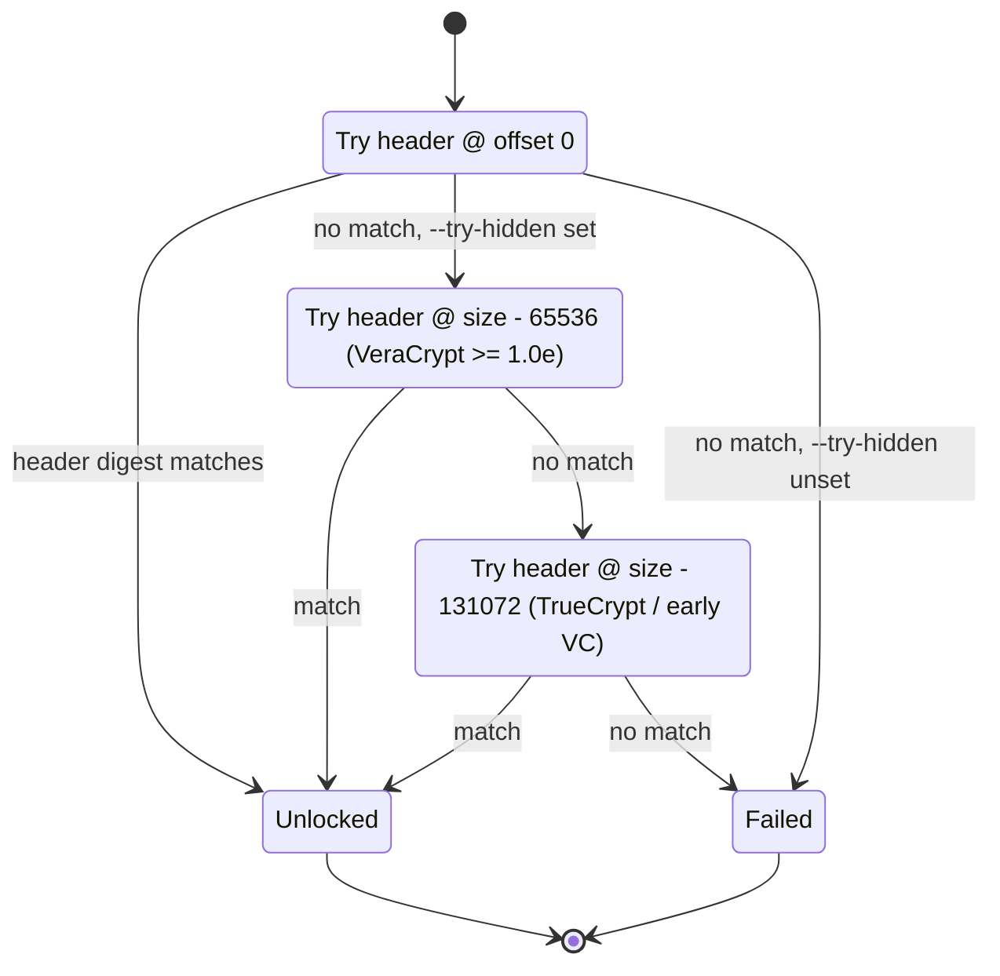

# Unlock a VeraCrypt container — outer + hidden volumes

VeraCrypt (and its TrueCrypt ancestor) is famous for one feature:
**plausible deniability** via hidden volumes. The outer volume holds
decoy data, and a second hidden volume sits invisibly in the
slack space at the end of the outer, decryptable only with a
different passphrase. Deep View's VeraCrypt adapter can unlock either
or both in the same pass.

This guide walks through:

1. Unlocking the outer volume with just a passphrase.
2. Adding `--try-hidden` to also probe the trailing region for the
   hidden volume.
3. The modern vs. legacy hidden-volume header offsets (65536 vs.
   131072) and how the probe state machine handles both.

## Prerequisites

- Deep View installed with the containers extra:
  ```bash
  pip install -e ".[dev,containers]"
  ```
- A VeraCrypt image (`vera.img`) you are authorized to examine.
- The outer volume passphrase (required to detect the container at all
  — VeraCrypt doesn't have plaintext magic).
- The hidden volume passphrase (if you want to unlock the hidden
  volume).

!!! tip "Read [Unlock a LUKS volume](unlock-luks-volume.md) first"
    The KDF / offload dance for VeraCrypt is identical to LUKS's
    passphrase path. This guide focuses only on what's different: the
    hidden-volume trailing-region probe.

## Scenario 1 — outer volume only

```bash
export VERA_OUTER_PW='correct horse battery staple'

deepview unlock veracrypt vera.img \
    --passphrase-env=VERA_OUTER_PW \
    --mount=vera_outer
```

The detection + unlock steps proceed exactly as for LUKS:

1. The detector tries every supported KDF × cipher cascade until one
   yields a header checksum match.
2. The matched passphrase produces a 64-byte header key via PBKDF2 /
   HMAC-RIPEMD160 / HMAC-SHA512 / HMAC-Whirlpool / HMAC-Streebog,
   offloaded through the [offload engine](../architecture/offload.md).
3. The plaintext header reveals the data offset + length, and a
   `DecryptedVolumeLayer` is built over that extent.

The banner you will see is:

```
VeraCrypt/TrueCrypt unlock performs a brute-force trial decryption
against every supported KDF x cascade combination. Each attempt is a
PBKDF2 derivation and takes measurable CPU time — this is expected.
detected VeraCrypt cipher=aes-xts kdf=sha512 payload_offset=0x20000
```

## Scenario 2 — probe for a hidden volume

Add `--try-hidden` and supply the hidden volume passphrase:

```bash
export VERA_HIDDEN_PW='another different passphrase'

deepview unlock veracrypt vera.img \
    --passphrase-env=VERA_HIDDEN_PW \
    --try-hidden \
    --mount=vera_hidden
```

The CLI will:

1. Detect and read the **outer** header at offset 0 exactly as in
   scenario 1.
2. If the given passphrase unwraps the outer header, you get the
   outer volume back.
3. If it does **not**, the adapter re-tries the decryption against
   the hidden-volume header(s) — which sit near the end of the
   container, not at offset 0.

### The trailing-region probe state machine

Modern VeraCrypt (≥ 1.0e) writes the hidden header at `disk_size -
65536`. TrueCrypt and early VeraCrypt wrote it at `disk_size -
131072`. The probe state machine tries both before giving up.



Implementation lives in
`src/deepview/storage/containers/veracrypt.py`; the two offsets are
hard-coded constants matching the upstream VeraCrypt source.

!!! tip "You can't tell which volume unlocked from the banner alone"
    Both the outer and hidden volumes print `format=VeraCrypt` on
    success. To know which one you got, compare `payload_offset`
    (outer = just past the 512-byte header; hidden = way further in)
    and the `data_length` (hidden < outer).

## Scenario 3 — unlock both outer and hidden in one pass

Use `deepview unlock auto` with both passphrases in a wordlist:

```bash
cat > /tmp/vera_pws.txt <<EOF
correct horse battery staple
another different passphrase
EOF

deepview unlock auto vera.img \
    --passphrase-list=/tmp/vera_pws.txt \
    --try-hidden \
    --register-as-prefix=vera
```

Output (both matched):

```
                auto-unlock results
┏━━━┳━━━━━━━━━━━━┳━━━━━━━━━━━━━━━━━━━━━━━━━━━━━━━━━━┓
┃ # ┃ Container  ┃ ProducedLayer                     ┃
┡━━━╇━━━━━━━━━━━━╇━━━━━━━━━━━━━━━━━━━━━━━━━━━━━━━━━━┩
│ 0 │ VeraCrypt  │ decrypted:vera.img:0              │
│ 1 │ VeraCrypt  │ decrypted:vera.img:1              │
└───┴────────────┴───────────────────────────────────┘
```

Both decrypted layers are registered: `vera_0` (outer) and `vera_1`
(hidden). Mount each and list:

```bash
deepview filesystem ls --layer=vera_0 --path=/
deepview filesystem ls --layer=vera_1 --path=/
```

## TrueCrypt legacy volumes

`deepview unlock truecrypt` is the same code path with the TRUE magic
and the legacy header offset (131072) preferred over 65536. The system-
encryption (`--system`) flag selects the pre-boot iteration table,
which has a shorter salt and fewer iterations than the volume table.

```bash
deepview unlock truecrypt old_vera.img \
    --passphrase-env=TC_PW \
    --try-hidden \
    --system
```

## Verification

Sanity-check that the right volume unlocked by reading the filesystem
signature from offset 0 of the decrypted layer:

```bash
deepview filesystem stat --layer=vera_hidden --path=/ --fs-type=auto
```

If the decrypted bytes have no recognisable filesystem magic, the
unlock matched the header digest by accident (highly improbable with
AES-XTS but possible) OR you mounted the outer when you wanted the
hidden.

!!! note "PIM (Personal Iterations Multiplier)"
    VeraCrypt supports a user-chosen PIM that changes the PBKDF2
    iteration count. Pass `--pim=N` (any integer 1-2147483647) if the
    volume was created with a non-default PIM — otherwise every
    attempt will silently derive the wrong key.

## Common pitfalls

!!! warning "Unlocking the outer with a hidden passphrase"
    If you only pass `--try-hidden` and the hidden passphrase, the
    outer header trial fails and the trailing-region probe succeeds.
    You end up with the hidden volume — which is probably what you
    wanted. But an unwary analyst might read `detected VeraCrypt` and
    assume they got the outer. Always cross-check `payload_offset`
    and filesystem contents.

!!! warning "Brute-forcing is slow on purpose"
    Every single passphrase attempt runs PBKDF2 at 500,000 iterations
    per KDF × 3-4 KDFs × 3-4 cipher cascades. Expect ~1-2 seconds per
    attempt on a modern CPU. A 10-passphrase wordlist takes 20-30
    seconds.

!!! warning "System encryption != volume encryption"
    A VeraCrypt pre-boot / BitLocker-style system-volume encryption
    uses a smaller salt + fewer iterations. If `--system` is wrong,
    every attempt fails. Re-read the VeraCrypt GUI's "Volume Info"
    panel on the source host to know which to use.

!!! note "Plausible deniability is not a secret from forensics"
    Deep View can detect the *existence* of a hidden volume only if
    you have its passphrase. A failed `--try-hidden` probe without a
    matching passphrase is indistinguishable from "no hidden volume".
    This is by design — VeraCrypt's threat model guarantees exactly
    this.

## What's next?

- [Unlock a LUKS volume](unlock-luks-volume.md) — the passphrase /
  memory-key path for Linux disk encryption.
- [PBKDF2 via offload](offload-pbkdf2.md) — benchmark the KDF that
  powers every VeraCrypt unlock attempt.
- [Architecture → Containers](../architecture/containers.md) — full
  `UnlockOrchestrator` diagram + state-machine reference.
- [Reference → Events](../reference/events.md) — every
  `ContainerUnlock*Event` class with its field schema, for dashboards
  and replay.
