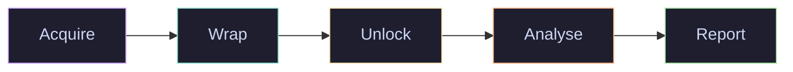

# Deep View

> Cross-platform forensics and runtime-analysis toolkit — memory, storage, encrypted containers, live tracing, instrumentation, remote acquisition.



## Where to start

<div class="grid cards" markdown>

-   :material-rocket-launch:{ .lg .middle } **Quick start**

    ---

    Install the CLI and run `deepview doctor` in 60 seconds.

    [:octicons-arrow-right-24: Installation](#installation)

-   :material-map:{ .lg .middle } **Architecture**

    ---

    How `AnalysisContext`, `DataLayer`, plugins, events, and the offload engine fit together.

    [:octicons-arrow-right-24: Overview](overview/architecture.md)

-   :material-cog:{ .lg .middle } **Guides**

    ---

    Task-oriented walkthroughs: storage imaging, container unlocking, remote acquisition, offload jobs.

    [:octicons-arrow-right-24: Guides](guides/storage-image-walkthrough.md)

-   :material-bookshelf:{ .lg .middle } **Reference**

    ---

    Every CLI command, plugin, interface, event class, and config field.

    [:octicons-arrow-right-24: Reference](reference/cli.md)

</div>

## Installation

```bash
pip install -e ".[dev]"                    # core + tests/lint
pip install -e ".[storage,containers]"     # storage stack + container unlock
pip install -e ".[remote_acquisition]"     # SSH/DMA/IPMI/AMT providers
pip install -e ".[all]"                    # everything (large)
```

Verify with:

```bash
deepview doctor
```

## What's in the box

| Subsystem | Surface | Module |
|---|---|---|
| Memory acquisition | `deepview memory` | [`deepview.memory`](https://github.com/example/deepview/tree/main/src/deepview/memory) |
| Storage stack (formats / ECC / FTL / FS / containers) | `deepview storage`, `deepview filesystem`, `deepview unlock` | [`deepview.storage`](https://github.com/example/deepview/tree/main/src/deepview/storage) |
| Offload engine (CPU + GPU) | `deepview offload` | [`deepview.offload`](https://github.com/example/deepview/tree/main/src/deepview/offload) |
| Remote acquisition (SSH/DMA/IPMI/AMT) | `deepview remote-image` | [`deepview.memory.acquisition.remote`](https://github.com/example/deepview/tree/main/src/deepview/memory/acquisition/remote) |
| Live tracing (eBPF/DTrace/ETW) | `deepview trace`, `deepview monitor` | [`deepview.tracing`](https://github.com/example/deepview/tree/main/src/deepview/tracing) |
| Instrumentation (Frida + static) | `deepview instrument` | [`deepview.instrumentation`](https://github.com/example/deepview/tree/main/src/deepview/instrumentation) |
| Network mangling | `deepview netmangle` | [`deepview.networking`](https://github.com/example/deepview/tree/main/src/deepview/networking) |
| Detection / scanning / reporting | `deepview scan`, `deepview report` | [`deepview.detection`](https://github.com/example/deepview/tree/main/src/deepview/detection) |

## License

MIT. See [`LICENSE`](https://github.com/example/deepview/blob/main/LICENSE).
