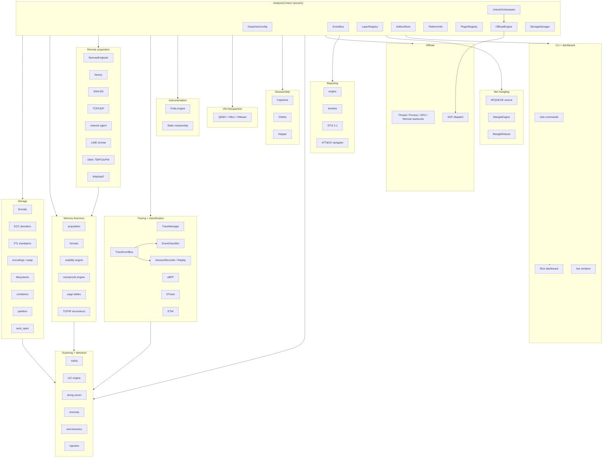
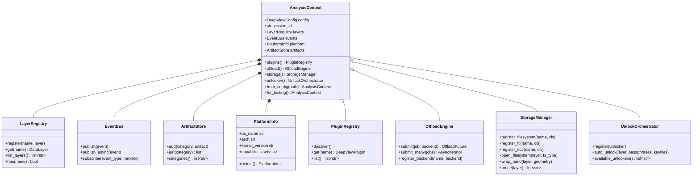
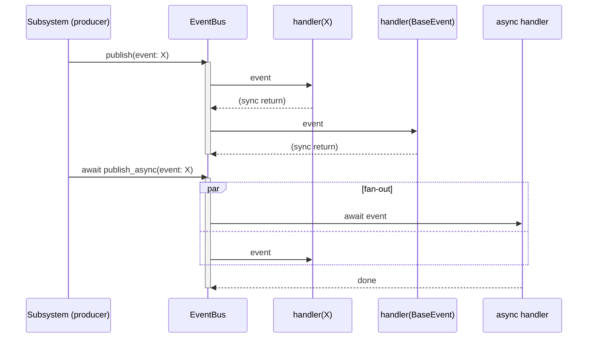
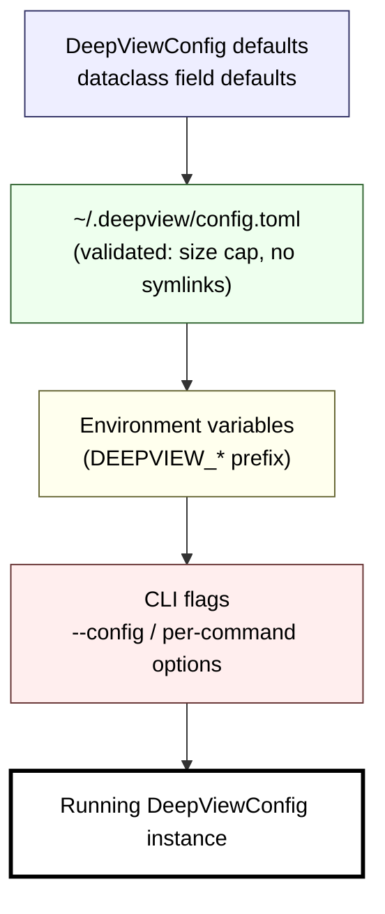

# Architecture

Deep View composes a forensic analysis session out of one
[`AnalysisContext`](../reference/interfaces.md#analysiscontext) and a registry of
[`DataLayer`](../reference/interfaces.md#datalayer) instances. Every subsystem — memory
forensics, live tracing, storage, container unlocking, remote acquisition, instrumentation,
VM introspection, disassembly, detection, reporting — plugs in through a small ABC and
talks to its peers exclusively through the context's `events` bus and `layers` registry.

That gives us three properties that the rest of this site keeps exercising:

- **Decoupling.** A subsystem that does not know about another subsystem can never break
  it. The storage stack doesn't know the tracing pipeline exists; the classification
  engine doesn't know whether events come from live eBPF or a replayed session.
- **Lazy imports.** Every heavy optional dep (`volatility3`, `yara-python`, `frida`,
  `lief`, `capstone`, `leechcore`, `pycuda`, `cryptography`, `libscca`, ...) is imported
  from inside the function that needs it, so `pip install deepview` gives you a CLI that
  imports cleanly and `deepview doctor` tells you exactly what's missing.
- **Testability.** `AnalysisContext.for_testing()` gives every test a clean session with
  no real side effects. Subsystems are trivial to mock by registering stand-in layers or
  by replacing handlers on the event bus.

!!! tip "Rule of thumb"
    If you find yourself importing a sibling subsystem's internals, or passing an
    `AnalysisContext` through three layers of helpers just to reach `.events` — stop.
    Either the work belongs in the other subsystem, or the wiring should move through
    an event type in `core/events.py`.

## Top-level system graph



!!! note "Reading the diagram"
    Every arrow is a one-way dependency. `Session` owns every subsystem node as a lazy
    attribute; the subgraphs just group the packages they live in. Nothing in `Storage`
    imports from `Tracing` (or vice versa) — they only talk through `Session.events`.

## `AnalysisContext` lazy attributes

The context itself is tiny. It owns the primitives everyone needs (config, events,
layers, artifacts, platform) eagerly, and constructs the heavier subsystems on first
access. This is what keeps `deepview doctor` instant on a machine that has no YARA,
no `cryptography`, no GPU:



The filled-diamond edges (`*--`) are eager composition — those four primitives are always
constructed in `__init__`. The open-diamond edges (`o--`) are lazy: the context holds
`None` until you touch `ctx.plugins` / `ctx.offload` / `ctx.storage` / `ctx.unlocker`,
at which point the heavy subsystem is imported and wired against the context.

From `src/deepview/core/context.py`:

> ```python
> @property
> def storage(self) -> StorageManager:
>     if self._storage_manager is None:
>         from deepview.storage.manager import StorageManager
>         self._storage_manager = StorageManager(self)
>     return self._storage_manager
> ```

The `from` import sits *inside* the property body. Nothing outside `core/` imports
`storage.manager` at module-load time; users who never open a forensic image never pay
the import cost of the filesystem registry.

## Crosscutting primitives

### EventBus pub/sub

The [`EventBus`](../reference/events.md) is the one place every subsystem meets. Producers
publish typed dataclass events (`OffloadJobCompletedEvent`,
`ContainerUnlockedEvent`, `RemoteAcquisitionProgressEvent`,
`NetworkPacketMangledEvent`, `EventClassifiedEvent`, ...) and consumers subscribe by
event class. Handlers registered on a parent class see all subclass events too, which is
how the replay recorder grabs everything in one subscription.



!!! warning "Trace-event fan-out drops, never blocks"
    The live-tracing fan-out `TraceEventBus` layers bounded per-subscriber asyncio queues
    on top of the core bus. Slow subscribers increment a `drops` counter; they do not
    exert backpressure on the eBPF/ETW/DTrace producer threads. That's a deliberate
    contract — new subsystems must not introduce unbounded buffering or blocking
    subscribers, or the live firehose will OOM.

### LayerRegistry

`context.layers` is a flat name → `DataLayer` dict. Memory acquisition, storage opens,
and container unlocks all deposit their results here so downstream plugins (YARA,
string carvers, anomaly detection) can find them by a stable name. The registry is
otherwise minimal: registration order is the iteration order, and duplicate names
overwrite.

### ArtifactStore

`context.artifacts` is the append-only findings store. Plugins and detectors deposit
dicts keyed by a category string (`"processes"`, `"network_connections"`,
`"registry_keys"`, `"encryption_keys"`, ...). Reporting subsystems read from it to build
HTML / Markdown / JSON / STIX output without caring how each category got populated.

### PluginRegistry

`context.plugins` is built lazily on first access and performs
[three-tier discovery](plugin-discovery.md): built-in plugins registered at import time,
third-party entry points, then directory scans of `config.plugin_paths`. Duplicate names
are logged and skipped — first-wins, earliest-tier wins.

## Configuration layering

`DeepViewConfig` is a pydantic-settings tree. Config reaches the running process through
four layers, each overriding the one below it:



The loader is defensive on purpose. `DeepViewConfig.load()` calls
`_validate_config_file()` before parsing, which rejects symlinks and files over a size
cap. Don't bypass it — config is an attacker-controlled surface on a forensics box.

!!! note "Env-var overrides use nested keys"
    `DEEPVIEW_OFFLOAD__DEFAULT_BACKEND=thread` overrides `config.offload.default_backend`.
    The double underscore delimits nesting; pydantic-settings handles the rest.

## Where to go next

<div class="grid cards" markdown>

-   **[Data-layer composition](data-layer-composition.md)**

    The `DataLayer` ABC is the single most important shape in Deep View. Everything
    stacks on top of it — raw NAND, ECC-corrected pages, FTL-linearised flash,
    partitions, decrypted volumes, filesystem file bytes.

-   **[Plugin discovery](plugin-discovery.md)**

    How `@register_plugin`, entry points, and directory scans compose into
    `context.plugins`.

-   **[Storage subsystem](../architecture/storage.md)**

    formats → ECC → FTL → encodings → filesystems → containers → partitions → auto.

-   **[Offload engine](../architecture/offload.md)**

    One engine, four backends (thread / process / GPU-OpenCL / GPU-CUDA / remote),
    event-published job lifecycle.

-   **[Container unlock](../architecture/containers.md)**

    `UnlockOrchestrator`, `KeySource` hierarchy, `DecryptedVolumeLayer`, hidden-volume
    probe.

-   **[Remote acquisition](../architecture/remote-acquisition.md)**

    `RemoteEndpoint`, transport factory, authorization gates, fail-secure defaults.

</div>
