# Data-layer composition

The `DataLayer` ABC in `src/deepview/interfaces/layer.py` is Deep View's single most
important shape. A `DataLayer` is a byte-addressable source with four operations:

- `read(offset, length) -> bytes`
- `write(offset, data)` (optional; most forensic layers are read-only)
- `is_valid(offset, length) -> bool`
- `scan(scanner) -> Iterator[ScanResult]`

And two metadata properties: `minimum_address` / `maximum_address` (inclusive address
bounds) plus `metadata` (a `LayerMetadata` bundle with a display name).

Anything that exposes those operations can be stacked into a composition — the ABC
doesn't distinguish "the real thing" from "a thin wrapper". That's the whole trick.

!!! tip "Why does it matter?"
    YARA, string carvers, IoC scanners, the anomaly detector, the injection detector —
    they all consume `DataLayer`. They don't know (or care) whether the bytes come from
    a live `/proc/[pid]/mem`, a raw flash dump, a decrypted LUKS volume, or a FAT file
    opened on top of a partition opened on top of an FTL-linearised NAND. Composition
    gives us end-to-end analysis across every transformation in the stack with zero
    adapter code per scanner.

## The canonical composition chain

A forensic image from an embedded device ends up walking every rung of this ladder:

```mermaid
graph LR
    A[RawNAND<br/>page+spare] --> B[ECCDataLayer<br/>Hamming / BCH / RS]
    B --> C[LinearizedFlashLayer<br/>UBI / JFFS2 / MTD / badblock]
    C --> D[PartitionLayer<br/>GPT / MBR / BSD / APM]
    D --> E[DecryptedVolumeLayer<br/>LUKS / BitLocker / VeraCrypt / FV2]
    E --> F[Filesystem<br/>ext / NTFS / APFS / HFS+ / FAT / ZFS / btrfs]
    F --> G[file bytes]

    style A fill:#fdd,stroke:#733,color:#000
    style B fill:#fed,stroke:#753,color:#000
    style C fill:#ffd,stroke:#773,color:#000
    style D fill:#dfd,stroke:#373,color:#000
    style E fill:#def,stroke:#337,color:#000
    style F fill:#edf,stroke:#535,color:#000
    style G fill:#eee,stroke:#333,color:#000,stroke-width:3px
```




Each rung is optional. A clean LUKS-encrypted laptop image starts at the partition rung
(no ECC, no FTL). A raw embedded flash dump might stop at `LinearizedFlashLayer` because
there's no partition table. A memory image hits none of this at all — it's already flat
bytes.

## Why stacking is lossless

Two properties make this work:

1. **Every layer lazily decodes on `read`.** `ECCDataLayer.read(off, len)` reads the
   underlying raw-NAND page, runs the codec, returns the corrected user bytes. It never
   eagerly materialises the whole corrected image. Same for `LinearizedFlashLayer`,
   `DecryptedVolumeLayer`, and the `Filesystem` file-byte helpers.
2. **Layers expose address bounds correctly.** `DecryptedVolumeLayer` reports the
   decrypted extent, not the ciphertext extent. `LinearizedFlashLayer` reports the
   linearised LBA range, not the physical-page range. Higher rungs never see holes,
   spare areas, or header metadata.

> ```python
> # DecryptedVolumeLayer.read (excerpted)
> first_sector = offset // self._sector_size
> last_sector = (end - 1) // self._sector_size
> result = bytearray()
> for sector in range(first_sector, last_sector + 1):
>     plaintext = self._decrypt_sector(sector, Cipher, algorithms, modes)
>     ...
>     result.extend(plaintext[start:stop])
> return bytes(result)
> ```

Sector-keyed, lazy, LRU-cached. Reading a 128-byte magic number at the start of a 2 TB
LUKS volume decrypts one 512-byte sector. Reading the next 1 KB decrypts one more.

## Programmatic composition

Here's the full stack, wired by hand to illustrate every extension point. For real
workflows, use [`storage.auto.auto_open()`](../architecture/storage.md#auto-open) which
does all of this (plus detection) in one call.

=== "Python (explicit)"

    ```python
    from pathlib import Path

    from deepview.core.context import AnalysisContext
    from deepview.storage.formats.nand_raw import RawNANDLayer
    from deepview.storage.geometry import NANDGeometry, SpareLayout
    from deepview.storage.ecc.bch import BCHDecoder
    from deepview.storage.ecc.base import ECCDataLayer
    from deepview.storage.ftl.ubi import UBITranslator
    from deepview.storage.ftl.linearized import LinearizedFlashLayer
    from deepview.storage.partition import parse_partitions, PartitionLayer

    ctx = AnalysisContext.from_config()

    # 1. Raw NAND with a known geometry + ONFI spare layout.
    geometry = NANDGeometry(
        page_size=2048,
        spare_size=64,
        pages_per_block=64,
        block_count=2048,
        spare_layout=SpareLayout.onfi(spare_size=64),
    )
    raw = RawNANDLayer(Path("/evidence/device.nand"), geometry)

    # 2. ECC-corrected view: BCH-8 over every page.
    corrected = ECCDataLayer(raw, BCHDecoder(t=8), geometry)

    # 3. FTL-linearised view: UBI logical-to-physical mapping.
    linear = LinearizedFlashLayer(corrected, UBITranslator(geometry), geometry)

    # 4. Partition table parsed off the linearised view.
    partitions = list(parse_partitions(linear))
    system_part = PartitionLayer(linear, partitions[0].start_offset, partitions[0].size)

    # 5. (Optionally) unlock a container that lives on the partition.
    unlocked = (await ctx.unlocker.auto_unlock(
        system_part,
        passphrases=["correct horse battery staple"],
    ))[0]

    # 6. Open the filesystem on top.
    fs = ctx.storage.open_filesystem(unlocked)

    # 7. Read file bytes.
    data = fs.read_file("/etc/shadow")
    ```

=== "Python (auto_open)"

    ```python
    from pathlib import Path
    from deepview.core.context import AnalysisContext
    from deepview.storage.auto import auto_unlock_and_open
    from deepview.storage.geometry import NANDGeometry

    ctx = AnalysisContext.from_config()
    result = await auto_unlock_and_open(
        ctx,
        Path("/evidence/device.nand"),
        nand_geometry=NANDGeometry.inferred_2k_64(),
        ecc="bch8",
        ftl="ubi",
        spare_layout="onfi",
        passphrases=["correct horse battery staple"],
    )
    for idx, fs in result.filesystems.items():
        print(f"partition {idx}: {fs.fs_type()}")
    ```

=== "CLI"

    ```bash
    # One command, every rung of the stack, rendered as a tree.
    deepview storage auto-open \
        /evidence/device.nand \
        --nand-geometry 2048/64/64 \
        --ecc bch8 \
        --ftl ubi \
        --spare-layout onfi \
        --unlock-passphrase-env LUKS_PASSPHRASE
    ```

!!! note "All optional deps are lazy"
    `BCHDecoder` imports its C codec inside the class body; `DecryptedVolumeLayer`
    imports `cryptography` inside `read()`. A core install can still `import deepview`
    and run `deepview doctor` — each missing extra shows up as a "not available" line
    instead of an `ImportError` at startup.

## Scanner reuse via `DataLayer.scan()`

Every layer inherits a default `scan()` that streams `read()` chunks through the
provided `PatternScanner`. That's how YARA-on-decrypted-LUKS or
string-carving-on-linearised-NAND works without any code specific to those backends:

```python
from deepview.scanning.yara_engine import YARAScanner

scanner = YARAScanner.from_rules_dir(Path("rules/"))
for hit in unlocked.scan(scanner):
    print(f"{hit.rule} @ {hit.offset:#x}")
```

`DecryptedVolumeLayer.scan()` chunks the decrypted stream into 64 KB reads and yields
`ScanResult`s with offsets in plaintext space — the scanner never sees ciphertext or
knows a cipher was involved.

## Composition is the test surface too

Because a `DataLayer` is just the ABC, a unit test can stand up a
`BytesMemoryLayer(b"\x00" * 4096)` and pass it through the exact same `ECCDataLayer`,
`PartitionLayer`, or `DecryptedVolumeLayer` the production code uses. The storage test
suite in `tests/unit/test_storage/` leans on this heavily: no fixtures are allocated on
disk unless the test genuinely exercises a format-detector on a binary blob.

## Related reading

- [Storage subsystem architecture](../architecture/storage.md) — the whole stack wired
  up with its extension points.
- [Containers](../architecture/containers.md) — `DecryptedVolumeLayer` modes and
  nesting for cascaded / hidden volumes.
- [`interfaces.DataLayer` reference](../reference/interfaces.md#datalayer) — the exact
  ABC shape.
