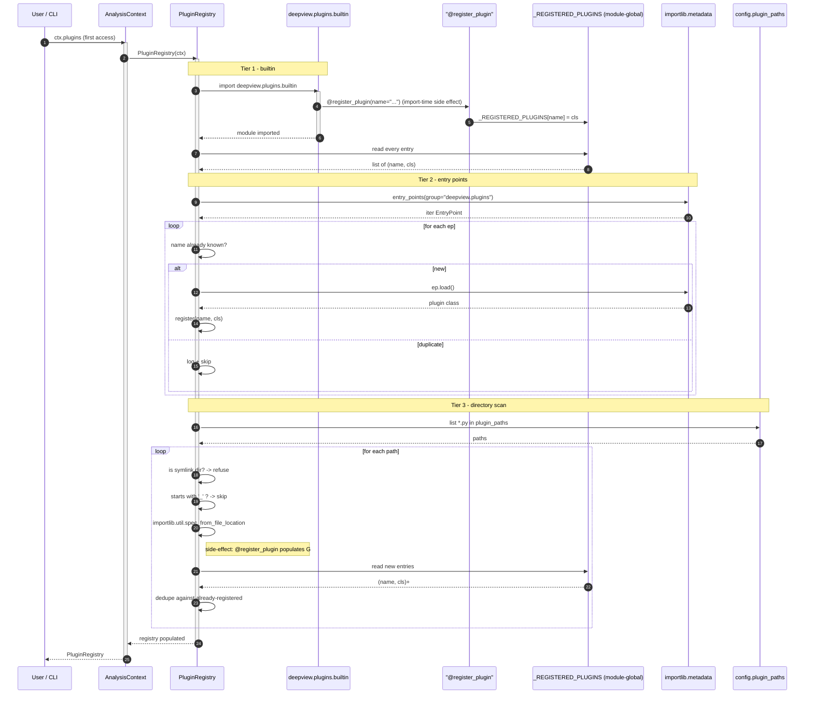

# Plugin discovery

`PluginRegistry` in `src/deepview/plugins/registry.py` is Deep View's extension surface.
Third parties (and the built-in plugins) declare analysis plugins; the registry finds
them through a **three-tier ordered discovery** mechanism and exposes them to the CLI
and to programmatic users via `context.plugins`.

## The three tiers

Later tiers **do not override** earlier tiers. Duplicates are logged and skipped.
First-seen wins.

| Tier | Source | When it registers | Ships with Deep View? |
|------|--------|-------------------|-----------------------|
| 1    | Built-in — `deepview.plugins.builtin` | At import time of the `builtin` package | Yes |
| 2    | Entry points — `[project.entry-points."deepview.plugins"]` in a third-party `pyproject.toml` | When `importlib.metadata.entry_points()` yields the ep | No (third-party) |
| 3    | Directory scan — `*.py` under `config.plugin_paths` or `<config_dir>/plugins/` | On first `context.plugins` access | No (operator-authored) |

!!! warning "Symlinked plugin directories are refused"
    The directory scanner rejects symlinked plugin directories outright. Files starting
    with `_` are skipped. These are intentional safety checks on a dual-use tool — don't
    bypass them.



## Writing a plugin

A `DeepViewPlugin` subclass is a single class. You declare requirements (so the CLI can
say "this plugin needs YARA and you don't have it" via `deepview doctor`) and implement
`run()` returning a `PluginResult`.

=== "Python"

    ```python
    # my_company_deepview_plugins/suspicious_ports.py
    from __future__ import annotations

    from deepview.interfaces.plugin import (
        DeepViewPlugin,
        PluginResult,
        PluginRequirement,
    )
    from deepview.plugins.base import register_plugin


    @register_plugin(
        name="suspicious_ports",
        description="Flag network connections on known-bad remote ports.",
        version="1.0.0",
    )
    class SuspiciousPortsPlugin(DeepViewPlugin):
        BAD_PORTS = {6666, 6667, 31337, 4444}

        def get_requirements(self) -> list[PluginRequirement]:
            # Declarative - CLI renders these on `deepview plugins show`.
            return [
                PluginRequirement(
                    name="layer:memory_primary",
                    description="A registered memory layer to scan connections on.",
                ),
            ]

        def run(self) -> PluginResult:
            ctx = self.context
            findings = []
            for conn in ctx.artifacts.get("network_connections"):
                if conn.get("remote_port") in self.BAD_PORTS:
                    findings.append(conn)
            return PluginResult(
                plugin=self.metadata.name,
                success=True,
                findings=findings,
                summary=f"{len(findings)} connections on known-bad ports",
            )
    ```

    Register from a downstream package's `pyproject.toml` via an entry point so it
    shows up on a user's `deepview plugins` listing once the package is installed:

    ```toml
    [project.entry-points."deepview.plugins"]
    suspicious_ports = "my_company_deepview_plugins.suspicious_ports:SuspiciousPortsPlugin"
    ```

=== "Directory-scan variant"

    Operators who don't want to publish a package can drop `*.py` files under
    `~/.deepview/plugins/`. The registry imports them on first `ctx.plugins` access and
    the `@register_plugin` side effect populates the global dict.

    ```python
    # ~/.deepview/plugins/quick_recon.py
    from deepview.interfaces.plugin import DeepViewPlugin, PluginResult
    from deepview.plugins.base import register_plugin


    @register_plugin(name="quick_recon", description="Fast triage overview")
    class QuickReconPlugin(DeepViewPlugin):
        def get_requirements(self): return []
        def run(self) -> PluginResult:
            return PluginResult(
                plugin="quick_recon",
                success=True,
                findings=[],
                summary="platform=" + self.context.platform.os_name,
            )
    ```

    !!! warning "Directory plugins skip packaging"
        Third-party plugin *authors* should publish real packages with entry points.
        The directory scan is meant for operator-authored scratch work — it bypasses
        dependency declarations and install-time validation, so anything you drop in
        there runs with the same privileges as the `deepview` process.

## `@register_plugin` is an import-time side effect

From `src/deepview/plugins/base.py`:

> ```python
> _REGISTERED_PLUGINS: dict[str, type[DeepViewPlugin]] = {}
>
> def register_plugin(
>     *, name: str, description: str = "", version: str = "0.1.0"
> ) -> Callable[[type[DeepViewPlugin]], type[DeepViewPlugin]]:
>     def decorator(cls: type[DeepViewPlugin]) -> type[DeepViewPlugin]:
>         cls.metadata = PluginMetadata(name=name, description=description, version=version)
>         _REGISTERED_PLUGINS[name] = cls
>         return cls
>     return decorator
> ```

Two consequences to internalise:

1. **If the module isn't imported, the plugin isn't registered.** A file sitting under
   `plugins/builtin/` that nothing imports silently does nothing. The built-in package
   `__init__.py` must import every sibling plugin module (directly or transitively).
   When you add a new built-in, add the import there.
2. **The decorator name is the lookup key.** The CLI's `deepview plugins run <name>`
   looks `<name>` up in the global dict. Renaming the `name=` argument is an API break.

## CLI surface

```bash
deepview plugins                # list every registered plugin
deepview plugins show foo       # description, version, requirements, source tier
deepview plugins run foo        # build a context, dispatch run(), render result
deepview doctor                 # per-requirement availability matrix
```

## Related reading

- [Interfaces reference](../reference/interfaces.md#deepviewplugin) — the exact
  `DeepViewPlugin` ABC shape.
- [Events reference](../reference/events.md) — what plugins can publish to the event
  bus to cooperate with the replay recorder and dashboard.
- [Architecture overview](architecture.md) — how `PluginRegistry` fits against the other
  lazy attributes of `AnalysisContext`.
