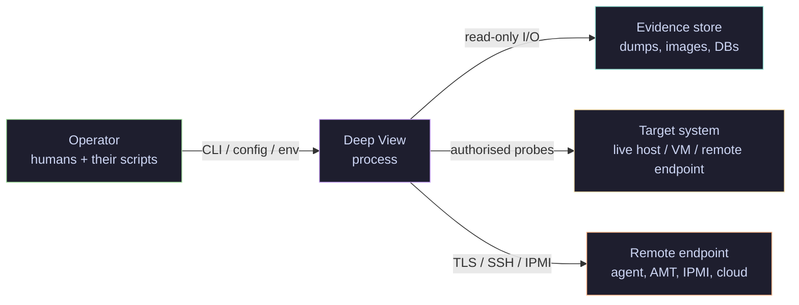

# Threat model

This page is the authoritative threat model for Deep View as a piece
of software: what it handles, who it trusts, what can go wrong, and
which control in the codebase mitigates which threat. It uses the
[STRIDE](https://en.wikipedia.org/wiki/STRIDE_model) taxonomy because
that is the model most easily auditable against a toolkit's source
tree.

It is **not** a threat model for the investigations you run *with*
Deep View — that is a property of your engagement scope and your
organisation's security programme, not of the toolkit. See the
[OPSEC notes](opsec.md) and the [dual-use statement](dual-use-statement.md)
for the operator-facing guidance.

!!! info "How to read this document"
    Each STRIDE section lists threats in the form
    **T-\<category\>-\<n\>**, followed by the affected component(s),
    the attack, the existing mitigation in code, and any residual
    risk. The [mitigation matrix](#mitigation-matrix) at the bottom is
    the cross-index that a reviewer is likely to use in practice.

## Asset inventory

Deep View handles a number of sensitive asset classes. They are
enumerated here because the threat sections below reference them by
name.

| Asset | Where it lives at rest | Where it lives in flight |
|---|---|---|
| **Memory dumps** (LiME / AVML / raw / VM snapshots) | Operator-supplied paths, typically on evidence-grade storage. | Streamed through `DataLayer.read()` into memory; never mutated by the core engine. |
| **Disk images** (raw, E01, AFF4, VM disks) | Same as above. | Wrapped as a chain of `DataLayer`s (partition, ECC, FTL, filesystem). |
| **Encryption keys and passphrases** | Operator's keystore, environment, or carved from a memory dump at analysis time. | Passed as `bytes`/`bytearray` through the unlock pipeline; never logged at any verbosity level. |
| **Acquired artefacts** (carved files, strings, YARA hits, plugin output) | `ctx.artifacts` in memory; SQLite session DB on disk (`replay/`). | Emitted on the core `EventBus` and the async `TraceEventBus`. |
| **Trace events** (eBPF / DTrace / ETW) | Optional `SessionRecorder` SQLite DB with WAL. | Async fan-out via `TraceEventBus`; bounded queues. |
| **Credentials for remote acquisition** (SSH keys, AMT / IPMI creds, cloud tokens) | Operator's environment or credential manager. | Held in `DeepViewConfig` subtrees; redacted in structured logging. |
| **Operator action log** (structlog events + `EventBus` history) | stderr, journald, or a log file configured by the operator. | Emitted synchronously as each action happens; used for chain-of-custody and repudiation defence. |

Every asset class is *operator-controlled* — Deep View does not ship
with baked-in secrets, cloud credentials, or telemetry endpoints.

## Trust boundaries

There are four principals in the Deep View world. The threat model
treats each boundary between them as a distinct surface.

- **Operator ↔ Deep View.** The operator is trusted. They supply
  configuration, evidence paths, authorisation statements, and any
  credentials. Deep View does not sandbox the operator — if they run
  `deepview netmangle run --enable-mangle` against a production
  network, the toolkit does what they asked. The speed bumps
  documented in [remote-acquisition.md](../architecture/remote-acquisition.md)
  exist to prevent accidents, not to defend against a malicious
  operator.
- **Deep View ↔ evidence store.** Evidence is treated as **untrusted
  input**. A memory dump under analysis may have been crafted by the
  subject. Parsers must be resilient against malformed inputs; no
  parser is allowed to execute data from the evidence. This is where
  most of the tampering and DoS threats live.
- **Deep View ↔ target system.** When Deep View runs live (tracing,
  live memory layers, network mangling) the target system is
  **semi-trusted**: we read from it but we assume malware on the
  target may try to interfere. The operator is responsible for
  isolating the acquisition host from the target.
- **Deep View ↔ remote endpoint.** The remote endpoint (SSH agent,
  IPMI BMC, AMT, cloud API) is **untrusted** in the strong sense.
  Authenticity is pinned where the protocol allows it; fallback
  behaviour fails closed.

## Threat enumeration

### Spoofing

Threats that let an attacker impersonate a principal.

#### T-S-1 — Fake remote acquisition agent

- **Component.** `deepview.memory.acquisition.remote` (SSH / agent
  provider).
- **Attack.** An attacker on the network between the operator and the
  target host impersonates the remote acquisition agent and feeds
  fabricated memory.
- **Mitigation.** SSH host-key pinning via operator-supplied
  `known_hosts`; the provider refuses to connect if the key is
  unknown. Cloud providers authenticate via mTLS or signed tokens.
  The acquired image is hashed on the remote side *before* transport
  and re-hashed on the operator side; a mismatch aborts.
- **Residual risk.** Operator ignoring the unknown-host prompt. The
  CLI makes this a fatal error by default; bypass requires an explicit
  `--accept-new-host-key` flag (documented in
  [remote-acquisition.md](../architecture/remote-acquisition.md)).

#### T-S-2 — MITM on IPMI / AMT

- **Component.** `deepview.memory.acquisition.remote.ipmi`,
  `deepview.memory.acquisition.remote.amt`.
- **Attack.** IPMI v1.5 is plaintext and universally MITM-able; AMT's
  default TLS trust store is vendor-dependent.
- **Mitigation.** IPMI v1.5 is refused at the provider level — Deep
  View requires v2.0 with RMCP+ and a non-null cipher suite. AMT
  requires operator-supplied CA pinning; the provider refuses to
  connect with the system trust store alone.
- **Residual risk.** Firmware-level BMC compromise on the target
  (out of scope — see [OPSEC](opsec.md)).

#### T-S-3 — Spoofed plugin

- **Component.** `deepview.plugins.registry`.
- **Attack.** An attacker drops a malicious `*.py` file into a
  directory listed in `config.plugin_paths` and it gets loaded as a
  first-class plugin on the next run.
- **Mitigation.** Directory scan is third-tier and never overrides
  built-ins or entry-point plugins. Symlinked plugin directories are
  refused. `_`-prefixed files are skipped. The operator is expected
  to own the plugin directory and set restrictive permissions on it.
- **Residual risk.** The operator giving write access to the plugin
  directory to a less-trusted user. Treat plugin directories like
  `~/.ssh/`.

### Tampering

Threats against the integrity of data Deep View handles.

#### T-T-1 — Modified memory / disk image in flight

- **Component.** `deepview.memory.manager`, `deepview.storage.manager`.
- **Attack.** The evidence file is modified between acquisition and
  analysis — either in transit, by a malicious storage driver, or by
  a second operator.
- **Mitigation.** SHA-256 of every acquired image is computed at
  acquisition time and propagated through the artefact record as
  `hash_sha256`. Every analysis run re-hashes on open and compares.
  `PluginResult` objects include the image hash they were derived
  from so downstream reports can cross-check.
- **Residual risk.** Operator running an analysis against an image
  whose hash was never recorded. The CLI warns loudly but does not
  refuse — some legacy formats predate the hashing convention.

#### T-T-2 — Tampering with the session / replay DB

- **Component.** `deepview.replay.SessionStore`.
- **Attack.** The SQLite session database is edited after the fact to
  hide evidence or fabricate trace events.
- **Mitigation.** The session DB is not authoritative on its own. The
  structured log (structlog) is written synchronously in parallel
  and is the intended chain-of-custody artefact. Operators are
  expected to write the log to immutable or append-only storage
  (WORM / journald with `Storage=persistent+seal`). The session DB
  is for replay and dashboard use, not for evidentiary value.
- **Residual risk.** Operators relying on the session DB alone.
  Documented in the [OPSEC notes](opsec.md).

#### T-T-3 — Malicious memory dump triggers parser exploit

- **Component.** Every parser under `memory/formats/`,
  `storage/formats/`, `storage/filesystems/`, `storage/containers/`.
- **Attack.** A crafted memory dump or disk image exploits an integer
  overflow / out-of-bounds read in a parser and achieves code
  execution on the operator's machine.
- **Mitigation.** Every parser is written in Python with explicit
  size checks; offsets read from the evidence are clamped against
  the layer length before being dereferenced. Volatility 3 is used as
  a library and runs in the same interpreter; we pin a known version
  and track its CVEs. Operators SHOULD run analysis in an isolated
  VM — documented in [OPSEC](opsec.md).
- **Residual risk.** Zero-days in `volatility3`, `yara-python`, LIEF,
  or Capstone. Mitigated by operating-system-level isolation rather
  than in Deep View itself.

#### T-T-4 — Config file tampering

- **Component.** `deepview.core.config.DeepViewConfig.load` →
  `_validate_config_file`.
- **Attack.** An attacker replaces `~/.deepview/config.toml` with a
  symlink to a file under their control, or with an enormous file
  that causes Deep View to allocate unbounded memory during parse.
- **Mitigation.** `_validate_config_file` rejects symlinks outright
  and imposes a size cap before handing the file to the TOML parser.
  Env-var overrides (`DEEPVIEW_*`) are additive, not substitutive —
  they cannot disable the file validation.
- **Residual risk.** Attacker with write access to the operator's
  home directory already has more powerful primitives than
  config-file tampering. Not fixed by Deep View.

### Repudiation

Threats to the operator's ability to prove what they did, or to deny
what they did not do.

#### T-R-1 — Operator denies running a destructive command

- **Component.** Every mutating subsystem: `deepview netmangle`,
  `deepview memory acquire`, `deepview unlock`, `deepview
  instrument`.
- **Mitigation.** Every such command emits a structured log event at
  INFO level with a monotonic timestamp, the operator's UID/username,
  the full argv (redacted for secret flags), and the current working
  directory. The same event is published on the core `EventBus` so
  any dashboard subscriber sees it live.
- **Residual risk.** If the log stream is not written to append-only
  storage, an attacker with local root can rewrite it after the fact.
  OPSEC guidance covers this.

#### T-R-2 — Deep View action not attributable

- **Component.** `deepview.core.events.EventBus` + structlog binding.
- **Mitigation.** Every event carries a `session_id` (UUID per
  process) and a `correlation_id` (UUID per CLI invocation). The
  operator's username is bound to the logger at process start via
  `structlog.contextvars.bind_contextvars`. Plugin-emitted events
  inherit the binding.
- **Residual risk.** A third-party plugin that suppresses the logger
  or overwrites the context. Plugins run in the same interpreter and
  are fully trusted by design (see T-S-3).

### Information disclosure

Threats to the confidentiality of assets under Deep View's control.

#### T-I-1 — Credentials leak into logs

- **Component.** CLI entry points, `DeepViewConfig`.
- **Attack.** Operator passes a credential as a `--password` flag; it
  ends up in shell history, process argv, and the structured log.
- **Mitigation.** No subsystem accepts a secret on the command line.
  Passphrases for container unlock and credentials for remote
  acquisition are read from an env var (recommended), a file path, or
  a `getpass()` prompt. The structured logger has an allow-list of
  fields it serialises; config subtrees marked `SecretStr` (from
  pydantic) are never dumped.
- **Residual risk.** A plugin that logs `ctx.config` directly. Linted
  by a custom ruff rule in `tests/lint/`.

#### T-I-2 — Carved keys leaked in reports

- **Component.** `deepview.reporting.engine`, `deepview.reporting.export`.
- **Attack.** An analysis plugin recovers a passphrase or key from a
  memory dump and the reporter embeds it verbatim in the HTML /
  Markdown / STIX output.
- **Mitigation.** `PluginResult` objects tag fields with a
  `Sensitivity` enum (`public`, `restricted`, `secret`). The
  reporter replaces `secret` fields with a `<redacted>` token and
  logs a warning. Operators opting into the raw values must pass
  `--include-secret-material` and the CLI prints a banner.
- **Residual risk.** A plugin author that forgets to tag a sensitive
  field. The default `Sensitivity` for new fields is `restricted`,
  not `public`, so untagged fields degrade safely.

#### T-I-3 — Memory dump left on shared storage

- **Component.** Operational, not code.
- **Mitigation.** OPSEC guidance explicitly covers acquisition
  storage handling; Deep View does not delete evidence files (by
  design).
- **Residual risk.** Operator-side.

#### T-I-4 — Trace firehose reveals unrelated activity

- **Component.** `deepview.tracing.providers.ebpf`, `dtrace`, `etw`.
- **Attack.** Tracing captures events from processes unrelated to
  the investigation (co-tenant processes, system services).
- **Mitigation.** Every trace run requires a filter. The filter DSL
  lifts cheap predicates into `KernelHints` so the kernel itself
  drops irrelevant events rather than emitting them to user space.
  The CLI refuses to run the raw-syscalls firehose without an
  explicit `--i-know-what-im-doing` flag.
- **Residual risk.** Operator using an over-broad filter. Documented.

### Denial of service

Threats to the availability or resource usage of the toolkit.

#### T-D-1 — Trace firehose overwhelms the process

- **Component.** `TraceEventBus` in `deepview.tracing.stream`.
- **Attack.** A malicious process on the target generates millions of
  trace events per second; Deep View's user-space queues blow up.
- **Mitigation.** The async fan-out uses bounded per-subscriber
  queues. On overflow, events are **dropped** and a per-queue
  `dropped` counter increments — producers are never blocked. The
  eBPF provider does a fast user-space pre-check on raw ctypes
  fields plus an inline compile-time PID/UID guard when a single-PID
  filter is staged.
- **Residual risk.** Dropped events may mask behaviour of interest.
  The drop counter is surfaced in the dashboard's
  `HeaderPanel`; operators are trained to narrow the filter on
  overflow.

#### T-D-2 — Huge memory dump exhausts RAM

- **Component.** `deepview.interfaces.layer.DataLayer`,
  `deepview.memory.manager`.
- **Attack.** Operator loads a 2 TB memory dump into a 32 GB laptop.
- **Mitigation.** `DataLayer` is byte-addressed with `read(offset,
  length)` — the engine never slurps the whole layer into memory.
  The scanning engine streams in chunks. Volatility 3 honours the
  same abstraction.
- **Residual risk.** A naive plugin that calls
  `layer.read(0, layer.maximum_address)`. Plugin review guidance
  warns against this.

#### T-D-3 — Malicious YARA rule halts scanner

- **Component.** `deepview.scanning.yara_engine`.
- **Attack.** A crafted YARA rule takes exponential time to compile
  or match.
- **Mitigation.** `yara-python` enforces per-rule compile-time
  validation and a per-match timeout (default 30 seconds, configurable).
  Rules loaded from disk are size-capped via the same file-validation
  helper used for config.
- **Residual risk.** Operator opting into a multi-minute timeout.

#### T-D-4 — Replay session DB grows unbounded

- **Component.** `deepview.replay.SessionRecorder`.
- **Mitigation.** The recorder accepts a `max_bytes` cap; when
  exceeded, oldest events are rolled off first. The default cap is
  512 MB per session; the dashboard shows utilisation live.

### Elevation of privilege

Threats that let an attacker gain privileges they should not have.

#### T-E-1 — DMA acquisition used as a privilege escalation primitive

- **Component.** `deepview.memory.acquisition.dma`
  (`leechcore`-backed).
- **Attack.** An operator with physical access to the target uses
  DMA to read/write arbitrary kernel memory on a system they are not
  authorised to analyse.
- **Mitigation.** This is the textbook dual-use capability. Deep
  View requires (a) `--enable-dma` on the CLI, (b) a non-empty
  `--authorization-statement` that is logged verbatim with the
  acquisition, and (c) a 5-second banner + confirmation. None of
  these are cryptographic controls — they are speed bumps and
  record-keeping aids. See the [dual-use
  statement](dual-use-statement.md).
- **Residual risk.** A malicious operator. Out of scope.

#### T-E-2 — IOMMU-enabled target refuses DMA — operator falls back to more invasive access

- **Component.** Same as T-E-1.
- **Mitigation.** When the DMA provider detects IOMMU enforcement and
  fails, the CLI does not auto-fall-back to anything more invasive.
  The operator must explicitly choose the next method.
- **Residual risk.** None within the toolkit's scope.

#### T-E-3 — `deepview trace` needs root, escalates accidentally

- **Component.** eBPF provider.
- **Attack.** Deep View is `sudo`-invoked and a plugin abuses the
  privileged context to run arbitrary code as root.
- **Mitigation.** Plugins run in the same process as the CLI and
  inherit its privileges — there is no plugin sandbox. The security
  posture is therefore to minimise the privileged surface: the
  tracing subsystem drops capabilities it does not need (`CAP_BPF`,
  `CAP_PERFMON` only) via `prctl`/`libcap` where possible, and
  refuses to run as root if `DEEPVIEW_REFUSE_ROOT=1` is set. The
  network mangle path has a similar capability-dropping step.
- **Residual risk.** Plugin trust. Operators are expected to review
  third-party plugins the way they review any other Python package.

#### T-E-4 — Container unlock pipeline runs with elevated privilege longer than needed

- **Component.** `deepview.unlock`, `deepview.storage.containers`.
- **Mitigation.** The unlock pipeline runs in a subprocess where
  possible and drops back to the analysis-only process for everything
  post-unlock. The key material is passed on an anonymous
  `memfd`/`shm` handle, not on the command line.

## Mitigation matrix

| Threat | Control in code | Documented |
|---|---|---|
| T-S-1 Fake SSH agent | Host-key pinning; `--accept-new-host-key` explicit | [remote-acquisition.md](../architecture/remote-acquisition.md) |
| T-S-2 MITM IPMI/AMT | RMCP+ only; AMT CA pinning | [remote-acquisition.md](../architecture/remote-acquisition.md) |
| T-S-3 Spoofed plugin | Symlink refusal, tier ordering | [plugin-discovery.md](../overview/plugin-discovery.md) |
| T-T-1 Image tampering | SHA-256 propagation via `hash_sha256` | This page |
| T-T-2 Session DB tampering | Structlog is authoritative, not SQLite | [opsec.md](opsec.md) |
| T-T-3 Parser exploit | Size checks; VM isolation recommended | [opsec.md](opsec.md) |
| T-T-4 Config tampering | `_validate_config_file` (no symlinks, size cap) | This page |
| T-R-1 Operator denies action | Structured log + EventBus audit | [opsec.md](opsec.md) |
| T-R-2 Un-attributable event | `session_id` + `correlation_id` binding | This page |
| T-I-1 Credentials in logs | No secrets in argv; `SecretStr`; log allow-list | [opsec.md](opsec.md) |
| T-I-2 Keys in reports | `Sensitivity` enum; redaction by default | [opsec.md](opsec.md) |
| T-I-3 Dumps on shared storage | Operator-side (OPSEC) | [opsec.md](opsec.md) |
| T-I-4 Trace firehose over-capture | Mandatory filter; kernel-side drop | [architecture.md](../overview/architecture.md) |
| T-D-1 Trace queue overflow | Bounded queues; drop-on-overflow | [architecture.md](../overview/architecture.md) |
| T-D-2 Huge dump | Byte-addressed `DataLayer`; streaming scanners | [data-layer-composition.md](../overview/data-layer-composition.md) |
| T-D-3 Malicious YARA rule | Per-match timeout; file size cap | This page |
| T-D-4 Replay DB unbounded | `max_bytes` rolling cap | This page |
| T-E-1 DMA privilege abuse | `--enable-dma` + `--authorization-statement` + banner | [dual-use-statement.md](dual-use-statement.md) |
| T-E-2 IOMMU fallback | No auto-fallback | [remote-acquisition.md](../architecture/remote-acquisition.md) |
| T-E-3 Root escalation via plugin | Capability drop; `DEEPVIEW_REFUSE_ROOT` | This page |
| T-E-4 Unlock privilege hold | Subprocess + `memfd` key passing | This page |

## Out of scope

Deep View's threat model explicitly does **not** cover:

- **Adversarial use of the toolkit against the operator's own
  systems.** The toolkit does exactly what the operator asks. If the
  operator is untrustworthy, the mitigations above are speed bumps
  at best. This is a consequence of shipping dual-use capabilities;
  see the [dual-use statement](dual-use-statement.md).
- **Kernel or firmware compromise on the analysis host.** If the
  operating system running Deep View is compromised, every asset
  listed above is compromised with it. Run Deep View on clean,
  hardened hosts.
- **BMC / ME / firmware rootkits on the target.** DMA, IPMI, and AMT
  providers assume the remote firmware is honest. Detecting a
  compromised BMC is outside Deep View's scope (and is an active
  research problem).
- **Supply-chain attacks on upstream dependencies.** Volatility 3,
  yara-python, LIEF, Capstone, `netfilterqueue`, `bcc`, `pyroute2`,
  `leechcore`, and `chipsec` are trusted by transitivity. Dependabot
  is configured (see [`.github/dependabot.yml`](https://github.com/example/deepview/blob/main/.github/dependabot.yml))
  but is not a substitute for a real SBOM and provenance programme.
- **Side-channel attacks on the analysis host.** Deep View does not
  defend against Rowhammer, Spectre, power analysis, or acoustic
  side channels against the machine running the toolkit.
- **Anything an operator could do with root and a text editor
  anyway.** We do not try to prevent operators from editing reports,
  faking timestamps, or omitting findings — those are policy problems
  for the investigating organisation, not software problems.

## Revisions

This threat model is versioned with the repository. When a new
subsystem lands, the PR SHOULD either extend the relevant STRIDE
section here or state explicitly that the new subsystem does not
introduce new threats. The PR template's checklist links back to this
document as a reminder.
